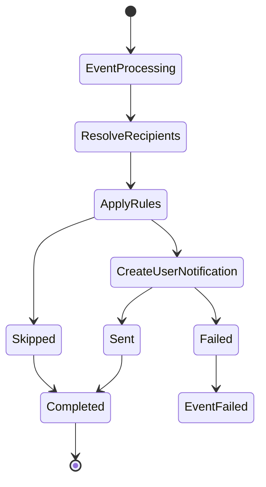
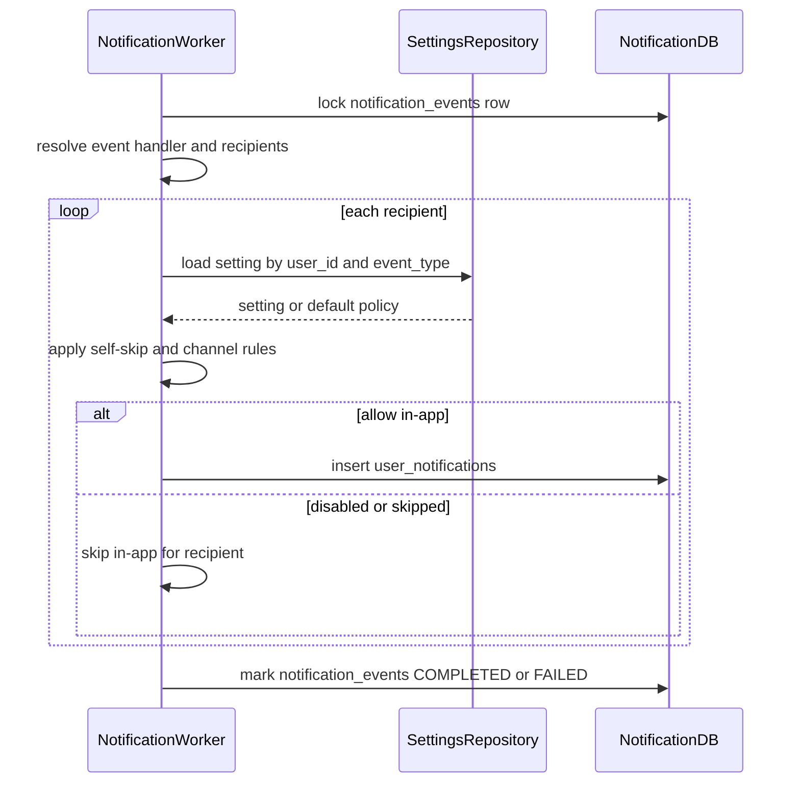

# In-App Notification Flow

## 1. Scope

Flow nay mo ta viec tao notification hien thi trong app/web tu `notification_events` da duoc ingest.

In scope:

- Resolve recipient.
- Apply settings va skip rules.
- Tao `user_notifications`.
- Set delivery status cho in-app channel.

Out of scope:

- API list/read/delete notification.
- Push/email delivery chi tiet.
- Business ownership cua resource referenced.

## 2. Actors

- **Notification Processing Worker:** Xu ly event va tao in-app records.
- **User:** Nhan notification.
- **Notification DB:** Luu `notification_events`, `user_notifications`, `user_notification_settings`.

## 3. Source Tables

- `notification_events`
- `user_notifications`
- `user_notification_settings`

## 4. State Machine



## 5. Flow Diagram



## 6. Business Rules

- In-app la channel chinh cua MVP.
- `user_notifications.user_id` la recipient, khong lay tu client request.
- `title` va `content` duoc tao server-side tu template theo `event_type`.
- `metadata` chi chua data da sanitize de client deep link/render.
- User setting `allow_in_app = false` thi khong tao in-app notification, tru event critical co override ro rang.
- Self notification bi skip voi social events neu `actor_id == recipient_user_id`.
- One source event co the tao nhieu user notifications, vi du `ORDER_CREATED` cho buyer va sellers.

## 7. Idempotency

Unique rule:

```text
(notification_event_id, user_id, type, reference_type, reference_id)
```

Neu retry event, worker phai:

- Check/insert theo unique key.
- Treat duplicate insert as success.
- Khong tao notification lan hai cho cung user/reference.

## 8. Transaction & Consistency

- Worker nen xu ly event trong transaction co row lock.
- Insert `user_notifications` va update `notification_events.status` nen nam trong cung transaction neu khong goi provider external.
- Neu co push/email external call trong cung handler, can tach phase de tranh giu DB transaction qua lau.
- In-app record duoc xem la `SENT` khi da persist va san sang hien thi.

## 9. Failure Cases

- **Missing recipient:** Mark event `FAILED` neu event yeu cau recipient.
- **Template missing:** Mark `FAILED` voi error sanitized.
- **Duplicate insert:** Treat success.
- **Settings read failed:** Retry event.
- **Invalid metadata:** Sanitize or fail by policy.

## 10. Acceptance Criteria

- Valid event creates correct `user_notifications`.
- Disabled in-app setting prevents notification creation.
- Self-like/self-comment does not notify user.
- Retry does not create duplicates.
- Event is marked completed when all required in-app records are handled.

