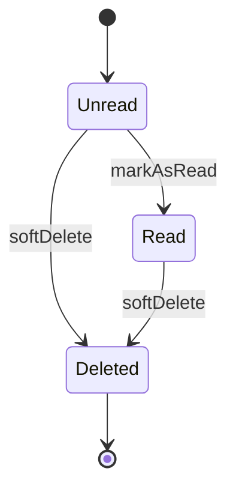
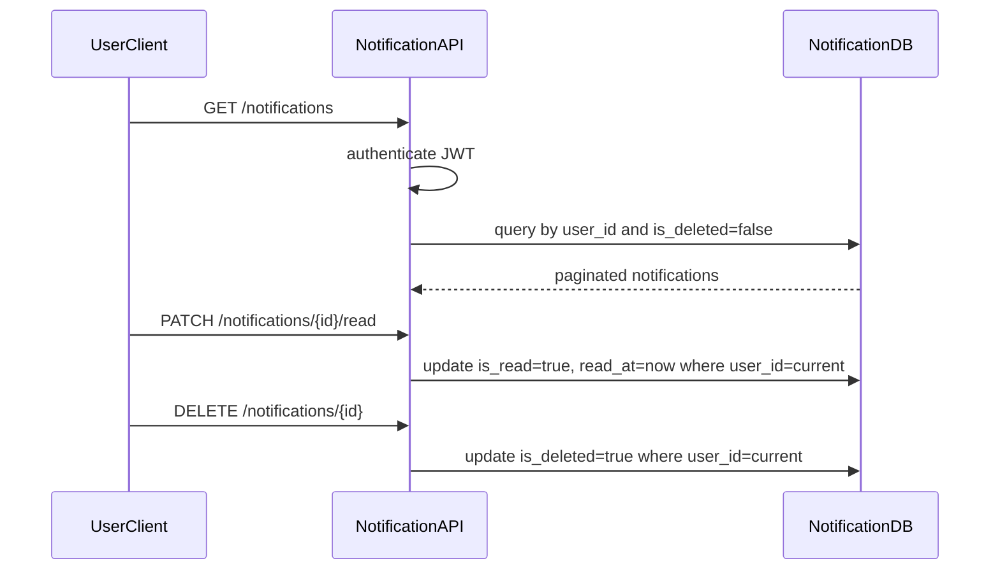

# Notification Read Delete Flow

## 1. Scope

Flow nay mo ta cac user-facing actions tren in-app notifications: list, unread list, unread count, mark read, mark all read va soft delete.

In scope:

- User notification read APIs.
- Ownership validation.
- Read/unread state transitions.
- Soft delete/hide.

Out of scope:

- Creating notifications from events.
- Hard delete/retention cleanup.
- Resource authorization in owner service after deep link.

## 2. Actors

- **User:** Quan ly notification cua minh.
- **Notification API:** Validate JWT/ownership and update records.
- **Notification DB:** Stores `user_notifications`.

## 3. Source Tables

- `user_notifications`

## 4. State Machine

Schema mapping:

- `Unread`: `is_read = false`, `read_at = null`, `is_deleted = false`.
- `Read`: `is_read = true`, `read_at != null`, `is_deleted = false`.
- `Deleted`: `is_deleted = true`.

## 5. Flow Diagram

## 6. Business Rules

- User can only access own notifications.
- Default list excludes `is_deleted = true`.
- Unread count excludes deleted notifications.
- Mark read is idempotent.
- Mark all read only affects current user's unread/non-deleted notifications.
- Delete is soft delete; no hard delete in MVP user API.
- Deep link target still requires authorization in owner service.

## 7. API Behaviors

- `GET /notifications`: paginated newest first.
- `GET /notifications/unread`: paginated unread.
- `GET /notifications/unread-count`: returns count.
- `PATCH /notifications/{notificationId}/read`: marks one read.
- `PATCH /notifications/read-all`: marks all read for current user.
- `DELETE /notifications/{notificationId}`: soft delete.

## 8. Failure Cases

- **Notification not found:** 404.
- **Notification belongs to another user:** 404 or 403 by security policy; prefer 404 to avoid existence leak.
- **Invalid pagination:** 400.
- **Unauthenticated:** 401.
- **Concurrent mark read/delete:** operations remain idempotent.

## 9. Acceptance Criteria

- User sees only own non-deleted notifications.
- Unread count is correct.
- Mark read sets `is_read = true` and `read_at`.
- Mark all read updates only current user records.
- Delete hides notification without hard deleting it.

