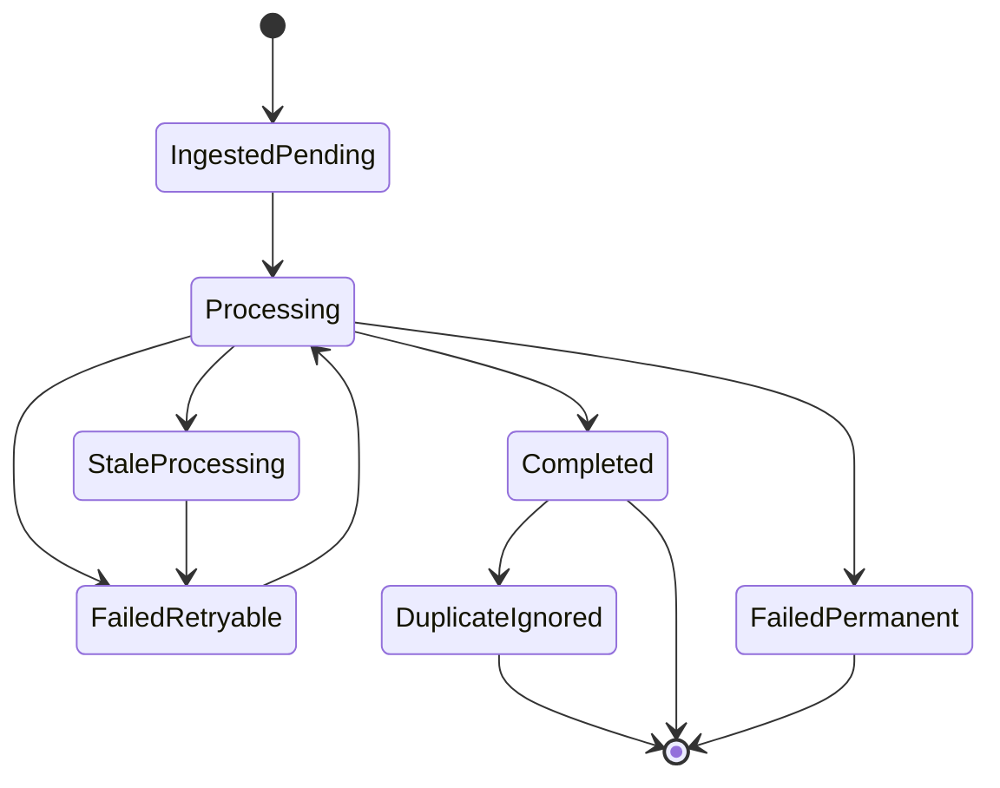
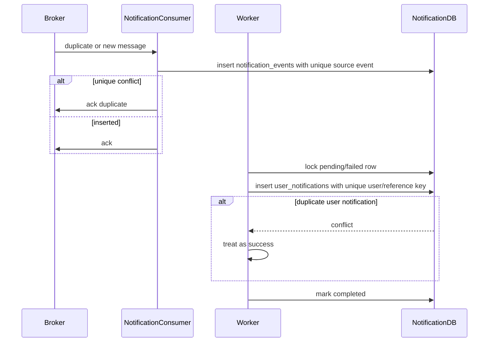

# Notification Reliability Idempotency Flow

## 1. Scope

Flow nay mo ta cac invariant ve reliability va idempotency cua Notification Service khi consume at-least-once events va retry delivery.

In scope:

- Event ingestion idempotency.
- Processing retry idempotency.
- User notification duplicate prevention.
- Worker crash recovery.
- Permanent failure handling.

Out of scope:

- Producer outbox implementation chi tiet.
- Real DLQ infrastructure.
- Provider-specific delivery exactly-once guarantee.

## 2. Reliability Model

2Hands event delivery model:

```text
Producer local transaction + outbox -> broker at-least-once -> Notification durable inbox -> idempotent processing
```

Notification Service must assume:

- Broker can deliver same message more than once.
- Producer may retry publish.
- Worker can crash after partial processing.
- External providers can timeout after actually sending.
- Events can arrive out of order.

## 3. Idempotency Keys

Event-level:

```text
(source_service, source_event_id)
```

Fallback:

```text
(source_service, event_key)
```

User notification-level:

```text
(notification_event_id, user_id, type, reference_type, reference_id)
```

System announcement fan-out:

```text
(notification_event_id, user_id, SYSTEM_ANNOUNCEMENT, announcement_id)
```

Review reminder optional:

```text
event_key = notification.review_reminder.{orderItemId}.{reminderDay}
```

## 4. State Machine



## 5. Flow Diagram



## 6. Business Rules

- Duplicate producer event must never duplicate user-visible notification.
- `COMPLETED` event is terminal unless manual reprocess is explicitly implemented later.
- Self-skipped event can be `COMPLETED` because no further work is needed.
- Missing recipient can be `FAILED`; retry only useful if payload/resolver can change.
- Stale `PROCESSING` rows must be recoverable.
- `last_error` must be sanitized and bounded in size.
- Events should be processed independently; one poison event must not block the queue.

## 7. Worker Recovery Rules

Stale processing detection:

```text
status = PROCESSING
AND locked_at < now() - processing_timeout
```

Recovery action:

- Set `status = FAILED`.
- Increment retry count only if processing likely started; exact policy must be consistent.
- Clear `locked_by`.
- Keep sanitized recovery error.

## 8. Ordering Rules

Notification Service should not rely on strict event ordering unless event contract says so.

Examples:

- `PAYMENT_SUCCESS` can arrive after `ORDER_CREATED`; both can create separate notifications.
- Duplicate `PAYMENT_SUCCESS` is deduped by event id.
- If `SHIPMENT_DELIVERED` arrives before `SHIPMENT_SHIPPED`, Notification may still notify delivered because Commerce owns shipment truth.

## 9. Failure And Dead-Letter Policy

MVP does not require real DLQ. Permanent failure is represented by:

```text
status = FAILED
retry_count = max_retry_count
last_error = permanent_failure_reason
```

Operational visibility should come from:

- Metrics by event type/source/status.
- Logs with sanitized error.
- Optional admin/internal query later.

## 10. Acceptance Criteria

- At-least-once broker delivery results in at-most-once user notification per key.
- Worker crash does not leave rows stuck forever.
- Retry can safely rerun partial work.
- Poison events do not block unrelated events.
- Duplicate insert conflicts are handled as successful idempotent outcomes.

