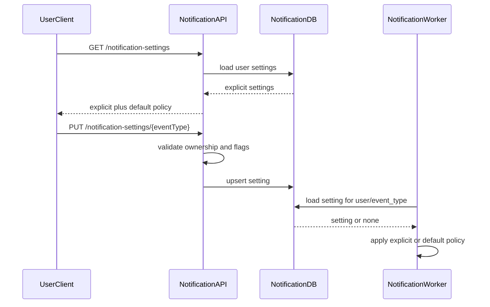

# Notification Settings Flow

## 1. Scope

Flow nay mo ta cach user xem va cap nhat notification preferences theo event type va cach delivery pipeline ap dung settings do.

In scope:

- View settings.
- Update settings.
- Initialize default settings.
- Apply `allow_push`, `allow_email`, `allow_in_app`.

Out of scope:

- Marketing subscription center.
- Complex audience targeting.
- Admin override UI.

## 2. Actors

- **User:** Quan ly preferences cua minh.
- **Notification API:** Expose view/update settings endpoints.
- **Notification Worker:** Apply settings khi route event.

## 3. Source Tables

- `user_notification_settings`
- `notification_events`
- `user_notifications`

## 4. Settings Model

Unique key:

```text
(user_id, event_type)
```

Fields:

- `allow_push`
- `allow_email`
- `allow_in_app`

Missing row means use default channel policy defined in application config.

## 5. Flow Diagram



## 6. Business Rules

- User chi xem/cap nhat settings cua minh.
- `event_type` phai la canonical event type duoc support.
- Neu setting khong ton tai, response nen cho client biet default effective values.
- Critical security notifications co the override `allow_email = false` neu business policy yeu cau.
- `allow_in_app = false` ngan tao `user_notifications`, tru critical/system mandatory events.
- Update settings phai set `updated_at`.

## 7. Transaction & Consistency

- Update setting la single-row upsert.
- Delivery worker doc setting tai thoi diem xu ly event.
- Khong can backfill old notifications khi setting thay doi.

## 8. Failure Cases

- **Unsupported event type:** 400.
- **Unauthorized:** 401.
- **Trying to update another user:** 403.
- **Invalid boolean payload:** 400.
- **Concurrent update:** last write wins unless versioning added later.

## 9. Acceptance Criteria

- User can view effective settings.
- User can update channel flags per event type.
- Delivery worker respects settings.
- Missing settings fall back to defined defaults.
- Critical override behavior is explicit, not accidental.

