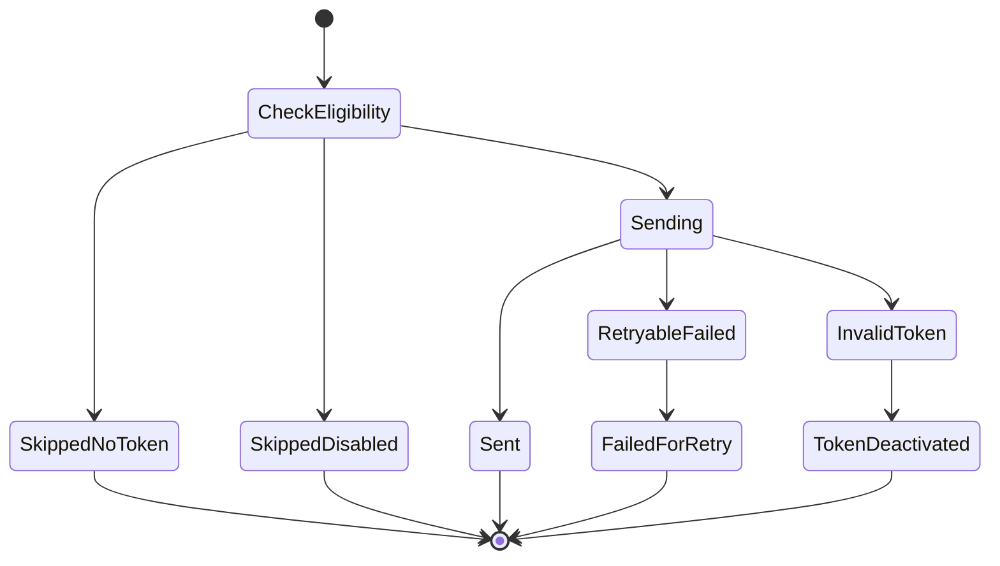
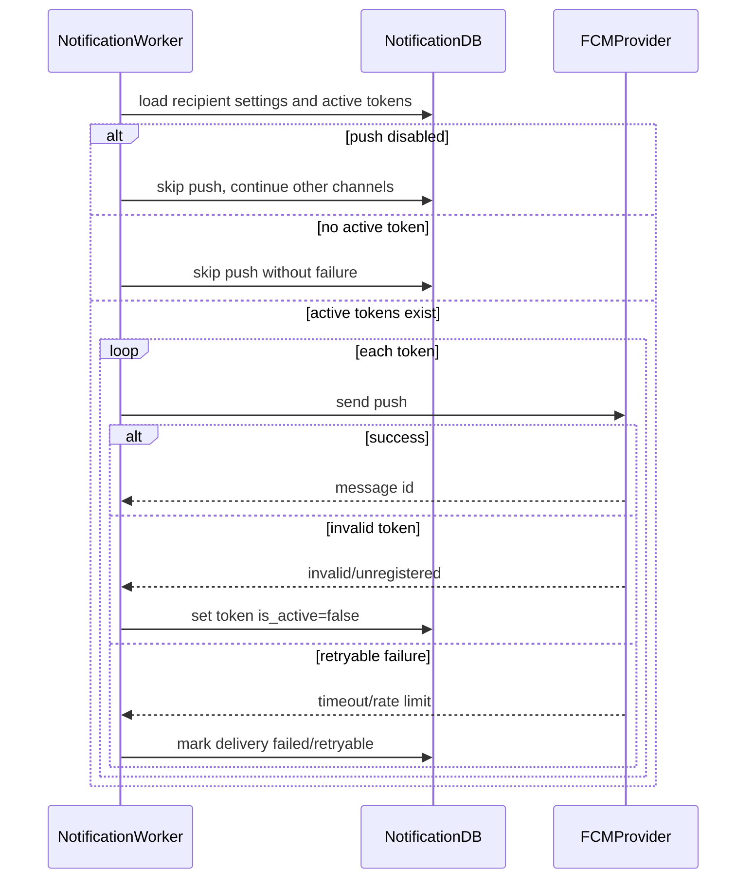

# Push Delivery Flow

## 1. Scope

Flow nay mo ta cach Notification Service gui push notification qua FCM cho user co active device token.

In scope:

- Check push setting.
- Lay active device tokens.
- Gui FCM push.
- Xu ly invalid token va retryable provider failure.

Out of scope:

- APNS native integration trong MVP.
- Push analytics/campaign.
- Realtime websocket.

## 2. Actors

- **Notification Worker:** Dieu phoi push delivery.
- **FCM:** Push provider MVP.
- **User Device:** Nhan notification.
- **Notification DB:** Luu token va delivery status.

## 3. Source Tables

- `user_notifications`
- `user_device_tokens`
- `user_notification_settings`
- `notification_events`

## 4. Delivery State

## 5. Flow Diagram

## 6. Business Rules

- Gui push khi event policy cho phep push va setting `allow_push = true`.
- Khong co active token khong phai system error.
- Invalid/unregistered FCM token la permanent token failure, phai deactivate token.
- Timeout/rate limit/provider unavailable la retryable failure.
- Device token la sensitive, khong log full token.
- Push payload nen ngan gon va khong chua secret/private raw content.
- Push click action nen dua den `reference_type/reference_id`, client van phai authorize resource o owner service.

## 7. Transaction & Consistency

- Khong nen giu DB transaction trong luc goi FCM lau.
- Nen persist `user_notifications` truoc, sau do attempt push.
- Neu push success, update `delivery_status = SENT` neu cac channel required khac cung thanh cong.
- Neu push fail retryable, update `delivery_status = FAILED` hoac retry marker trong MVP.

## 8. Failure Cases

- **FCM invalid token:** Deactivate token, khong retry token do.
- **FCM timeout:** Mark retryable failed.
- **FCM rate limit:** Apply backoff.
- **Malformed push payload:** Fail delivery and log sanitized error.
- **Token belongs to different user:** Do not send; deactivate/reject by security policy.

## 9. Acceptance Criteria

- Push sent only to active tokens.
- User setting can disable push.
- Invalid token is deactivated.
- No active token does not fail whole event.
- Retryable FCM error can be retried by delivery retry job.

