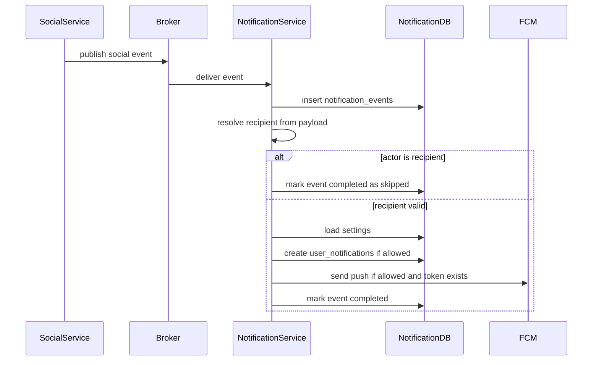

# Social Notification Flow

## 1. Scope

Flow nay mo ta cac notification phat sinh tu Social Service events: like, follow, comment, reply va comment like.

In scope:

- Map social event type sang recipient/content/reference.
- Skip self notification.
- Respect notification settings.
- Tao in-app va push theo default policy.

Out of scope:

- Social graph/post/comment ownership.
- Mutate Social database.
- Moderation/enforcement policy.

## 2. Actors

- **Social Service:** Publish social events.
- **Notification Service:** Consume va notify recipients.
- **Actor User:** Nguoi thuc hien action.
- **Recipient User:** Chu post/comment hoac user duoc follow.

## 3. Source Tables

- `notification_events`
- `user_notifications`
- `user_notification_settings`
- `user_device_tokens`

## 4. Event Mapping

| Event Type | Recipient | Reference | Default Channels | Self Skip |
|---|---|---|---|---|
| `POST_LIKED` | post author | `POST` | in-app, push | yes |
| `USER_FOLLOWED` | followed user | `USER` | in-app, push | yes |
| `COMMENT_CREATED` | post author | `POST`/`COMMENT` | in-app, push | yes |
| `COMMENT_REPLIED` | parent comment author | `COMMENT` | in-app, push | yes |
| `COMMENT_LIKED` | comment author | `COMMENT` | in-app, push | yes |

## 5. Flow Diagram

## 6. Required Payload Fields

`POST_LIKED`:

- `actor_id`
- `post_id`
- `post_author_id`
- actor display name/avatar summary optional

`USER_FOLLOWED`:

- `actor_id`
- `followed_user_id`

`COMMENT_CREATED`:

- `actor_id`
- `post_id`
- `comment_id`
- `post_author_id`

`COMMENT_REPLIED`:

- `actor_id`
- `comment_id`
- `parent_comment_id`
- `parent_comment_author_id`

`COMMENT_LIKED`:

- `actor_id`
- `comment_id`
- `comment_author_id`

## 7. Business Rules

- Notification Service khong query Social DB de xac dinh owner trong MVP; producer payload phai co recipient.
- Neu recipient missing, event failed/retryable theo policy.
- Self notification skip neu `actor_id == recipient_user_id`.
- Social notifications mac dinh khong gui email.
- Content phai ngan gon, khong chua private post/comment body neu khong can.

## 8. Idempotency

- Duplicate social event khong tao duplicate notification.
- Unique user notification based on event + recipient + reference.
- Self-skipped event van co the mark `COMPLETED` de khong retry vo han.

## 9. Acceptance Criteria

- Like/follow/comment/reply/comment-like notify dung recipient.
- Self actions do not notify.
- User settings can disable in-app/push.
- Social DB is not accessed directly.
- Duplicate broker delivery does not duplicate notifications.

