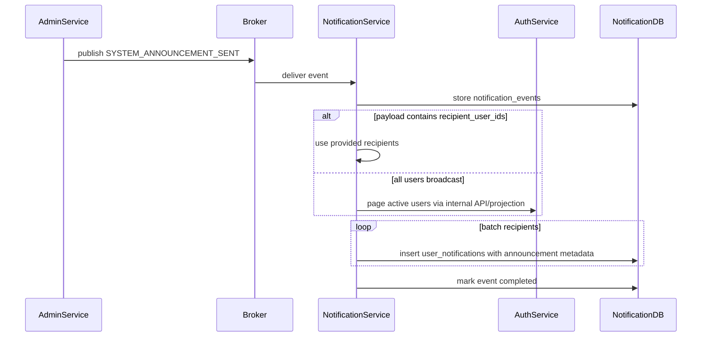

# System Announcement Fan-Out Flow

## 1. Scope

Flow nay mo ta cach Notification Service fan-out system announcement da publish tu Admin Service thanh `user_notifications`.

In scope:

- Consume announcement published event.
- Resolve target audience/recipients.
- Create in-app announcement notifications in batches.
- Support pinned/dismissible metadata.

Out of scope:

- Admin announcement authoring/publishing state.
- Campaign/marketing system.
- Complex segmentation engine.

## 2. Actors

- **Admin Service:** Own announcement and publish event.
- **Notification Service:** Fan-out to recipients.
- **Auth Service:** Own user list if all-user broadcast needs paging.
- **User:** Receives announcement.

## 3. Source Tables

- `notification_events`
- `user_notifications`
- `user_notification_settings`

Logical upstream:

- Admin `system_announcements`
- Auth users for recipient enumeration if needed.

## 4. Flow Diagram



## 5. Announcement Payload

Recommended payload:

- `announcement_id`
- `title`
- `content`
- `severity`
- `is_pinned`
- `dismissible`
- `target_audience`: `ALL_USERS`, `BUYERS`, `SELLERS`, `ADMINS`, or explicit group
- `recipient_user_ids` optional
- `published_at`

## 6. Business Rules

- Admin Service owns announcement status; Notification only fan-out after publish event.
- Fan-out must be batch-based, not load all users into memory.
- One announcement creates at most one notification per recipient.
- `is_pinned` stored in `metadata`.
- `dismissible` stored in `metadata`; dismiss maps to soft delete of user notification.
- Critical announcement may bypass disabled in-app setting if policy says mandatory.
- If Auth user enumeration is not implemented, producer should include explicit recipients for MVP.

## 7. Idempotency

Duplicate fan-out prevention key:

```text
(notification_event_id, user_id, type, reference_type = SYSTEM_ANNOUNCEMENT, reference_id = announcement_id)
```

Retrying fan-out should:

- Continue safely from existing inserted recipients.
- Treat duplicate insert as success.
- Avoid duplicate notification for same announcement/user.

## 8. Failure Cases

- **Missing announcement_id:** fail event.
- **Missing recipients and no audience resolver:** fail event.
- **Batch insert partial failure:** retry event; unique key prevents duplicates.
- **Auth user paging unavailable:** retry if transient.
- **Announcement cancelled after publish:** handle via separate cancellation event if supported later.

## 9. Acceptance Criteria

- Published announcement creates in-app notifications for target recipients.
- Pinned/dismissible flags are preserved in metadata.
- Fan-out is idempotent and batch-safe.
- Notification Service does not own or mutate Admin announcement state.
- All-user broadcast has a clear recipient enumeration strategy.

