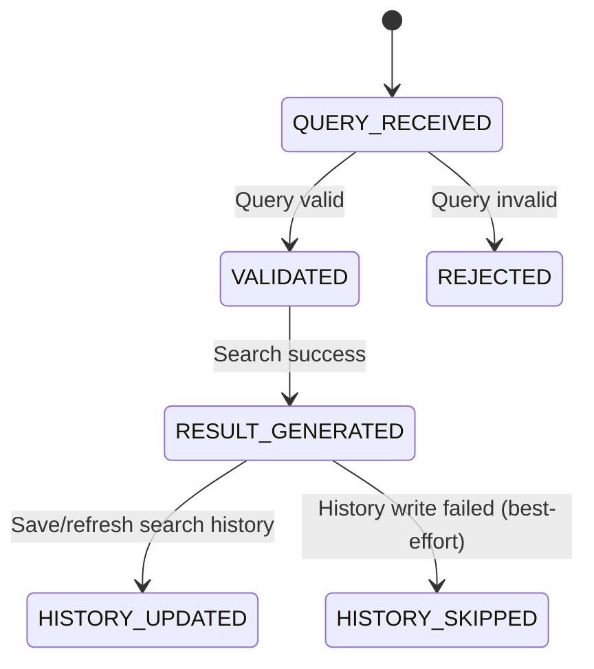
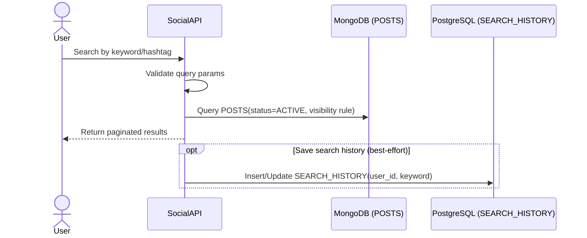

# Discovery Flow

## 1. Overview
Luồng này mô tả discovery MVP của Social Service gồm search post theo từ khóa, search hashtag, và lưu search history. Kết quả tìm kiếm phải tuân thủ trạng thái nội dung và visibility rules.

## 2. State Machine (Search Lifecycle)

## 3. Business Flow Diagram

## 4. Entity Impact
- `POSTS`: dữ liệu nguồn cho search theo caption/hashtags.
- `SEARCH_HISTORY`: lưu/refresh từ khóa người dùng đã tìm kiếm.
- Không thay đổi business state của post/comment trong flow discovery.

## 5. Event Publishing
- Không có event publish bắt buộc trong flow discovery MVP.
- Lưu search history theo cơ chế best-effort, không làm fail response chính.
