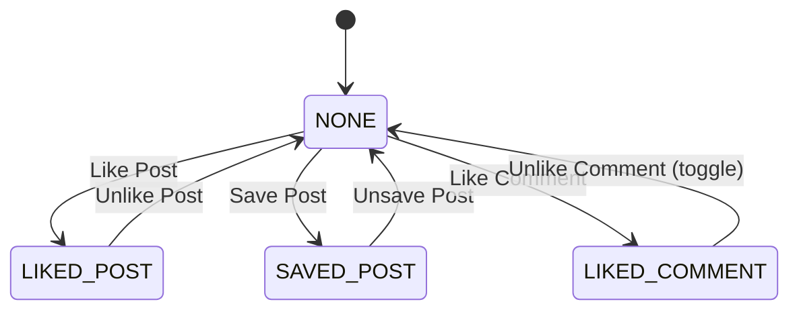
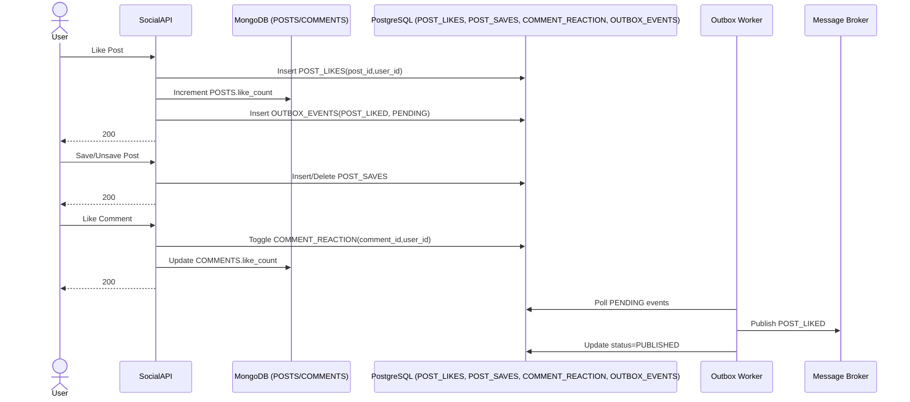

# Engagement Flow

## 1. Overview
Luồng này mô tả các tương tác chính của user trên nội dung social: like/unlike post, save/unsave post, xem saved posts, like comment. Luồng đảm bảo idempotency qua unique constraints và cập nhật counters theo mô hình eventual consistency.

## 2. State Machine (User Engagement Relation)

## 3. Business Flow Diagram

## 4. Entity Impact
- `POST_LIKES`: mapping like post theo `(post_id, user_id)`.
- `POST_SAVES`: mapping lưu bài viết theo `(post_id, user_id)`.
- `COMMENT_REACTION`: mapping like comment theo `(comment_id, user_id)`.
- `POSTS.like_count`, `COMMENTS.like_count`: cập nhật counter hiển thị.
- `OUTBOX_EVENTS`: ghi event tương tác cần phát ra ngoài.

## 5. Event Publishing
- `POST_LIKED`: event MVP bắt buộc để Notification Service xử lý.
- Có thể mở rộng `COMMENT_LIKED` theo chính sách notification.
