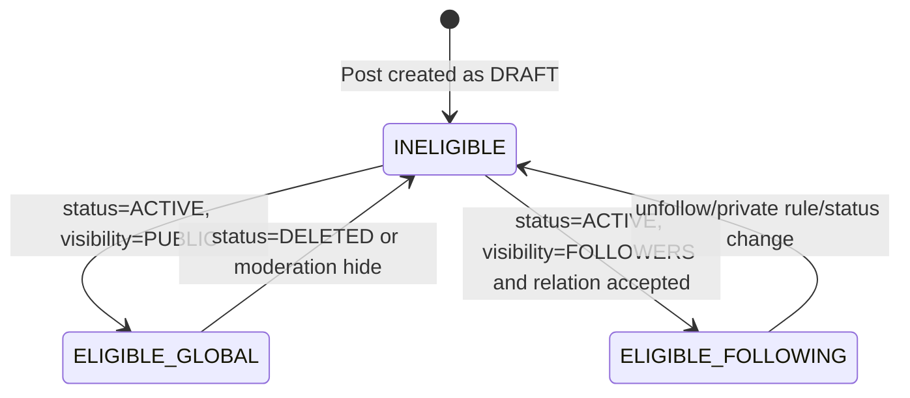
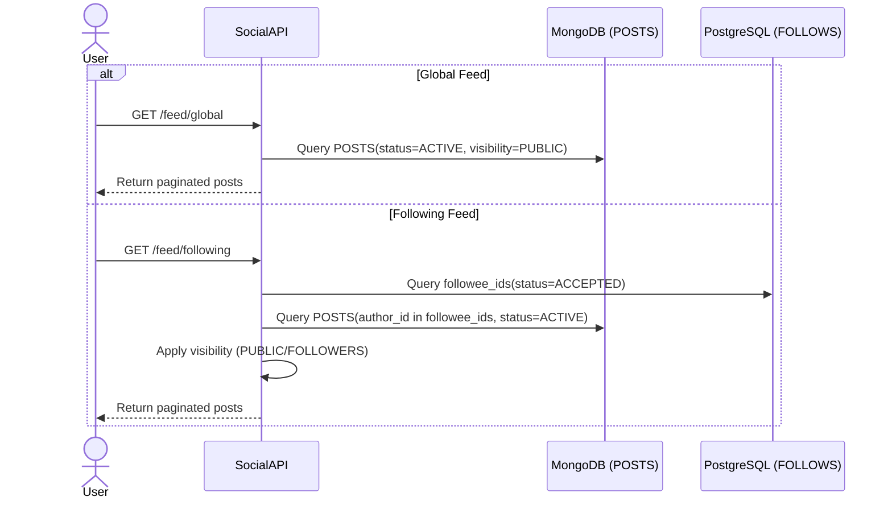

# Feed Delivery Flow

## 1. Overview
Luồng này mô tả cách Social Service trả về Global Feed và Following Feed. Hệ thống chỉ trả post `ACTIVE`, áp dụng filter visibility (`PUBLIC`, `FOLLOWERS`) và quan hệ follow hợp lệ để đảm bảo đúng quyền truy cập.

## 2. State Machine (Feed Eligibility)

## 3. Business Flow Diagram

## 4. Entity Impact
- `POSTS`: dữ liệu nguồn của feed; đọc theo index `status/visibility/created_at`, `author_id/status/created_at`.
- `FOLLOWS`: xác định social graph cho Following Feed.
- Không có thay đổi trạng thái dữ liệu bắt buộc trong flow đọc feed.

## 5. Event Publishing
- Không có event publish bắt buộc trong luồng đọc feed.
- Nếu bật analytics nội bộ, có thể phát event read-only (không thuộc MVP bắt buộc).
