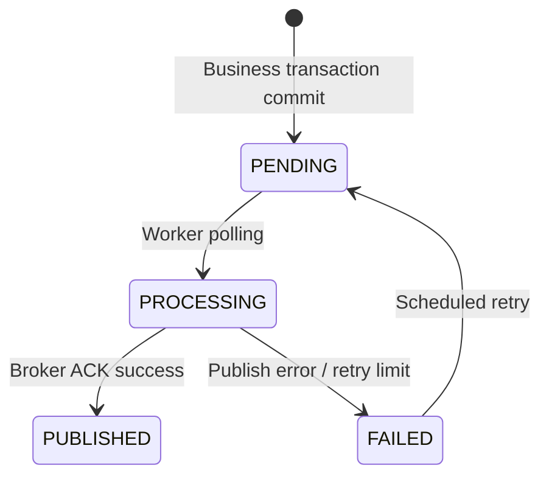
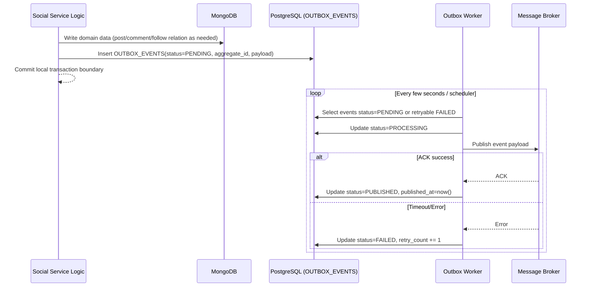

# Outbox Event Flow

## 1. Overview
Đây là luồng cốt lõi đảm bảo Social Service đồng bộ dữ liệu liên service theo kiến trúc Event-Driven mà không gặp lỗi dual-write. Mọi domain event đều được ghi vào `OUTBOX_EVENTS` trong cùng transaction local trước khi worker publish lên message broker.

## 2. Transactional Outbox State Machine

## 3. Business Flow Diagram

## 4. Entity Impact
- `OUTBOX_EVENTS`: lưu và theo dõi toàn bộ vòng đời publish event.
- Domain entities liên quan: `POSTS`, `COMMENTS`, `FOLLOWS`, `POST_LIKES` (tùy event được phát).
- Consumer side phải xử lý idempotent để chấp nhận at-least-once delivery.

## 5. Event Publishing
- **Consume from Auth:** `USER_CREATED`, `USER_UPDATED`, `USER_DELETED`.
- **Publish from Social (MVP):** `POST_LIKED`, `COMMENT_CREATED`, `USER_FOLLOWED`.
- Retry policy dựa trên `retry_count` và trạng thái `PENDING/PROCESSING/FAILED/PUBLISHED`.
