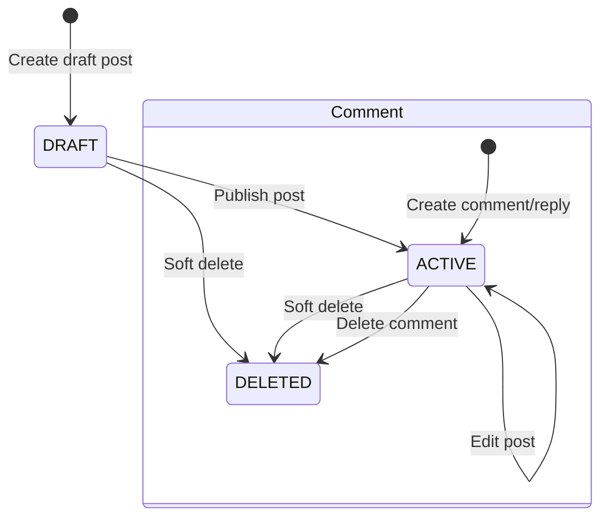
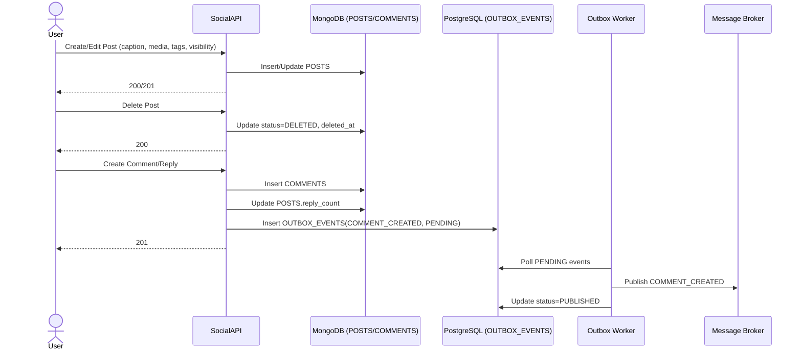

# Post Lifecycle Flow

## 1. Overview
Luồng này mô tả vòng đời bài viết và bình luận trong Social Service: tạo, chỉnh sửa, xóa mềm post; tạo comment/reply; xóa comment. Luồng bám theo trạng thái `DRAFT/ACTIVE/DELETED` của post và `ACTIVE/DELETED` của comment.

## 2. State Machine (Post & Comment Status)

## 3. Business Flow Diagram

## 4. Entity Impact
- `POSTS`: tạo/sửa/xóa mềm bài viết, cập nhật `status`, `updated_at`, `deleted_at`.
- `COMMENTS`: tạo comment/reply, xóa mềm comment.
- `OUTBOX_EVENTS`: ghi event `COMMENT_CREATED` (và event mở rộng như `POST_CREATED`, `POST_UPDATED`, `POST_DELETED` nếu bật).

## 5. Event Publishing
- `COMMENT_CREATED`: phát sau khi tạo comment/reply thành công.
- Có thể mở rộng: `POST_CREATED`, `POST_UPDATED`, `POST_DELETED`, `COMMENT_DELETED`.
