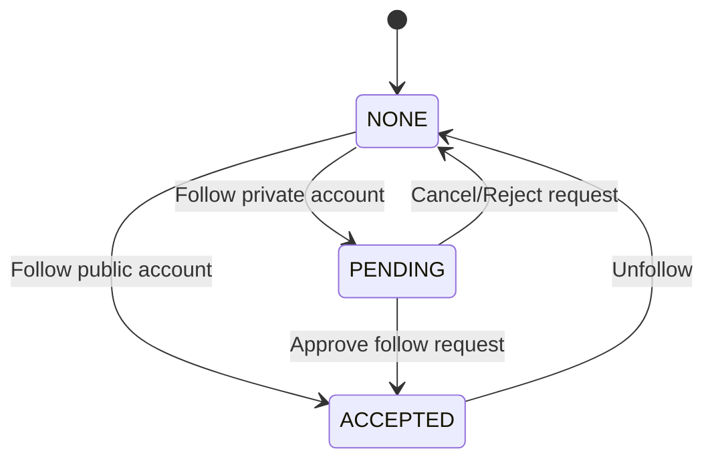
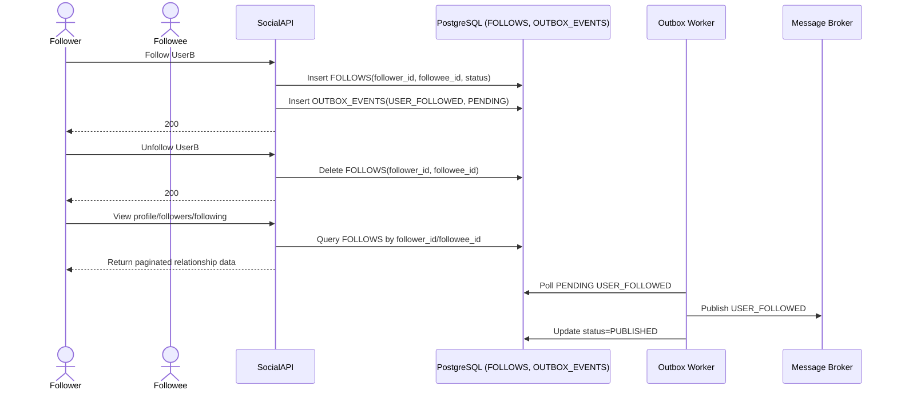

# Social Graph Flow

## 1. Overview
Luồng này mô tả quản lý quan hệ theo dõi trong Social Service: follow, unfollow, xem profile user và danh sách followers/following. Luồng sử dụng bảng `FOLLOWS` để điều khiển social graph và quyền hiển thị cho `FOLLOWERS` visibility.

## 2. State Machine (Follow Relationship)

## 3. Business Flow Diagram

## 4. Entity Impact
- `FOLLOWS`: tạo/xóa quan hệ follow, trạng thái `PENDING` hoặc `ACCEPTED`.
- `OUTBOX_EVENTS`: lưu event `USER_FOLLOWED`.
- Projection profile local của Social được dùng khi xem profile public.

## 5. Event Publishing
- `USER_FOLLOWED`: event MVP để Notification Service gửi thông báo.
- Có thể mở rộng `USER_UNFOLLOWED` nếu cần nghiệp vụ analytics/notification.
