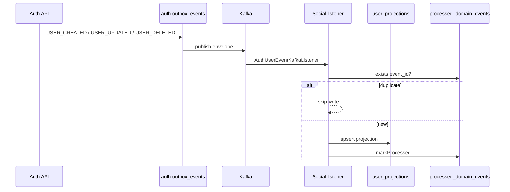

# Kafka — Hạng mục 3A: Auth → Social (user projection)

Tài liệu bật luồng **Auth publish user lifecycle → Social consume → MongoDB `user_projections`** trên local. Phụ thuộc:

- [Hạng mục 0 — broker](kafka_section_0.md)
- [Hạng mục 1 — outbox publisher](kafka_section_1.md) (Auth `AUTH_OUTBOX_PUBLISH_ENABLED=true`)
- [Hạng mục 2](kafka_section_2.md) / [email OTP](kafka_section_email_otp.md) — có thể chạy **song song** (notification cũng nhận `auth.user.created`); **3A không bắt buộc** notification.

**Phạm vi 3A:** document + env mẫu. Code consumer/publisher đã có sẵn — không refactor trong hạng mục này.

---

## 1. Mục tiêu & bảng topic

| Kafka topic | `event_type` | Auth publish khi nào | Social `user_projections` |
|-------------|--------------|----------------------|---------------------------|
| `auth.user.created` | `USER_CREATED` | Register email, OAuth user mới | **Upsert**; `status` từ payload (register → `PENDING_VERIFICATION`) |
| `auth.user.updated` | `USER_UPDATED` | Verify email (`status: ACTIVE`), update profile / avatar / privacy | **Merge** fields; `status` chỉ đổi khi payload có `status` |
| `auth.user.deleted` | `USER_DELETED` | Soft delete account | `status` = `DELETED` |

**Idempotency:** PostgreSQL `processed_domain_events`, `consumer_name` = `social-user-projection` (`ConsumeAuthUserEventsUseCase.CONSUMER_NAME`).

**Không lưu** email / password / phone trong projection Mongo.

---

## 2. Luồng end-to-end

### Register → projection PENDING_VERIFICATION

```text
POST /api/v1/auth/register
  → Auth transaction: users + USER_CREATED outbox (payload status=PENDING_VERIFICATION)
  → commit

Auth scheduler (AUTH_OUTBOX_PUBLISH_ENABLED=true)
  → Kafka topic auth.user.created
  → envelope JSON (AuthOutboxMessageBuilder): event_id, event_type, payload, ...

Social AuthUserEventKafkaListener (SOCIAL_KAFKA_CONSUMER_ENABLED=true)
  → AuthUserEventMessageParser → ConsumeAuthUserEventsUseCase
  → MongoDB user_projections upsert
  → PostgreSQL processed_domain_events (event_id, social-user-projection)
```

### Verify email → projection ACTIVE

```text
POST /api/v1/auth/verify-email (OTP)
  → Auth: user ACTIVE + USER_UPDATED outbox (status, email_verified, verified_at)
  → Kafka auth.user.updated

Social consume → merge projection: status=ACTIVE
  (display_name / avatar / is_private giữ giá trị cũ nếu payload không gửi — xem hạng mục 3C)
```

### Soft delete

```text
Auth USER_DELETED outbox → auth.user.deleted → projection status=DELETED
```



---

## 3. Biến môi trường

### Auth (reference — `Services/auth-service/.env.example`)

| Biến | Gợi ý dev |
|------|-----------|
| `KAFKA_BOOTSTRAP_SERVERS` | `localhost:9092` |
| `AUTH_KAFKA_PRODUCER_ENABLED` | `true` |
| `AUTH_OUTBOX_PUBLISH_ENABLED` | `true` |

### Social (`Services/social-service/.env` — copy từ `.env.example`)

| Biến | Gợi ý dev (3A) | Vai trò |
|------|----------------|---------|
| `KAFKA_BOOTSTRAP_SERVERS` | `localhost:9092` | Broker (host) |
| `SOCIAL_KAFKA_CONSUMER_ENABLED` | `true` | Bật `AuthUserEventKafkaListener` + `PostModeratedEventKafkaListener` |
| `SOCIAL_KAFKA_PRODUCER_ENABLED` | `false` | Hạng mục 3 không cần social publish |
| `SOCIAL_OUTBOX_PUBLISH_ENABLED` | `false` | |
| `SOCIAL_OUTBOX_RETRY_ENABLED` | `false` | |
| `DB_URL` | `jdbc:postgresql://localhost:5433/social_db` | PG: `processed_domain_events`, social relations |
| `DB_USERNAME` / `DB_PASSWORD` | `postgres` / `123456` | |
| `MONGO_URI` | `mongodb://localhost:27017/social_db` | Collection `user_projections` |

**Lưu ý:** `SOCIAL_KAFKA_CONSUMER_ENABLED=true` cũng đăng ký consumer **`admin.post.moderated`** (group `social-post-moderated`, `PostModeratedEventKafkaListener`). Dev OK nếu chưa có message admin — listener idle.

Notification service: **tắt được** khi chỉ test 3A; bật mục 2 không ảnh hưởng projection social.

---

## 4. Subscribe thêm (cùng consumer config, ngoài test 3A chính)

`Services/social-service/src/main/resources/application.yml` → `social.kafka.consumer.topics`:

| Kafka topic | `event_type` (fallback) | Projection `status` |
|-------------|-------------------------|---------------------|
| `admin.user.suspended` | `USER_SUSPENDED` | `SUSPENDED` |
| `admin.user.banned` | `USER_BANNED` | `SUSPENDED` |
| `admin.user.restricted` | `USER_RESTRICTED` | Giữ status cũ nếu payload không có `status` (MVP) |
| `admin.user.enforcement_revoked` | `USER_ENFORCEMENT_REVOKED` | `ACTIVE` |
| `admin.user.enforcement_expired` | `USER_ENFORCEMENT_EXPIRED` | `ACTIVE` |

**Hạng mục sau:** Admin enforcement E2E (admin publish → social projection).

**Post moderated (khác domain):**

| Topic | Consumer group | Listener |
|-------|----------------|----------|
| `admin.post.moderated` | `social-post-moderated` | `PostModeratedEventKafkaListener` |

---

## 5. Payload & mapping

### Envelope Kafka (Auth publish)

`AuthOutboxMessageBuilder.buildEnvelope()`:

| Field envelope | Mô tả |
|----------------|--------|
| `event_id` | UUID outbox row |
| `event_type` | `USER_CREATED` / `USER_UPDATED` / `USER_DELETED` |
| `event_key` | Partition key |
| `source` | `auth` |
| `occurred_at` | ISO-8601 |
| `payload` | Object JSON |

Social parser: `AuthUserEventMessageParser` — đọc `event_id` / `event_type` từ root; `user_id`, `status`, `display_name`, `avatar_url`, `is_private` từ `payload`.

### Auth payload theo use case (sau hạng mục 3C)

| Sự kiện | Nguồn | Payload chính | Social mapping |
|---------|-------|---------------|----------------|
| `USER_CREATED` | `UserCreatedOutboxService` + `UserProjectionSyncPayload` | `user_id`, `email`, `status`, `display_name`, `is_private` (register); OAuth thêm `avatar_url` khi có | Upsert profile fields từ payload |
| `USER_UPDATED` (verify) | `userActivatedAfterEmailVerification` | `status: ACTIVE`, `email_verified`, `verified_at` — **không** profile fields | `status` → ACTIVE |
| `USER_UPDATED` (profile) | `userUpdated(..., profileOnly(displayName, …))` | `user_id`, `email`, `updated_at`, `display_name` | Merge `display_name`; giữ `status` cũ |
| `USER_UPDATED` (avatar) | `profileOnly(null, avatarUrl, null)` | + `avatar_url` | Merge `avatar_url` |
| `USER_UPDATED` (privacy) | `profileOnly(null, null, isPrivate)` | + `is_private` | Merge `is_private` |
| `USER_DELETED` | `userDeleted` | `user_id`, `email`, `deleted_at` | `status` → DELETED |

**Mongo document** (`user_projections`): `user_id`, `status`, `display_name`, `avatar_url`, `is_private` — **không** có email.

**Quy ước JSON (3C):** snake_case; **omit** key khi giá trị `null` (không `"avatar_url": null`) — `UserProjectionSyncPayload.applyTo`. Social `mergeProjection` chỉ ghi đè field non-null trong command.

**Không gửi:** `bio`, `website`, `social_links`, email/password/phone.

### Ví dụ payload (3C)

**USER_CREATED (register):**

```json
{
  "user_id": "...",
  "email": "u@example.com",
  "status": "PENDING_VERIFICATION",
  "display_name": "u",
  "is_private": false
}
```

**USER_UPDATED (update profile):**

```json
{
  "user_id": "...",
  "email": "...",
  "updated_at": "...",
  "display_name": "Ten moi"
}
```

**USER_UPDATED (avatar):** chỉ thêm `avatar_url`.

**USER_UPDATED (privacy):** chỉ thêm `is_private`.

---

## 6. UserWriteGuard

`UserWriteGuard` chặn **ghi social** (post, comment, follow, …) khi projection:

| `user_projections.status` | Chặn ghi? |
|---------------------------|-----------|
| `SUSPENDED` | **Có** → `ACCOUNT_SUSPENDED` |
| `DELETED` | **Có** → `FORBIDDEN` |
| `PENDING_VERIFICATION` | **Không** — vẫn cho phép ghi (tránh nhầm với suspended) |
| `ACTIVE` | Không |

Role `MODERATOR` / `ADMIN` có thể bypass (`assertCanWrite(actorId, roles)`).

---

## 7. Class / file tham chiếu (đã implement)

| Thành phần | File |
|------------|------|
| Listener | `Services/social-service/src/main/java/com/twohands/social_service/infrastructure/integration/kafka/AuthUserEventKafkaListener.java` |
| Parser | `Services/social-service/src/main/java/com/twohands/social_service/application/integration/consumeauthuserevents/AuthUserEventMessageParser.java` |
| Use case | `Services/social-service/src/main/java/com/twohands/social_service/application/integration/consumeauthuserevents/ConsumeAuthUserEventsUseCase.java` |
| Topic resolver | `Services/social-service/src/main/java/com/twohands/social_service/infrastructure/integration/kafka/AuthUserEventTopicResolver.java` |
| Consumer config | `Services/social-service/src/main/java/com/twohands/social_service/config/SocialKafkaConsumerConfig.java` |
| Auth USER_CREATED outbox | `Services/auth-service/.../UserCreatedOutboxService.java` |
| Auth USER_UPDATED / DELETED | `Services/auth-service/.../UserAccountOutboxService.java` |
| Profile sync DTO | `Services/auth-service/.../UserProjectionSyncPayload.java` |
| Envelope publish | `Services/auth-service/src/main/java/com/twohands/auth_service/infrastructure/outbox/AuthOutboxMessageBuilder.java` |
| Write guard | `Services/social-service/src/main/java/com/twohands/social_service/application/user/common/UserWriteGuard.java` |
| Behavior spec | `docs/api_fe_behavior/social_api_fe_behavior/ConsumeAuthUserEvents-api-and-behavior.md` |
| FR | `docs/feature_requirements/social/FR_ConsumeAuthUserEvents.md` |

---

## 8. Verify 3A (đối chiếu code — read-only)

| Kiểm tra | Kết quả |
|----------|---------|
| Topics `application.yml` khớp doc §4 | **PASS** — 8 topic auth/admin + `admin.post.moderated` riêng group |
| `ConsumeAuthUserEvents-api-and-behavior.md` | **PASS** — event types, idempotency, merge status |
| `SOCIAL_KAFKA_CONSUMER_ENABLED` → listener bean | **PASS** — `@ConditionalOnProperty` trên `AuthUserEventKafkaListener` |

Smoke E2E manual: xem [Verify 3B](#verify-3b-manual-checklist) (hạng mục tiếp theo).

---

## Verify 3B (manual checklist)

Smoke E2E Auth → Social projection trên local. Notification **có thể tắt**; không ảnh hưởng `user_projections`.

### Chuẩn bị infra

```bash
cd Infrastructure
docker compose up -d kafka kafka-ui postgres-auth postgres-social mongodb redis
```

| Dịch vụ | Port / URL |
|---------|------------|
| Kafka | `localhost:9092` |
| Kafka UI | http://localhost:8080 |
| postgres-auth | `localhost:5432` → `auth_db` |
| postgres-social | `localhost:5433` → `social_db` |
| MongoDB | `localhost:27017` → `social_db` |
| Redis | `localhost:6379` |

### Env runtime (copy `.env.example` → `.env`, **không commit**)

**auth-service** (`Services/auth-service/.env`):

| Biến | Giá trị |
|------|---------|
| `KAFKA_BOOTSTRAP_SERVERS` | `localhost:9092` |
| `AUTH_KAFKA_PRODUCER_ENABLED` | `true` |
| `AUTH_OUTBOX_PUBLISH_ENABLED` | `true` |

**social-service** (`Services/social-service/.env`):

| Biến | Giá trị |
|------|---------|
| `KAFKA_BOOTSTRAP_SERVERS` | `localhost:9092` |
| `SOCIAL_KAFKA_CONSUMER_ENABLED` | `true` |
| `SOCIAL_KAFKA_PRODUCER_ENABLED` | `false` |
| `SOCIAL_OUTBOX_PUBLISH_ENABLED` | `false` |
| `DB_URL` | `jdbc:postgresql://localhost:5433/social_db` |
| `MONGO_URI` | `mongodb://localhost:27017/social_db` |
| JWT secrets | Theo `.env.example` |

**Lưu ý:** Nếu `.env` local vẫn `SOCIAL_KAFKA_CONSUMER_ENABLED=false`, social **không** consume — đồng bộ với `.env.example` hoặc export env trước `bootRun`.

### Chạy services

```bash
cd Services/auth-service && ./gradlew bootRun    # http://localhost:3001
cd Services/social-service && ./gradlew bootRun  # http://localhost:3002
```

### Test 1 — `USER_CREATED` sau register

```http
POST http://localhost:3001/api/v1/auth/register
Content-Type: application/json

{
  "email": "e2e-unique@example.com",
  "password": "Password123",
  "confirm_password": "Password123"
}
```

**Kỳ vọng**

- HTTP `201`, `data.status` = `PENDING_VERIFICATION`
- Kafka UI → `auth.user.created`: `event_type: USER_CREATED`, `payload.user_id`, `payload.status: PENDING_VERIFICATION`
- Log social: `Applied auth user event to projection ... USER_CREATED`
- Mongo:

```javascript
db.user_projections.find({ user_id: "<userId từ response>" }).pretty()
// status: "PENDING_VERIFICATION"
// display_name: từ auth payload (3C) hoặc "User xxxxxxxx" nếu payload thiếu field
```

- PostgreSQL social:

```sql
SELECT event_id, consumer_name, event_type, processed_at
FROM processed_domain_events
WHERE consumer_name = 'social-user-projection'
ORDER BY processed_at DESC
LIMIT 5;
-- event_id trùng outbox USER_CREATED (auth_db.outbox_events.id)
```

**Auth SQL (kiểm tra outbox / OTP dev — không log OTP vào git):**

```sql
SELECT id, event_type, status, payload
FROM outbox_events
WHERE payload::text LIKE '%<user_id>%'
ORDER BY created_at DESC;
-- EMAIL_VERIFICATION_REQUESTED.payload.verification_code = OTP 6 số (nếu cần Test 2, không bật notification)
```

### Test 2 — `USER_UPDATED` sau verify email (OTP)

```http
POST http://localhost:3001/api/v1/auth/verify-email
Content-Type: application/json

{ "token": "<6-digit OTP>" }
```

Lấy OTP an toàn: query `outbox_events` event `EMAIL_VERIFICATION_REQUESTED` (field `verification_code`) hoặc MailHog nếu notification mục 2 bật.

**Kỳ vọng**

- HTTP `200`, user `ACTIVE`
- Kafka `auth.user.updated` — `payload.status: ACTIVE`
- Mongo: cùng `user_id` → `status: "ACTIVE"`; **một** document (`countDocuments` = 1)
- Log social: `Applied ... USER_UPDATED ... status=ACTIVE`

### Test 3 — Idempotency (optional)

Replay / duplicate `event_id` → log `Skip duplicate auth user event`; không insert trùng `event_id` trong `processed_domain_events`.

### Test 4 — `USER_DELETED` (optional)

`POST /api/v1/users/me/soft-delete` + JWT + password → `auth.user.deleted` → Mongo `DELETED` → social write (create post) → `FORBIDDEN` / guard.

---

### Kết quả smoke 3B (2026-06-04)

| Test | Kết quả | Ghi chú |
|------|---------|---------|
| 1 Register → Kafka + Mongo + PG | **PASS** (3B) | Trước 3C: `display_name=User 5a3fd761`; sau 3C kỳ vọng `display_name` từ email prefix |
| 2 Verify OTP → ACTIVE | **PASS** | OTP lấy từ auth `outbox_events` (không commit secret); 1 doc Mongo |
| 3 Idempotency | *Chưa chạy* | Optional |
| 4 Soft delete | *Chưa chạy* | Optional |

Social chạy với `SOCIAL_KAFKA_CONSUMER_ENABLED=true` (env override khi `.env` local còn `false`).

### Troubleshooting (3B)

| Triệu chứng | Kiểm tra |
|-------------|----------|
| Không có topic/message | Auth `AUTH_OUTBOX_PUBLISH_ENABLED=true`, Kafka up, `outbox_events.status` = `PUBLISHED` |
| Social không log consume | `SOCIAL_KAFKA_CONSUMER_ENABLED=true`, `KAFKA_BOOTSTRAP_SERVERS=localhost:9092`, restart social sau khi sửa `.env` |
| `Invalid auth user event` | Message thiếu `event_id` hoặc `payload.user_id` — so `AuthOutboxMessageBuilder` |
| Mongo không có doc | `MONGO_URI=mongodb://localhost:27017/social_db`; consumer bật **trước** khi publish |
| PG lỗi `processed_domain_events` | `postgres-social` `:5433`, Flyway social đã migrate |
| Consumer group lag | Kafka UI → group `social-user-projection` |
| Mongo không đổi sau profile update | Kafka có `display_name`? → `SOCIAL_KAFKA_CONSUMER_ENABLED`; thiếu field → auth call site / [Verify 3C](#verify-3c-manual) |

**Phạm vi sửa code khi E2E fail:** parser / listener / config / envelope bắt buộc (`event_id`, `user_id`). Không bật social outbox publish; không admin enforcement trong 3B.

---

## Verify 3C (manual)

**Tiền đề:** env [3B](#verify-3b-manual-checklist) (auth publish + social consumer). User **ACTIVE** (đã verify email).

1. **Login** — `POST /api/v1/auth/login` → JWT.
2. **Update profile** — `PUT /api/v1/users/me/profile` body có `display_name` mới (xem `UserAccountController`).
3. Kafka UI `auth.user.updated` → `payload.display_name` khớp.
4. Mongo: `db.user_projections.find({ user_id: "..." })` → `display_name` khớp (không còn chỉ `User xxxxxxxx` sau khi đã update).
5. **Avatar** — `PUT` update avatar → `payload.avatar_url` + Mongo `avatar_url`.
6. **Privacy** — toggle privacy → `payload.is_private` + Mongo `is_private`.
7. **Register user mới** — `auth.user.created` có `display_name` từ email prefix (vd `u` cho `u@example.com`).

### Troubleshooting (3C)

| Triệu chứng | Kiểm tra |
|-------------|----------|
| Kafka có field, Mongo không đổi | Social consumer bật; log `Applied auth user event` |
| Kafka thiếu `display_name` / `avatar_url` | Auth use case có truyền `UserProjectionSyncPayload` sau khi `userProfileRepository.update` |

### Kết quả smoke 3C

| Bước | Kết quả | Ghi chú |
|------|---------|---------|
| Unit tests auth outbox | **PASS** | `UserAccountOutboxServiceTest`, `UserCreatedOutboxServiceTest` |
| Manual profile → Mongo | *Chạy local* | Sau deploy auth 3C + restart auth |

---

## 9. Việc chưa làm

| Hạng mục | Nội dung |
|----------|----------|
| Admin | Enforcement E2E (admin publish → social) |
| Social publish | `SOCIAL_KAFKA_PRODUCER_ENABLED` + outbox |
| Vận hành | Monitoring lag, DLQ |

---

## Liên kết

- [kafka_section_0.md](kafka_section_0.md) — Docker broker
- [kafka_section_1.md](kafka_section_1.md) — Outbox publisher
- [kafka_section_2.md](kafka_section_2.md) — Auth → Notification
- [kafka_section_email_otp.md](kafka_section_email_otp.md) — Email verify OTP
- [ConsumeAuthUserEvents-api-and-behavior.md](../api_fe_behavior/social_api_fe_behavior/ConsumeAuthUserEvents-api-and-behavior.md)
- [event-driven-architecture.md](../architecture/event-driven-architecture.md)
