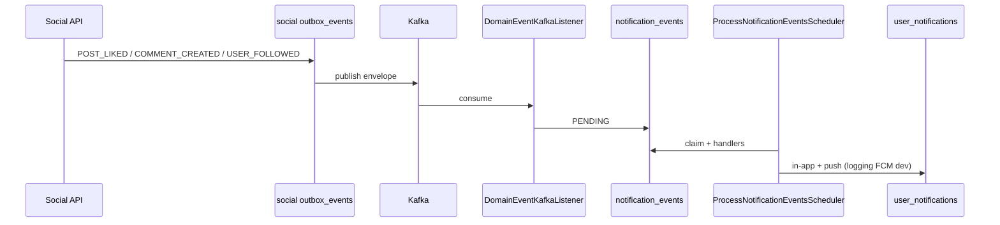

# Kafka — Hạng mục 4A: Social → Notification (engagement in-app + push)

Tài liệu mô tả luồng **Social publish engagement events → Notification consume + process → in-app notification + push** trên local (MVP 3 topic). Phụ thuộc:

- [Hạng mục 0 — broker](kafka_section_0.md) (`localhost:9092`, UI http://localhost:8080)
- [Hạng mục 1 — outbox publisher](kafka_section_1.md) (`KafkaOutboxEventPublisher` cho auth + social)
- [Hạng mục 2](kafka_section_2.md) (`NOTIFICATION_KAFKA_CONSUMER_ENABLED`, `NOTIFICATION_PROCESS_EVENTS_ENABLED`)
- [Hạng mục 3](kafka_section_3.md) (`user_projections` Mongo — `UserWriteGuard` trước like/comment/follow)

**Phạm vi:** 4A document + `.env.example`; **4B** social outbox payload + unit tests (mục [4. Event contract](#4-event-contract-payload-fr)).

**Out of scope 4A:** `social.comment.replied`, `social.comment.liked`, commerce, admin topics.

---

## 1. Mục tiêu & bảng topic (MVP)

| Kafka topic | `event_type` | Social trigger (use case) | Notification |
|-------------|--------------|---------------------------|--------------|
| `social.post.liked` | `POST_LIKED` | `POST /api/v1/social/posts/{postId}/like` — **like mới** (không unlike) | In-app + push cho post author |
| `social.comment.created` | `COMMENT_CREATED` | `POST /api/v1/social/posts/{postId}/comments` | In-app + push cho post author |
| `social.user.followed` | `USER_FOLLOWED` | `POST /api/v1/social/users/{userId}/follow` — follow mới | In-app + push cho followee |

Default channels (`NotificationDefaultChannelPolicy`): `POST_LIKED`, `COMMENT_CREATED`, `USER_FOLLOWED` → **in-app + push**, **không email**.

---

## 2. Luồng end-to-end

```text
Social API (like / comment / follow)
  → use case transaction
  → INSERT social outbox_events (PENDING)
  → commit

OutboxPublishScheduler (SOCIAL_OUTBOX_PUBLISH_ENABLED=true)
  → PublishSocialEventsUseCase
  → KafkaOutboxEventPublisher
  → topic social.post.liked | social.comment.created | social.user.followed

Notification DomainEventKafkaListener (NOTIFICATION_KAFKA_CONSUMER_ENABLED=true)
  → DomainEventMessageParser + DomainEventTopicResolver
  → ConsumeDomainEventUseCase
  → INSERT notification_events (PENDING, idempotent source_event_id)

ProcessNotificationEventsScheduler (NOTIFICATION_PROCESS_EVENTS_ENABLED=true, cron ~30s)
  → ProcessNotificationEventUseCase
  → Dedicated handlers (Order 29–31):
       PostLikedNotificationEventHandler
       CommentCreatedNotificationEventHandler
       UserFollowedNotificationEventHandler
  → CreateInAppNotificationUseCase → user_notifications
  → SendPushNotificationUseCase (PushNotificationEventHandler @Order 55)
       dev: LoggingFcmPushNotificationProvider when NOTIFICATION_FCM_ENABLED=false
```



---

## 3. Notification handlers (đã implement)

| `event_type` | Handler | `@Order` | Ghi chú |
|--------------|---------|----------|---------|
| `POST_LIKED` | `PostLikedNotificationEventHandler` | 29 | Parser: `PostLikedNotificationPayloadParser` |
| `COMMENT_CREATED` | `CommentCreatedNotificationEventHandler` | 31 | Parser: `CommentCreatedNotificationPayloadParser` |
| `USER_FOLLOWED` | `UserFollowedNotificationEventHandler` | 30 | Parser: `UserFollowedNotificationPayloadParser` |

Channel mặc định (`NotificationDefaultChannelPolicy`):

| `event_type` | in-app | push | email |
|--------------|--------|------|-------|
| `POST_LIKED` | ✓ | ✓ | ✗ |
| `COMMENT_CREATED` | ✓ | ✓ | ✗ |
| `USER_FOLLOWED` | ✓ | ✓ | ✗ |

Handlers chuyên biệt chạy **trước** generic `InAppSocialNotificationEventHandler` (`@Order(100)`).

---

## 4. Event contract (payload FR)

Tham chiếu:

- `docs/feature_requirements/notification/FR_HandlePostLikedNotification.md`
- `docs/feature_requirements/notification/FR_HandleCommentCreatedNotification.md`
- `docs/feature_requirements/notification/FR_HandleUserFollowedNotification.md`
- `docs/feature_requirements/social/FR_PublishSocialEvents.md`
- `docs/api_fe_behavior/social_api_fe_behavior/PublishSocialEvents-api-and-behavior.md`

### Payload bắt buộc (snake_case, sau envelope)

| `event_type` | Fields bắt buộc (FR / notification parsers) |
|--------------|---------------------------------------------|
| `POST_LIKED` | `post_id`, `actor_id` (liker), `post_author_id` (recipient) |
| `COMMENT_CREATED` | `comment_id`, `post_id`, `actor_id` (commenter), `post_author_id` |
| `USER_FOLLOWED` | `actor_id` (follower), `followed_user_id` (followee) |

### Envelope (Kafka value — sau `SocialOutboxMessageBuilder`)

`SocialOutboxMessageBuilder` đặt ở **root envelope** (không nằm trong `payload`):

- `actor_id` — từ `payload.actor_id`
- `recipient_user_ids` — `[post_author_id]` hoặc `[followed_user_id]` (giúp `ConsumeDomainEvent` resolve recipient sớm)

Quy ước: **omit null** — không gửi key có giá trị `null`. Field legacy (`user_id`, `author_id`, `follower_id`, `followee_id`) giữ backward-compat khi có giá trị.

### Ví dụ payload (4B — trong `payload` của envelope)

**POST_LIKED** (`social.post.liked`) — chỉ khi **like mới**; **unlike không publish**.

```json
{
  "event_id": "550e8400-e29b-41d4-a716-446655440000",
  "event_type": "POST_LIKED",
  "occurred_at": "2026-06-04T10:00:00Z",
  "actor_id": "11111111-1111-1111-1111-111111111111",
  "recipient_user_ids": ["22222222-2222-2222-2222-222222222222"],
  "aggregate_type": "POST",
  "aggregate_id": "aaaaaaaa-aaaa-aaaa-aaaa-aaaaaaaaaaaa",
  "payload": {
    "post_id": "aaaaaaaa-aaaa-aaaa-aaaa-aaaaaaaaaaaa",
    "actor_id": "11111111-1111-1111-1111-111111111111",
    "post_author_id": "22222222-2222-2222-2222-222222222222",
    "user_id": "11111111-1111-1111-1111-111111111111"
  }
}
```

`user_id` = liker (deprecated alias của `actor_id`). Recipient = `post_author_id`.

**COMMENT_CREATED** (`social.comment.created`) — comment mới và reply đều dùng topic này (MVP: notify post author).

```json
{
  "event_type": "COMMENT_CREATED",
  "actor_id": "11111111-1111-1111-1111-111111111111",
  "recipient_user_ids": ["22222222-2222-2222-2222-222222222222"],
  "payload": {
    "comment_id": "bbbbbbbb-bbbb-bbbb-bbbb-bbbbbbbbbbbb",
    "post_id": "aaaaaaaa-aaaa-aaaa-aaaa-aaaaaaaaaaaa",
    "actor_id": "11111111-1111-1111-1111-111111111111",
    "post_author_id": "22222222-2222-2222-2222-222222222222",
    "author_id": "11111111-1111-1111-1111-111111111111"
  }
}
```

**USER_FOLLOWED** (`social.user.followed`)

```json
{
  "event_type": "USER_FOLLOWED",
  "actor_id": "11111111-1111-1111-1111-111111111111",
  "recipient_user_ids": ["22222222-2222-2222-2222-222222222222"],
  "payload": {
    "actor_id": "11111111-1111-1111-1111-111111111111",
    "followed_user_id": "22222222-2222-2222-2222-222222222222",
    "follower_id": "11111111-1111-1111-1111-111111111111",
    "followee_id": "22222222-2222-2222-2222-222222222222",
    "status": "ACCEPTED"
  }
}
```

**Business note:** `FollowUserUseCase` vẫn emit khi `FollowStatus.PENDING` (private account). Payload có `status`; notification handler không block PENDING trong 4B.

### Self-skip (notification handlers)

Khi `actor_id` == recipient (`post_author_id` / `followed_user_id`), handler **không** tạo in-app/push (like own post, comment own post, follow self — nếu API cho phép).

### Parser fallback (notification — safety net)

| Parser | Fallback |
|--------|----------|
| `PostLikedNotificationPayloadParser` | `actor_id` ← `user_id` |
| `CommentCreatedNotificationPayloadParser` | `actor_id` ← `author_id` |
| `UserFollowedNotificationPayloadParser` | `actor_id` ← `follower_id`; `followed_user_id` ← `followee_id` |

Ưu tiên payload chuẩn từ social; fallback chỉ cho message cũ trên topic.

---

## 5. Biến môi trường

### Social (`Services/social-service/.env` — copy từ `.env.example`)

| Biến | Gợi ý dev (4A) | Vai trò |
|------|----------------|---------|
| `KAFKA_BOOTSTRAP_SERVERS` | `localhost:9092` | Broker |
| `SOCIAL_KAFKA_PRODUCER_ENABLED` | `true` | Bật `KafkaOutboxEventPublisher` |
| `SOCIAL_OUTBOX_PUBLISH_ENABLED` | `true` | Scheduler publish outbox |
| `SOCIAL_OUTBOX_RETRY_ENABLED` | `true` | Retry outbox FAILED (khuyến nghị dev) |
| `SOCIAL_KAFKA_CONSUMER_ENABLED` | `true` / `false` | **Mục 3** — auth projection; có thể `true` song song mục 4 |

### Notification (reference — `Services/notification-service/.env.example`, mục 2)

| Biến | Gợi ý dev |
|------|-----------|
| `NOTIFICATION_KAFKA_CONSUMER_ENABLED` | `true` |
| `NOTIFICATION_KAFKA_BOOTSTRAP_SERVERS` | `localhost:9092` |
| `NOTIFICATION_PROCESS_EVENTS_ENABLED` | `true` |
| `NOTIFICATION_RETRY_EVENTS_ENABLED` | `true` |
| `NOTIFICATION_FCM_ENABLED` | `false` |

Push dev: `LoggingFcmPushNotificationProvider` — log push, không cần FCM credentials.

Email (mục 2) độc lập — engagement MVP **không** dùng email channel.

### Auth (reference)

Giữ publish (mục 1) nếu test user mới / projection (mục 3).

---

## 6. Class / file tham chiếu — Social

| Thành phần | File |
|------------|------|
| Outbox POST_LIKED | `Services/social-service/.../post/common/PostLikedOutboxService.java` |
| Outbox COMMENT_CREATED | `Services/social-service/.../comment/common/CommentCreatedOutboxService.java` |
| Outbox USER_FOLLOWED | `Services/social-service/.../user/common/UserFollowedOutboxService.java` |
| Like | `Services/social-service/.../post/likeunlikepost/LikeUnlikePostUseCase.java` |
| Comment | `Services/social-service/.../comment/commentpost/CommentPostUseCase.java` |
| Follow | `Services/social-service/.../user/followuser/FollowUserUseCase.java` |
| Topic map | `Services/social-service/.../infrastructure/outbox/SocialOutboxTopicResolver.java` |
| Envelope | `Services/social-service/.../infrastructure/outbox/SocialOutboxMessageBuilder.java` |
| Publisher | `Services/social-service/.../infrastructure/outbox/KafkaOutboxEventPublisher.java` |
| Scheduler | `Services/social-service/.../application/outbox/PublishSocialEventsUseCase.java`, `OutboxPublishScheduler.java` |

---

## 7. Class / file tham chiếu — Notification

| Thành phần | File |
|------------|------|
| Kafka listener | `Services/notification-service/.../infrastructure/messaging/kafka/DomainEventKafkaListener.java` |
| Topic → event type | `Services/notification-service/.../application/consume/DomainEventTopicResolver.java` |
| Ingest parser | `Services/notification-service/.../application/consume/DomainEventMessageParser.java` |
| Ingest use case | `Services/notification-service/.../application/consume/ConsumeDomainEventUseCase.java` |
| Process scheduler | `Services/notification-service/.../infrastructure/scheduler/ProcessNotificationEventsScheduler.java` |
| Process use case | `Services/notification-service/.../application/worker/ProcessNotificationEventUseCase.java` |
| In-app | `Services/notification-service/.../application/inapp/CreateInAppNotificationUseCase.java` |
| Push | `Services/notification-service/.../application/push/SendPushNotificationUseCase.java` |
| Push provider (dev) | `Services/notification-service/.../infrastructure/push/LoggingFcmPushNotificationProvider.java` |

---

## 8. API & SQL (4C)

| Service | Base URL |
|---------|----------|
| Auth | http://localhost:3001 |
| Social | http://localhost:3002 |
| Notification | http://localhost:3005 |

**Social (JWT actor):**

| Action | Method / path |
|--------|----------------|
| Create post | `POST /api/v1/social/posts` |
| Like post | `POST /api/v1/social/posts/{postId}/like` |
| Comment | `POST /api/v1/social/posts/{postId}/comments` |
| Follow | `POST /api/v1/social/users/{userId}/follow` |

**Notification (JWT recipient):**

| Action | Method / path |
|--------|----------------|
| List in-app | `GET /api/v1/notification/notifications` |
| Register device (push test) | `POST /api/v1/notification/device-tokens` — body: `deviceType`, `deviceToken` |

**SQL notification DB:**

```sql
SELECT event_type, status, recipient_user_id, actor_id, last_error
FROM notification_events
WHERE event_type IN ('POST_LIKED', 'COMMENT_CREATED', 'USER_FOLLOWED')
ORDER BY created_at DESC
LIMIT 10;

SELECT type, title, reference_type, reference_id
FROM user_notifications
WHERE user_id = '<recipient-uuid-A>'
ORDER BY created_at DESC
LIMIT 10;
```

**SQL social DB (optional):**

```sql
SELECT event_type, status, created_at
FROM outbox_events
ORDER BY created_at DESC
LIMIT 10;
```

Kỳ vọng sau **4B+4C**: `notification_events.status = COMPLETED`, `recipient_user_id` = post author / followee; in-app rows cho recipient.

---

## 9. Verify 4C (manual checklist)

### Chuẩn bị infra

```bash
cd Infrastructure
docker compose up -d kafka kafka-ui postgres-social postgres-notification mongodb redis postgres-auth mailhog
```

### Env runtime (copy vào `.env` local — **không commit**)

**`Services/social-service/.env`**

| Biến | Giá trị dev |
|------|-------------|
| `KAFKA_BOOTSTRAP_SERVERS` | `localhost:9092` |
| `SOCIAL_KAFKA_PRODUCER_ENABLED` | `true` |
| `SOCIAL_OUTBOX_PUBLISH_ENABLED` | `true` |
| `SOCIAL_OUTBOX_RETRY_ENABLED` | `true` |
| `SOCIAL_KAFKA_CONSUMER_ENABLED` | `true` (mục 3 projection) |
| `JWT_ACCESS_SECRET` / `JWT_REFRESH_SECRET` | **Cùng giá trị với auth-service** |

**`Services/notification-service/.env`** (mục 2 + 4)

| Biến | Giá trị dev |
|------|-------------|
| `NOTIFICATION_KAFKA_CONSUMER_ENABLED` | `true` |
| `NOTIFICATION_KAFKA_BOOTSTRAP_SERVERS` | `localhost:9092` |
| `NOTIFICATION_PROCESS_EVENTS_ENABLED` | `true` |
| `NOTIFICATION_RETRY_EVENTS_ENABLED` | `true` |
| `NOTIFICATION_FCM_ENABLED` | `false` (→ `LoggingFcmPushNotificationProvider`) |
| `JWT_ACCESS_SECRET` / `JWT_REFRESH_SECRET` | **Cùng auth** |

**`Services/auth-service/.env`**

| Biến | Giá trị dev |
|------|-------------|
| `AUTH_KAFKA_PRODUCER_ENABLED` | `true` |
| `AUTH_OUTBOX_PUBLISH_ENABLED` | `true` |

### Chạy services

```bash
cd Services/auth-service && ./gradlew bootRun      # :3001
cd Services/social-service && ./gradlew bootRun    # :3002
cd Services/notification-service && ./gradlew bootRun  # :3005
```

PowerShell (một lần nếu `.env` social chưa bật outbox / JWT lệch):

```powershell
$env:JWT_ACCESS_SECRET="<same-as-auth>"
$env:JWT_REFRESH_SECRET="<same-as-auth>"
$env:SOCIAL_KAFKA_PRODUCER_ENABLED="true"
$env:SOCIAL_OUTBOX_PUBLISH_ENABLED="true"
cd Services/social-service; ./gradlew bootRun
```

### Dữ liệu test

| User | Vai trò |
|------|---------|
| **A** | Chủ bài / followee (recipient) |
| **B** | Liker / commenter / follower (actor) |

Cả hai: register + verify OTP (`ACTIVE`), Mongo `user_projections.status = ACTIVE` (mục 3).

1. Register + verify (auth) — OTP từ `auth_db.outbox_events` (`EMAIL_VERIFICATION_REQUESTED.verification_code`) hoặc MailHog.
2. **A** tạo post: `POST /api/v1/social/posts` — body tối thiểu `{ "caption": "...", "visibility": "PUBLIC", "allowComments": true, "publish": true }`.

### Checklist

| # | Kịch bản | Thao tác | Kỳ vọng |
|---|----------|----------|---------|
| **1** | POST_LIKED | **B** like post của **A** | Kafka `social.post.liked` — `post_author_id`=A, `actor_id`=B; `notification_events` COMPLETED; in-app + API cho A |
| **2** | Self-like skip | **A** like post của **A** | Outbox có thể có `POST_LIKED`; ingest/handler skip — **không** thêm `user_notifications` POST_LIKED mới cho A |
| **3** | COMMENT_CREATED | **B** comment `{ "contentText": "hello" }` | Topic `social.comment.created`; in-app COMMENT_CREATED cho A |
| **4** | USER_FOLLOWED | **B** `POST .../users/{uuid-A}/follow` | Topic `social.user.followed`; `followed_user_id`=A; in-app USER_FOLLOWED cho A |
| **5** | Push (optional) | **A** register device; lặp Test 1 | Log: `FCM provider accepted push messageId=...` (`NOTIFICATION_FCM_ENABLED=false`) |

**Unlike:** `POST .../like` lần 2 (toggle) — **không** publish `POST_LIKED` mới.

Chờ scheduler notification ~30–60s sau mỗi đợt action (hoặc poll SQL).

### Kết quả smoke 4C (2026-06-04, local)

| Test | Kết quả | Ghi chú |
|------|---------|---------|
| 1 POST_LIKED | **PASS** | `recipient_user_id` = A; 1 row `user_notifications` POST_LIKED; API `GET /notifications` có item |
| 2 Self-like skip | **PASS** | 2 row social `outbox_events` POST_LIKED; 1 `notification_events` + 1 in-app POST_LIKED (B→A) |
| 3 COMMENT_CREATED | **PASS** | COMPLETED; in-app cho A |
| 4 USER_FOLLOWED | **PASS** | Sau fix PG enum `follows.status`; COMPLETED + in-app |
| 5 Push log | **Partial** | Device token API 200; log `FCM provider accepted` chưa grep thấy trong smoke ngắn — kiểm tra settings push + device token active |

**Sửa bug phát hiện khi smoke (4C):**

| Vùng | Vấn đề | Fix |
|------|--------|-----|
| Social | `outbox_status` enum vs JDBC string | `OutboxEventRepositoryAdapter` + `JdbcSqlDialect` CAST |
| Social | `follow_status` enum (follow API 500) | `FollowEntity` `@JdbcTypeCode(NAMED_ENUM)` |
| Notification | `recipient_user_ids` sau `user_id` → recipient sai | `DomainEventMessageParser` ưu tiên array + `post_author_id` |
| Notification | `notification_delivery_status` enum (in-app 500) | `UserNotificationEntity` `@JdbcTypeCode(NAMED_ENUM)` |

---

## 10. Troubleshooting (4C)

| Triệu chứng | Kiểm tra |
|-------------|----------|
| Social API **401** | `JWT_ACCESS_SECRET` social/notification **khớp auth** |
| Không có Kafka message | `SOCIAL_OUTBOX_PUBLISH_ENABLED=true`; restart social; `outbox_events.status` → `PUBLISHED` |
| Social API **500** like/comment/follow | Log SQL enum (`outbox_status`, `follow_status`); Flyway đã chạy |
| `notification_events` không có row | `NOTIFICATION_KAFKA_CONSUMER_ENABLED`; bootstrap `localhost:9092` |
| `recipient_user_id` = liker (sai) | Payload 4B + parser: `recipient_user_ids` / `post_author_id` trước `user_id` |
| FAILED `post_author_id required` | Social chưa deploy 4B / chưa restart |
| FAILED `actor id required` | Thiếu `actor_id` trong payload |
| `PENDING` / `PROCESSING` mãi | `NOTIFICATION_PROCESS_EVENTS_ENABLED=true`; event `PROCESSING` kẹt sau crash → `UPDATE ... SET status='PENDING'` (dev) hoặc restart + retry |
| Social **403** | Mongo `user_projections`: A,B `ACTIVE` (mục 3) |
| Duplicate in-app | Idempotent `uq_user_notifications_event_recipient_reference` — replay cùng `event_id` |
| Không thấy push log | `NOTIFICATION_FCM_ENABLED=false`; device token đăng ký trước khi xử lý event; user notification settings bật push |

---

## 11. Việc chưa làm (sau 4C)

| Hạng mục | Nội dung |
|----------|----------|
| Enhancement | `actor_display_name` trong payload |
| FCM prod | `NOTIFICATION_FCM_ENABLED=true` + credentials |
| Reply | Topic/handler riêng `COMMENT_REPLIED` (hiện comment reply có thể map `COMMENT_CREATED` + `parent_comment_id`) |
| Follow private | Hiện emit `USER_FOLLOWED` cả `FollowStatus.PENDING` — notification có thể tới followee trước ACCEPTED; document / chỉnh ở 4B+ |
| Aggregation | "3 người đã thích" — chưa có |

---

## Liên kết

- [kafka_section_0.md](kafka_section_0.md)
- [kafka_section_1.md](kafka_section_1.md)
- [kafka_section_2.md](kafka_section_2.md)
- [kafka_section_3.md](kafka_section_3.md)
- [ConsumeDomainEvent-internal-and-behavior.md](../api_fe_behavior/notification_api_fe_behavior/ConsumeDomainEvent-internal-and-behavior.md)
- [PublishSocialEvents-api-and-behavior.md](../api_fe_behavior/social_api_fe_behavior/PublishSocialEvents-api-and-behavior.md)
