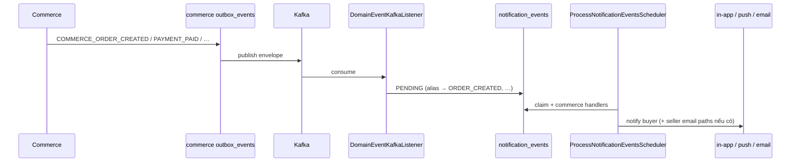

# Kafka — Hạng mục 5: Commerce → Notification (đơn hàng / thanh toán / vận chuyển)

Tài liệu mô tả luồng **Commerce publish order/payment/shipment events → Notification consume + process → in-app / push / email** trên local (MVP 7 topic). Phụ thuộc:

- [Hạng mục 0 — broker](kafka_section_0.md) (`localhost:9092`, UI http://localhost:8080)
- [Hạng mục 1 — outbox publisher](kafka_section_1.md) (`KafkaOutboxEventPublisher` cho auth, social, commerce)
- [Hạng mục 2](kafka_section_2.md) (`NOTIFICATION_KAFKA_CONSUMER_ENABLED`, `NOTIFICATION_PROCESS_EVENTS_ENABLED`, email SMTP tùy chọn)

**Phạm vi 5A:** document + `commerce-service/.env.example` — **không** sửa Java.

**Phạm vi 5B (đã implement):** enrich outbox payload (`buyer_id`, `seller_ids`, `order_code`, …); PayOS webhook success → mark PAID + `COMMERCE_PAYMENT_PAID`.

**Phạm vi 5C (đã implement):** Hướng A — publish riêng `COMMERCE_SHIPMENT_SHIPPED` / `COMMERCE_SHIPMENT_DELIVERED` song song `COMMERCE_SHIPMENT_STATUS_CHANGED`.

**Phạm vi 5D (doc):** manual E2E checklist + troubleshooting trên local — mục **§12–§13** (không commit `.env`).

**Out of scope 5A:** catalog/shop/product/review outbox (20+ topic trong `CommerceOutboxTopicResolver`), FCM production, email template line-items đẹp.

---

## 1. Mục tiêu & bảng topic (MVP)

Notification **đã subscribe** các topic sau (`DomainEventTopicResolver` + `NotificationKafkaConsumerProperties`).

| Kafka topic | Commerce `event_type` | Canonical (`NotificationEventTypeAliasResolver`) | Kênh mặc định (`NotificationDefaultChannelPolicy`) |
|-------------|----------------------|---------------------------------------------------|------------------------------------------------------|
| `commerce.order.created` | `COMMERCE_ORDER_CREATED` | `ORDER_CREATED` | in-app + push + **email** |
| `commerce.payment.paid` | `COMMERCE_PAYMENT_PAID` | `PAYMENT_SUCCESS` | in-app + push + **email** |
| `commerce.payment.failed` | `COMMERCE_PAYMENT_FAILED` | `PAYMENT_FAILED` | in-app + push |
| `commerce.shipment.created` | `COMMERCE_SHIPMENT_CREATED` | `SHIPMENT_CREATED` | in-app only |
| `commerce.shipment.shipped` | `COMMERCE_SHIPMENT_SHIPPED` | `SHIPMENT_SHIPPED` | in-app + push |
| `commerce.shipment.delivered` | `COMMERCE_SHIPMENT_DELIVERED` | `SHIPMENT_DELIVERED` | in-app + push |
| `commerce.order.completed` | `COMMERCE_ORDER_COMPLETED` | `ORDER_COMPLETED` | in-app + push |

**Không nằm MVP consumer doc này (commerce vẫn publish cho audit / service khác):** `commerce.shipment.status_changed`, `commerce.payment.created`, product/shop/review topics, v.v.

---

## 2. Luồng end-to-end

```text
Commerce API / webhook / scheduler
  → use case transaction (CreateOrder, HandlePaymentFailure, GHN webhook, …)
  → INSERT commerce outbox_events (PENDING)
  → commit

OutboxPublishScheduler (COMMERCE_OUTBOX_PUBLISH_ENABLED=true)
  → PublishCommerceEventsUseCase
  → KafkaOutboxEventPublisher + CommerceOutboxMessageBuilder
  → topic commerce.order.created | commerce.payment.paid | …

Notification DomainEventKafkaListener (NOTIFICATION_KAFKA_CONSUMER_ENABLED=true)
  → DomainEventMessageParser (buyer_id / recipient resolution)
  → NotificationEventTypeAliasResolver (COMMERCE_* → canonical)
  → ConsumeDomainEventUseCase
  → INSERT notification_events (PENDING, idempotent source_event_id)

ProcessNotificationEventsScheduler (NOTIFICATION_PROCESS_EVENTS_ENABLED=true, cron ~30s)
  → ProcessNotificationEventUseCase
  → Dedicated handlers (@Order 34–42):
       OrderCreated, PaymentSuccess, PaymentFailed,
       ShipmentCreated, ShipmentShipped, ShipmentDelivered,
       OrderCompleted (+ email handlers @Order 35, 37 where applicable)
  → user_notifications + SendPushNotificationUseCase
  → SendEmailNotificationUseCase (mục 2B, MailHog dev)
```



---

## 3. Alias event type

`NotificationEventTypeAliasResolver` map type từ envelope Commerce sang type handler Notification:

| Commerce `event_type` | Canonical (handler / policy) |
|----------------------|------------------------------|
| `COMMERCE_ORDER_CREATED` | `ORDER_CREATED` |
| `COMMERCE_PAYMENT_PAID` | `PAYMENT_SUCCESS` |
| `COMMERCE_PAYMENT_FAILED` | `PAYMENT_FAILED` |
| `COMMERCE_SHIPMENT_CREATED` | `SHIPMENT_CREATED` |
| `COMMERCE_SHIPMENT_SHIPPED` | `SHIPMENT_SHIPPED` |
| `COMMERCE_SHIPMENT_DELIVERED` | `SHIPMENT_DELIVERED` |
| `COMMERCE_ORDER_COMPLETED` | `ORDER_COMPLETED` |

Ingest vẫn lưu payload JSON gốc; alias chỉ áp dụng khi chọn handler và channel policy.

---

## 4. Shipment — quyết định kiến trúc (Hướng A, MVP doc)

| Thành phần | Hành vi |
|------------|---------|
| **Audit / tương lai** | Commerce tiếp tục publish `COMMERCE_SHIPMENT_STATUS_CHANGED` → `commerce.shipment.status_changed` (`ShipmentStatusChangedOutboxService`) khi status đổi (GHN webhook, seller update). |
| **Notification MVP** | **Không** consume `status_changed`. Khi `new_status` = `SHIPPED` / `DELIVERED`, Commerce **thêm** publish riêng `COMMERCE_SHIPMENT_SHIPPED` / `COMMERCE_SHIPMENT_DELIVERED` → topic notification đã listen. |
| **Out of scope doc** | Hướng B: notification subscribe `commerce.shipment.status_changed` và map trong consumer — **không** dùng trong MVP. |

**Trạng thái code (5C):** `CommerceOutboxTopicResolver` map `COMMERCE_SHIPMENT_SHIPPED` → `commerce.shipment.shipped`, `COMMERCE_SHIPMENT_DELIVERED` → `commerce.shipment.delivered`. Emit từ `ProcessGhnWebhookUseCase` và `UpdateSellerShipmentTransactionService` khi transition thực sự tới `SHIPPED` / `DELIVERED` (idempotent replay không emit lại).

### Lifecycle publish (Hướng A)

```text
GHN webhook / seller PATCH status
  → UPDATE shipments + status_history
  → COMMERCE_SHIPMENT_STATUS_CHANGED  (audit — luôn khi status đổi)
  → IF new_status == SHIPPED  → COMMERCE_SHIPMENT_SHIPPED
  → IF new_status == DELIVERED → COMMERCE_SHIPMENT_DELIVERED
```

| `ShipmentStatus` mới (sau transition) | Outbox notification (5C) | Kafka topic |
|--------------------------------------|--------------------------|-------------|
| `SHIPPED` | `COMMERCE_SHIPMENT_SHIPPED` | `commerce.shipment.shipped` |
| `DELIVERED` | `COMMERCE_SHIPMENT_DELIVERED` | `commerce.shipment.delivered` |
| Khác (`READY_TO_SHIP`, `PICKING_UP`, …) | Chỉ `COMMERCE_SHIPMENT_STATUS_CHANGED` | `commerce.shipment.status_changed` |

`buyer_id` load từ `orders.buyer_id` qua `OrderBuyerRepository` (cache theo `order_id` trong cùng emit). `tracking_code` = `tracking_number` hoặc `ghn_order_code` (sanitize giống notification).

---

## 5. Event contract (payload FR)

Tham chiếu FR:

- [FR_HandleOrderCreatedNotification.md](../feature_requirements/notification/FR_HandleOrderCreatedNotification.md)
- [FR_HandlePaymentSuccessNotification.md](../feature_requirements/notification/FR_HandlePaymentSuccessNotification.md)
- [FR_HandlePaymentFailedNotification.md](../feature_requirements/notification/FR_HandlePaymentFailedNotification.md)
- [FR_HandleShipmentCreatedNotification.md](../feature_requirements/notification/FR_HandleShipmentCreatedNotification.md)
- [FR_HandleShipmentShippedNotification.md](../feature_requirements/notification/FR_HandleShipmentShippedNotification.md)
- [FR_HandleShipmentDeliveredNotification.md](../feature_requirements/notification/FR_HandleShipmentDeliveredNotification.md)
- [FR_HandleOrderCompletedNotification.md](../feature_requirements/notification/FR_HandleOrderCompletedNotification.md)

### Payload bắt buộc (FR — canonical sau alias)

| Canonical | Fields bắt buộc (notification parsers / FR) |
|-----------|-----------------------------------------------|
| `ORDER_CREATED` | `order_id`, `buyer_id`; `seller_ids[]` cho notify seller; `order_code` optional |
| `PAYMENT_SUCCESS` | `buyer_id`, `payment_id` hoặc `order_id`; `order_code` optional |
| `PAYMENT_FAILED` | `buyer_id`, `payment_id` và/hoặc `order_id` |
| `SHIPMENT_CREATED` | `buyer_id`, `shipment_id`, `order_id`; `seller_id` optional; `tracking_code` optional |
| `SHIPMENT_SHIPPED` / `SHIPMENT_DELIVERED` | `buyer_id`, `shipment_id`, `order_id`; `tracking_code` optional |
| `ORDER_COMPLETED` | `buyer_id`, `order_id` |

`CommerceOutboxMessageBuilder` set `recipient_user_ids: [buyer_id]` khi payload có `buyer_id`. `DomainEventMessageParser` vẫn fallback `buyer_id` trong payload nếu envelope thiếu recipient.

### Payload commerce (sau 5B)

| Canonical | `event_type` | Fields chính trong payload JSON |
|-----------|--------------|----------------------------------|
| `ORDER_CREATED` | `COMMERCE_ORDER_CREATED` | `order_id`, `buyer_id`, `order_code`, `seller_ids[]` (nếu có), `final_amount`, `payment_method`, `created_at` |
| `PAYMENT_SUCCESS` | `COMMERCE_PAYMENT_PAID` | `payment_id`, `order_id`, `buyer_id`, `order_code`, `reason`, `paid_at` |
| `PAYMENT_FAILED` | `COMMERCE_PAYMENT_FAILED` | `payment_id`, `order_id`, `buyer_id`, `order_code`, `reason`, `failed_at` |
| `SHIPMENT_CREATED` | `COMMERCE_SHIPMENT_CREATED` | `shipment_id`, `order_id`, `buyer_id`, `seller_id`, `carrier`, `order_item_ids`, `created_at`; `tracking_code` optional |
| `SHIPMENT_SHIPPED` | `COMMERCE_SHIPMENT_SHIPPED` | `shipment_id`, `order_id`, `buyer_id`, `seller_id`, `shipped_at`; `tracking_code` optional |
| `SHIPMENT_DELIVERED` | `COMMERCE_SHIPMENT_DELIVERED` | `shipment_id`, `order_id`, `buyer_id`, `seller_id`, `delivered_at`; `tracking_code` optional |
| `ORDER_COMPLETED` | `COMMERCE_ORDER_COMPLETED` | `order_id`, `buyer_id`, `order_code`, `reason`, `completed_at`, `completed_by` |

### PayOS success (5B)

`ProcessPayosWebhookUseCase` (`code=00`): trong transaction — mark payment `PAID`, order `AWAITING_PAYMENT` → `PROCESSING` + `payment_status=PAID`, ghi `COMMERCE_PAYMENT_PAID` outbox (idempotent nếu đã PAID).

### Ví dụ payload JSON (snake_case)

`COMMERCE_ORDER_CREATED`:

```json
{
  "order_id": "550e8400-e29b-41d4-a716-446655440000",
  "buyer_id": "660e8400-e29b-41d4-a716-446655440001",
  "order_code": "550e8400-e29b-41d4-a716-446655440000",
  "seller_ids": ["770e8400-e29b-41d4-a716-446655440002"],
  "final_amount": 1000000,
  "payment_method": "PAYOS",
  "created_at": "2026-06-04T10:00:00Z"
}
```

`COMMERCE_PAYMENT_PAID`:

```json
{
  "payment_id": "880e8400-e29b-41d4-a716-446655440003",
  "order_id": "550e8400-e29b-41d4-a716-446655440000",
  "buyer_id": "660e8400-e29b-41d4-a716-446655440001",
  "order_code": "550e8400-e29b-41d4-a716-446655440000",
  "reason": "PAYOS_WEBHOOK_PAID",
  "paid_at": "2026-06-04T10:05:00Z"
}
```

`COMMERCE_SHIPMENT_SHIPPED`:

```json
{
  "shipment_id": "aa0e8400-e29b-41d4-a716-446655440010",
  "order_id": "550e8400-e29b-41d4-a716-446655440000",
  "buyer_id": "660e8400-e29b-41d4-a716-446655440001",
  "seller_id": "770e8400-e29b-41d4-a716-446655440002",
  "tracking_code": "GHN-TRK-001",
  "shipped_at": "2026-06-04T11:00:00Z"
}
```

`COMMERCE_SHIPMENT_DELIVERED`:

```json
{
  "shipment_id": "aa0e8400-e29b-41d4-a716-446655440010",
  "order_id": "550e8400-e29b-41d4-a716-446655440000",
  "buyer_id": "660e8400-e29b-41d4-a716-446655440001",
  "seller_id": "770e8400-e29b-41d4-a716-446655440002",
  "delivered_at": "2026-06-04T12:00:00Z"
}
```

---

## 6. Notification handlers (đã implement)

| Canonical | Handler | `@Order` | Parser / ghi chú |
|-----------|---------|----------|------------------|
| `ORDER_CREATED` | `OrderCreatedNotificationEventHandler` | 34 | `OrderCreatedNotificationPayloadParser` |
| `ORDER_CREATED` (email) | `OrderConfirmationNotificationEventHandler` | 35 | Email xác nhận đơn |
| `PAYMENT_SUCCESS` | `PaymentSuccessNotificationEventHandler` | 36 | `PaymentSuccessNotificationPayloadParser` |
| `PAYMENT_SUCCESS` (email) | `PaymentSuccessEmailNotificationEventHandler` | 37 | |
| `PAYMENT_FAILED` | `PaymentFailedNotificationEventHandler` | 38 | |
| `SHIPMENT_CREATED` | `ShipmentCreatedNotificationEventHandler` | 39 | `ShipmentCreatedNotificationPayloadParser` |
| `SHIPMENT_SHIPPED` | `ShipmentShippedNotificationEventHandler` | 40 | + `CommerceShipmentNotificationPayloadNormalizer` |
| `SHIPMENT_DELIVERED` | `ShipmentDeliveredNotificationEventHandler` | 41 | + normalizer |
| `ORDER_COMPLETED` | `OrderCompletedNotificationEventHandler` | 42 | |

Push dev: `LoggingFcmPushNotificationProvider` khi `NOTIFICATION_FCM_ENABLED=false`.

---

## 7. Biến môi trường

### Commerce (`Services/commerce-service/.env` — copy từ `.env.example`)

| Biến | Gợi ý dev (5A) | Vai trò |
|------|----------------|---------|
| `KAFKA_BOOTSTRAP_SERVERS` | `localhost:9092` | Broker |
| `COMMERCE_KAFKA_PRODUCER_ENABLED` | `true` | Bật `KafkaOutboxEventPublisher` |
| `COMMERCE_OUTBOX_PUBLISH_ENABLED` | `true` | Scheduler publish outbox |
| `COMMERCE_OUTBOX_RETRY_ENABLED` | `true` | Retry outbox FAILED (khuyến nghị dev) |
| `COMMERCE_AUTO_COMPLETE_DELIVERED_ORDER_ENABLED` | `true` (Test 6) | Scheduler auto-complete đơn delivered (tùy chọn) |
| `COMMERCE_PAYOS_ENABLED` | `true` (Test 2A) | PayOS checkout + webhook |
| `COMMERCE_PAYOS_CLIENT_ID` / `API_KEY` / `CHECKSUM_KEY` | sandbox PayOS | Hoặc `COMMERCE_PAYOS_MOCK_FALLBACK_ENABLED=true` dev |
| `COMMERCE_PAYOS_RETURN_URL` / `CANCEL_URL` | frontend URLs | |
| `JWT_ACCESS_SECRET` / `JWT_REFRESH_SECRET` | **Cùng auth-service** | Commerce + notification validate JWT |

`COMMERCE_GHN_WEBHOOK_SECRET` để trống → GHN webhook verification **tắt** (dev). PayOS không cấu hình live client → webhook signature **bỏ qua** (dev).

### Notification (reference — mục 2 + 4)

| Biến | Gợi ý dev |
|------|-----------|
| `NOTIFICATION_KAFKA_CONSUMER_ENABLED` | `true` |
| `NOTIFICATION_KAFKA_BOOTSTRAP_SERVERS` | `localhost:9092` |
| `NOTIFICATION_PROCESS_EVENTS_ENABLED` | `true` |
| `NOTIFICATION_RETRY_EVENTS_ENABLED` | `true` |
| `NOTIFICATION_FCM_ENABLED` | `false` |

**Email đơn hàng (ORDER_CREATED, PAYMENT_SUCCESS):** bật mục 2B — `NOTIFICATION_EMAIL_ENABLED=true`, `NOTIFICATION_EMAIL_PROVIDER=smtp`, MailHog `localhost:1025` (xem [kafka_section_2.md](kafka_section_2.md)).

### Auth / Social (reference)

- Auth publish (mục 1) nếu test user mới.
- Social (mục 3–4) độc lập với commerce MVP.

---

## 8. Ports & database (local)

| Service | HTTP | PostgreSQL |
|---------|------|------------|
| commerce-service | http://localhost:3003 | `localhost:5434` → `commerce_db` |
| notification-service | http://localhost:3005 | `localhost:5435` → `notification_db` |

Kafka UI: http://localhost:8080 — filter topic prefix `commerce.`.

---

## 9. Class / file tham chiếu — Commerce

| Thành phần | File |
|------------|------|
| Topic map | `Services/commerce-service/.../infrastructure/outbox/CommerceOutboxTopicResolver.java` |
| Envelope | `Services/commerce-service/.../infrastructure/outbox/CommerceOutboxMessageBuilder.java` |
| Publisher | `Services/commerce-service/.../infrastructure/outbox/KafkaOutboxEventPublisher.java` |
| Scheduler | `Services/commerce-service/.../application/outbox/PublishCommerceEventsUseCase.java`, `OutboxPublishScheduler.java` |
| Outbox ORDER_CREATED | `Services/commerce-service/.../order/common/OrderCreatedOutboxService.java` |
| Outbox PAYMENT_PAID | `Services/commerce-service/.../order/common/PaymentPaidOutboxService.java` |
| Outbox PAYMENT_FAILED | `Services/commerce-service/.../payment/common/PaymentFailedOutboxService.java` |
| Outbox SHIPMENT_CREATED | `Services/commerce-service/.../shipment/common/ShipmentCreatedOutboxService.java` |
| Outbox SHIPMENT_STATUS_CHANGED | `Services/commerce-service/.../shipment/common/ShipmentStatusChangedOutboxService.java` |
| Outbox SHIPMENT_SHIPPED / DELIVERED | `ShipmentShippedOutboxService.java`, `ShipmentDeliveredOutboxService.java`, `ShipmentLifecycleOutboxEmitter.java` |
| Order buyer lookup | `Services/commerce-service/.../order/OrderBuyerRepository.java` |
| Outbox ORDER_COMPLETED | `Services/commerce-service/.../order/common/OrderCompletedOutboxService.java` |
| Create order | `Services/commerce-service/.../order/createorder/CreateOrderUseCase.java` |
| PayOS webhook | `Services/commerce-service/.../payment/processpayoswebhook/ProcessPayosWebhookUseCase.java` |
| PayOS success repo | `Services/commerce-service/.../payment/ProcessPayosPaymentSuccessRepositoryAdapter.java` |
| GHN webhook | `Services/commerce-service/.../shipment/processghnwebhook/ProcessGhnWebhookUseCase.java` |
| Seller shipment | `Services/commerce-service/.../shipment/updatesellershipment/UpdateSellerShipmentTransactionService.java` |

---

## 10. Class / file tham chiếu — Notification

| Thành phần | File |
|------------|------|
| Kafka listener | `Services/notification-service/.../infrastructure/messaging/kafka/DomainEventKafkaListener.java` |
| Topic → event type | `Services/notification-service/.../application/consume/DomainEventTopicResolver.java` |
| Alias resolver | `Services/notification-service/.../domain/notificationevent/NotificationEventTypeAliasResolver.java` |
| Ingest parser | `Services/notification-service/.../application/consume/DomainEventMessageParser.java` |
| Process scheduler | `Services/notification-service/.../infrastructure/scheduler/ProcessNotificationEventsScheduler.java` |
| Shipment normalizer | `Services/notification-service/.../application/email/CommerceShipmentNotificationPayloadNormalizer.java` |
| Default channels | `Services/notification-service/.../domain/delivery/NotificationDefaultChannelPolicy.java` |

---

## 11. Việc chưa làm (sau 5D)

| Hạng mục | Nội dung |
|----------|----------|
| **Sau 5** | `commerce.review.reminder` publisher (consumer đã có `commerce.review.reminder` → `REVIEW_REMINDER`) |
| Catalog | Toàn bộ product/shop/review outbox (ngoài MVP notification) |
| Enhancement | FCM prod, email template line-items đẹp |
| E2E automation | Script curl/Postman collection (hiện manual checklist §12) |

---

## 12. Verify 5D (manual checklist)

### Chuẩn bị infra

```bash
cd Infrastructure
docker compose up -d kafka kafka-ui postgres-commerce postgres-notification redis
# Tùy chọn email ORDER_CREATED / PAYMENT_SUCCESS:
docker compose up -d mailhog
```

Kafka UI: http://localhost:8080 — filter `commerce.`.

### Env runtime (copy vào `.env` local — **không commit**)

**`Services/commerce-service/.env`**

```env
KAFKA_BOOTSTRAP_SERVERS=localhost:9092
COMMERCE_KAFKA_PRODUCER_ENABLED=true
COMMERCE_OUTBOX_PUBLISH_ENABLED=true
COMMERCE_OUTBOX_RETRY_ENABLED=true
JWT_ACCESS_SECRET=<same-as-auth>
JWT_REFRESH_SECRET=<same-as-auth>
# Test 6 (optional):
COMMERCE_AUTO_COMPLETE_DELIVERED_ORDER_ENABLED=true
# Test 2A PayOS:
COMMERCE_PAYOS_ENABLED=true
# COMMERCE_PAYOS_CLIENT_ID=...
# COMMERCE_PAYOS_API_KEY=...
# COMMERCE_PAYOS_CHECKSUM_KEY=...
# COMMERCE_PAYOS_RETURN_URL=http://localhost:3000/payments/payos/return
# COMMERCE_PAYOS_CANCEL_URL=http://localhost:3000/payments/payos/cancel
```

**`Services/notification-service/.env`** (mục 2)

```env
NOTIFICATION_KAFKA_CONSUMER_ENABLED=true
NOTIFICATION_KAFKA_BOOTSTRAP_SERVERS=localhost:9092
NOTIFICATION_PROCESS_EVENTS_ENABLED=true
NOTIFICATION_RETRY_EVENTS_ENABLED=true
NOTIFICATION_FCM_ENABLED=false
JWT_ACCESS_SECRET=<same-as-auth>
JWT_REFRESH_SECRET=<same-as-auth>
# Optional email:
NOTIFICATION_EMAIL_ENABLED=true
NOTIFICATION_EMAIL_PROVIDER=smtp
NOTIFICATION_SMTP_HOST=localhost
NOTIFICATION_SMTP_PORT=1025
```

**Auth:** buyer **B** và seller **S** — register + verify OTP (`ACTIVE`). JWT commerce/notification **cùng secret** với auth (`:3001`).

### Chạy services

```bash
cd Services/auth-service && ./gradlew bootRun      # :3001
cd Services/commerce-service && ./gradlew bootRun   # :3003
cd Services/notification-service && ./gradlew bootRun  # :3005
```

Chờ outbox publish + process notification **~30–60s** sau mỗi bước (hoặc poll SQL).

### Dữ liệu test (ghi lại ID)

| Bước | Thao tác | API gợi ý |
|------|----------|-------------|
| Shop + product | Seller **S** tạo shop, product **PUBLISHED** | `POST /commerce/api/v1/seller/shop`, `POST /commerce/api/v1/seller/products` |
| Giỏ hàng | Buyer **B** thêm sản phẩm | `POST /commerce/api/v1/cart/items` |
| Địa chỉ | Buyer có địa giao hàng | `POST /commerce/api/v1/addresses` |
| Checkout | Tạo đơn | `POST /commerce/api/v1/checkout` — body: `cartItemIds`, `addressId`, `paymentMethod` (`PAYOS` hoặc `COD`), `shipmentType` |

**Response checkout:** lưu `orderId`, `paymentId`. PayOS: lấy thêm `payosCheckoutUrl` hoặc `POST /commerce/api/v1/payments/{paymentId}/payos-checkout-url` → `payos_order_code` trong DB `payments`.

| Biến smoke | UUID |
|------------|------|
| `buyerId` (B) | |
| `sellerId` (S) | |
| `orderId` | |
| `paymentId` | |
| `shipmentId` | |
| `payos_order_code` (nếu PayOS) | |

### Thứ tự API theo test

```text
1. POST /commerce/api/v1/checkout                    (B) → orderId, paymentId
2. [PayOS] thanh toán hoặc POST .../webhooks/payos  → payment.paid
   [COD]  bỏ qua bước 2 — mark paid khi confirm-received (Test 6)
3. POST /commerce/api/v1/seller/order-items/process  (S) → items PROCESSING
4. POST /commerce/api/v1/seller/shipments            (S) → shipmentId
5. PATCH .../seller/shipments/{id} status SHIPPED   (MANUAL) hoặc POST .../webhooks/ghn
6. PATCH / webhook DELIVERED
7. POST /commerce/api/v1/orders/{orderId}/confirm-received (B) — COD paid + complete
   hoặc scheduler AUTO_COMPLETE nếu bật
8. GET /api/v1/notification/notifications            (B) — bell API
```

### Checklist

| # | Kịch bản | Thao tác | Kỳ vọng |
|---|----------|----------|---------|
| **1** | ORDER_CREATED | Buyer checkout (`POST /commerce/api/v1/checkout`) | Kafka `commerce.order.created` — payload `buyer_id`, `order_id`, `seller_ids[]` (nếu multi-seller). SQL `notification_events` → `ORDER_CREATED` / alias `COMPLETED`. `user_notifications` cho **B** (+ **S** nếu có `seller_ids`). MailHog: email xác nhận (nếu bật email). |
| **2** | PAYMENT_SUCCESS | **A PayOS:** webhook `code=00` hoặc thanh toán sandbox → `commerce.payment.paid`, payload `buyer_id`. **B COD:** bỏ qua tới Test 6 `confirm-received` (COD `markCodPaymentPaid`). | `notification_events` `PAYMENT_SUCCESS` `COMPLETED`; in-app buyer (+ email nếu bật). |
| **3** | PAYMENT_FAILED (optional) | PayOS webhook fail/cancel (`code` ≠ `00`) | `commerce.payment.failed`; in-app buyer; **không** email. |
| **4** | SHIPMENT_CREATED | Seller `POST /commerce/api/v1/seller/shipments` (order `PROCESSING`, items đã process) | `commerce.shipment.created`; payload `buyer_id`; buyer `SHIPMENT_CREATED` in-app only. |
| **5** | SHIPMENT_SHIPPED | **MANUAL:** `PATCH .../seller/shipments/{id}` `{"status":"SHIPPED"}`. **GHN:** `POST /commerce/api/v1/shipments/webhooks/ghn` body `OrderCode` + `Status` shipped/picked. | Kafka `commerce.shipment.shipped` (+ `commerce.shipment.status_changed` audit). Buyer `SHIPMENT_SHIPPED` in-app + push log (device token — xem [kafka_section_4.md](kafka_section_4.md) Test 5). |
| **6** | SHIPMENT_DELIVERED + ORDER_COMPLETED | Status `DELIVERED` (PATCH hoặc GHN `delivered`). Sau đó `confirm-received` (B) hoặc `COMMERCE_AUTO_COMPLETE_DELIVERED_ORDER_ENABLED=true`. | `commerce.shipment.delivered`; `commerce.order.completed`; buyer `SHIPMENT_DELIVERED` + `ORDER_COMPLETED`. |
| **7** | API bell | `GET http://localhost:3005/api/v1/notification/notifications` JWT **B** | Thấy các event trên (filter `event_type`). |

**PayOS webhook dev (không live client — signature bỏ qua):**

```http
POST http://localhost:3003/commerce/api/v1/payments/webhooks/payos
Content-Type: application/json

{
  "code": "00",
  "desc": "success",
  "data": { "orderCode": "<payos_order_code_from_payments_table>" }
}
```

**GHN webhook dev (`COMMERCE_GHN_WEBHOOK_SECRET` trống — verification tắt):**

```http
POST http://localhost:3003/commerce/api/v1/shipments/webhooks/ghn
Content-Type: application/json

{
  "OrderCode": "<ghn_order_code_from_shipments>",
  "Status": "delivered"
}
```

### SQL hữu ích

```sql
-- commerce_db (port 5434)
SELECT event_type, status, created_at
FROM outbox_events
ORDER BY created_at DESC
LIMIT 15;

SELECT id, status, payment_status FROM orders WHERE id = '<orderId>';
SELECT id, status, payos_order_code FROM payments WHERE order_id = '<orderId>';
SELECT id, status, ghn_order_code, tracking_number FROM shipments WHERE order_id = '<orderId>';
```

```sql
-- notification_db (port 5435)
SELECT event_type, status, last_error, created_at
FROM notification_events
WHERE source_service = 'COMMERCE'
ORDER BY created_at DESC
LIMIT 15;

SELECT event_type, status, last_error
FROM notification_events
WHERE event_type IN ('ORDER_CREATED', 'COMMERCE_ORDER_CREATED', 'PAYMENT_SUCCESS', 'SHIPMENT_SHIPPED')
ORDER BY created_at DESC
LIMIT 10;

SELECT user_id, event_type, title, is_read, created_at
FROM user_notifications
WHERE user_id = '<buyer-uuid>'
ORDER BY created_at DESC
LIMIT 20;
```

### Kết quả smoke 5D (điền sau khi chạy local)

| Test | Kết quả | Ghi chú |
|------|---------|---------|
| 1 ORDER_CREATED | | Kafka + `notification_events` COMPLETED + in-app B (+ seller S) |
| 2 PAYMENT_SUCCESS | | PayOS path **hoặc** COD tại confirm-received |
| 3 PAYMENT_FAILED | | Optional |
| 4 SHIPMENT_CREATED | | `buyer_id` trong payload |
| 5 SHIPMENT_SHIPPED | | Topic `commerce.shipment.shipped` (5C) |
| 6 DELIVERED + ORDER_COMPLETED | | Topics `delivered` + `order.completed` |
| 7 API bell | | `GET /api/v1/notification/notifications` |

---

## 13. Troubleshooting (5D)

| Triệu chứng | Kiểm tra |
|-------------|----------|
| Commerce / Notification **401** | `JWT_ACCESS_SECRET` commerce + notification **khớp auth** |
| Không có Kafka message | `COMMERCE_OUTBOX_PUBLISH_ENABLED=true`; restart commerce; `outbox_events.status` → `PUBLISHED` |
| `notification_events` không có row | `NOTIFICATION_KAFKA_CONSUMER_ENABLED=true`; bootstrap `localhost:9092` |
| FAILED `buyer_id is required` | Commerce chưa deploy **5B** / chưa restart sau payload fix |
| PayOS success không có `commerce.payment.paid` | **5B** `ProcessPayosWebhookUseCase` — webhook `code=00`; `payos_order_code` khớp `payments` |
| Không có topic `shipped` / `delivered` | **5C** — emit chỉ khi `new_status` = `SHIPPED` / `DELIVERED` (không replay cùng status) |
| Chỉ thấy `commerce.shipment.status_changed` | Đúng audit; notification cần topic **shipped/delivered** riêng (5C) |
| `notification_events` `PENDING` mãi | `NOTIFICATION_PROCESS_EVENTS_ENABLED=true`; chờ scheduler ~30s |
| ORDER_CREATED chỉ buyer, không seller | Payload `seller_ids[]` trong `OrderCreatedOutboxService` (**5B**); đơn multi-seller |
| Email không gửi | `NOTIFICATION_EMAIL_ENABLED=true`, SMTP MailHog `:1025` (mục 2B) |
| Checkout 4xx / không tạo đơn | Cart validate, address buyer, product PUBLISHED, shop shipping profile |
| Shipment 4xx | Order `PROCESSING` + payment PAID (PayOS); seller process order items trước |
| GHN webhook ignored transition | `GhnShipmentStatusPolicy` — transition hợp lệ (vd `SHIPPED` → `DELIVERED`) |
| Push không log | `NOTIFICATION_FCM_ENABLED=false` → tìm `LoggingFcmPushNotificationProvider`; đăng ký device token trước ([kafka_section_4.md](kafka_section_4.md) §9 Test 5) |

---

## Liên kết

- [kafka_section_0.md](kafka_section_0.md)
- [kafka_section_1.md](kafka_section_1.md)
- [kafka_section_2.md](kafka_section_2.md)
- [kafka_section_4.md](kafka_section_4.md) — Social engagement (song song, độc lập)
- [event-driven-architecture.md](../architecture/event-driven-architecture.md)
