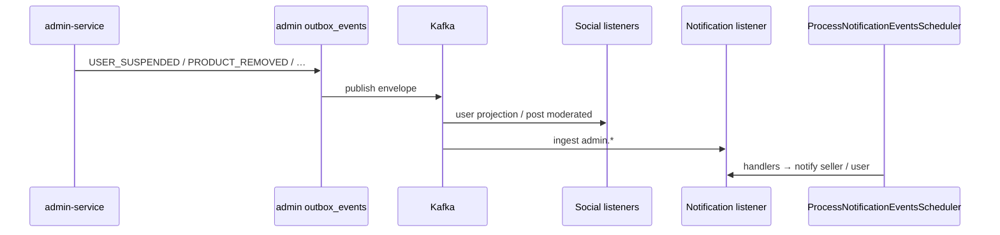

# Kafka — Hạng mục 6: Admin → Social + Notification (moderation / enforcement)

Tài liệu mô tả luồng **Admin publish outbox events → Kafka → Social (projection / post moderation) + Notification (in-app / push / email)** trên local. Phụ thuộc:

- [Hạng mục 0 — broker](kafka_section_0.md) (`localhost:9092`, UI http://localhost:8080)
- [Hạng mục 1 — outbox publisher](kafka_section_1.md) (`KafkaOutboxEventPublisher` cho auth, admin, commerce, social)
- [Hạng mục 2](kafka_section_2.md) (Notification consume + process)
- [Hạng mục 3](kafka_section_3.md) (Social consume Auth/Admin → `user_projections`)

**Phạm vi 6A:** document + `admin-service/.env.example` + comment tham chiếu trên social/notification `.env.example` — **không** sửa Java.

**Phạm vi 6B:** enrich admin outbox payload (`seller_user_id`, `shop_owner_id`, fan-out audience, …) — xem **§6 Payload examples**.

**Phạm vi 6C:** E2E verify **Social** consume `admin.user.*` + `admin.post.moderated` — checklist **§11** (ít/không sửa Java; notification có thể chạy song song).

**Phạm vi 6D:** E2E **Admin publish → Kafka → Notification** (in-app / push / email) — checklist **§12** (doc + env runtime; sửa Java chỉ khi `notification_events` FAILED).

**Phạm vi 6E (optional, sau 6A–6D):** mở rộng consumer Notification + Social post restore + đồng bộ Commerce catalog khi admin remove product — checklist **§14**.

**Out of scope 6A:** E2E checklist (6D tương tự commerce 5D), sửa payload Java, FCM production.

---

## 1. Luồng end-to-end

```text
Admin API (enforcement / moderation / announcement)
  → InsertAdminOutboxEventUseCase (cùng transaction domain)
  → INSERT admin outbox_events (PENDING)
  → commit

OutboxPublishScheduler (ADMIN_OUTBOX_PUBLISH_ENABLED=true)
  → PublishAdminEventsUseCase
  → KafkaOutboxEventPublisher + AdminOutboxMessageBuilder
  → topic admin.user.* | admin.post.* | admin.product.* | …

Social (SOCIAL_KAFKA_CONSUMER_ENABLED=true)
  → AuthUserEventKafkaListener + ConsumeAuthUserEventsUseCase
       → Mongo user_projections (auth + admin.user.*)
  → PostModeratedEventKafkaListener + HandlePostModeratedEventUseCase
       → admin.post.moderated

Notification (NOTIFICATION_KAFKA_CONSUMER_ENABLED=true)
  → DomainEventKafkaListener
  → DomainEventMessageParser + NotificationEventTypeAliasResolver
  → INSERT notification_events (PENDING)
  → ProcessNotificationEventsScheduler
  → Admin handlers (USER_SUSPENDED, PRODUCT_REMOVED, …)
  → user_notifications + email / push
```



**Kiến trúc quan trọng**

- **Commerce không consume `admin.*`.** Đồng bộ catalog/enforcement sang commerce qua HTTP `admin.integrations.commerce` (optional) hoặc API seller/commerce riêng — không có Kafka consumer commerce cho admin topics.
- **`RemoveProductUseCase` (MVP 6B):** ghi moderation log + outbox `PRODUCT_REMOVED`; chỉ `ensureProductExists` + lookup seller khi integration bật.
- **`RemoveProductUseCase` (6E):** khi `ADMIN_COMMERCE_INTEGRATION_ENABLED=true`, gọi thêm `POST /commerce/api/v1/internal/moderation/products/{id}/remove` (catalog REMOVED) **trước** ghi moderation + outbox.

---

## 2. Admin publish — toàn bộ `AdminOutboxTopicResolver`

Mọi `event_type` trong `AdminOutboxTopicResolver.java` đều được map sang topic `admin.*` khi publish (20 event types).

| Admin `event_type` | Kafka topic |
|--------------------|-------------|
| `USER_SUSPENDED` | `admin.user.suspended` |
| `USER_BANNED` | `admin.user.banned` |
| `USER_RESTRICTED` | `admin.user.restricted` |
| `USER_ENFORCEMENT_REVOKED` | `admin.user.enforcement_revoked` |
| `USER_ENFORCEMENT_EXPIRED` | `admin.user.enforcement_expired` |
| `PRODUCT_REMOVED` | `admin.product.removed` |
| `PRODUCT_RESTORED` | `admin.product.restored` |
| `REVIEW_HIDDEN` | `admin.review.hidden` |
| `REVIEW_REMOVED` | `admin.review.removed` |
| `REVIEW_RESTORED` | `admin.review.restored` |
| `SHOP_SUSPENDED` | `admin.shop.suspended` |
| `SHOP_RESTORED` | `admin.shop.restored` |
| `SHOP_CLOSED` | `admin.shop.closed` |
| `POST_MODERATED` | `admin.post.moderated` |
| `POST_RESTORED` | `admin.post.restored` |
| `COMMENT_MODERATED` | `admin.comment.moderated` |
| `COMMENT_RESTORED` | `admin.comment.restored` |
| `SYSTEM_CONFIG_UPDATED` | `admin.config.updated` |
| `SYSTEM_ANNOUNCEMENT_PUBLISHED` | `admin.announcement.published` |
| `SYSTEM_ANNOUNCEMENT_CANCELLED` | `admin.announcement.cancelled` |

---

## 3. Ma trận topic → consumer (MVP)

| Kafka topic | Admin publish | Social consumer | Notification consumer | Ghi chú MVP |
|-------------|---------------|-----------------|----------------------|-------------|
| `admin.user.suspended` | ✓ | ✓ `user_projections` → SUSPENDED | ✓ `USER_SUSPENDED` | E2E ưu tiên |
| `admin.user.banned` | ✓ | ✓ → SUSPENDED (cùng projection) | ✓ ingest → `USER_BANNED` | Handler in-app chỉ `USER_SUSPENDED` — **6B** alias/handler |
| `admin.user.restricted` | ✓ | ✓ (MVP: giữ status projection) | ✓ `USER_RESTRICTED` | |
| `admin.user.enforcement_revoked` | ✓ | ✓ → ACTIVE | ✓ `USER_ENFORCEMENT_REVOKED` (**6E**) | In-app + push |
| `admin.user.enforcement_expired` | ✓ | ✓ → ACTIVE | ✓ `USER_ENFORCEMENT_EXPIRED` (**6E**) | In-app + push |
| `admin.post.moderated` | ✓ | ✓ `PostModeratedEventKafkaListener` | ✗ | Social only |
| `admin.post.restored` | ✓ | ✓ cùng listener group `social-post-moderated` (**6E**) | ✗ | `action=RESTORE` |
| `admin.shop.closed` | ✓ | — | ✓ `SHOP_CLOSED` (**6E**) | `shop_owner_id` trong payload |
| `admin.announcement.cancelled` | ✓ | — | ✓ `SYSTEM_ANNOUNCEMENT_CANCELLED` (**6E**) | Soft-delete in-app theo `announcement_id` |
| `admin.product.removed` | ✓ | — | ✓ `PRODUCT_REMOVED` | Payload enrich **6B** |
| `admin.review.hidden` | ✓ | — | ✓ `REVIEW_HIDDEN` | Payload enrich **6B** |
| `admin.shop.suspended` | ✓ | — | ✓ `SHOP_SUSPENDED` | Payload enrich **6B** |
| `admin.announcement.published` | ✓ | — | ✓ fan-out → `SYSTEM_ANNOUNCEMENT_SENT` | Audience **6B** |

### Out of scope MVP (chưa làm trong **6E**)

Publish vẫn có trên Kafka; consumer **chưa** subscribe trong 6E:

`admin.product.restored`, `admin.review.removed`, `admin.review.restored`, `admin.shop.restored`, `admin.comment.moderated`, `admin.comment.restored`, `admin.config.updated`

**Commerce Kafka consumer cho `admin.*`:** không có — by design.

---

## 4. Social consumer groups

| Listener | Consumer group (`application.yml`) | Topics |
|----------|-----------------------------------|--------|
| `AuthUserEventKafkaListener` | `social-user-projection` (default `group-id`) | `auth.user.*` + `admin.user.suspended` … `admin.user.enforcement_expired` |
| `PostModeratedEventKafkaListener` | `social-post-moderated` (`post-moderated-group-id`) | `admin.post.moderated`, `admin.post.restored` (**6E**) |

**`SOCIAL_KAFKA_CONSUMER_ENABLED=true` bật cả hai listener** (cùng flag trong `SocialKafkaConsumerProperties`).

Projection user (`ConsumeAuthUserEventsUseCase`):

| Event (topic) | Mongo `user_projections.status` |
|---------------|----------------------------------|
| `USER_SUSPENDED`, `USER_BANNED` | `SUSPENDED` |
| `USER_RESTRICTED` | (MVP: policy giữ / cập nhật theo payload) |
| `USER_ENFORCEMENT_REVOKED`, `USER_ENFORCEMENT_EXPIRED` | `ACTIVE` |

Tham chiếu: [ConsumeAuthUserEvents-api-and-behavior.md](../api_fe_behavior/social_api_fe_behavior/ConsumeAuthUserEvents-api-and-behavior.md)

---

## 5. Notification — topic, alias, handlers

### Topic → event type (`DomainEventTopicResolver`)

| Kafka topic | `notification_events.event_type` (trước alias) |
|-------------|-----------------------------------------------|
| `admin.user.suspended` | `USER_SUSPENDED` |
| `admin.user.banned` | `USER_BANNED` |
| `admin.user.restricted` | `USER_RESTRICTED` |
| `admin.product.removed` | `PRODUCT_REMOVED` |
| `admin.review.hidden` | `REVIEW_HIDDEN` |
| `admin.shop.suspended` | `SHOP_SUSPENDED` |
| `admin.announcement.published` | `SYSTEM_ANNOUNCEMENT_PUBLISHED` |

### Alias (`NotificationEventTypeAliasResolver`)

| Admin / ingest type | Canonical (handler / policy) |
|---------------------|------------------------------|
| `SYSTEM_ANNOUNCEMENT_PUBLISHED` | `SYSTEM_ANNOUNCEMENT_SENT` |
| (các type khác) | giữ nguyên (`USER_SUSPENDED`, …) |

### Handlers MVP (`@Order`)

| Canonical | Handler | Order | Kênh mặc định (xem §7) |
|-----------|---------|-------|-------------------------|
| `USER_SUSPENDED` | `UserSuspendedNotificationEventHandler` | 46 | in-app + push + email |
| `USER_RESTRICTED` | `UserRestrictedNotificationEventHandler` | 45 | in-app + push + email |
| `PRODUCT_REMOVED` | `ProductRemovedNotificationEventHandler` | 44 | in-app + push |
| `REVIEW_HIDDEN` | `ReviewHiddenNotificationEventHandler` | 43 | in-app only |
| `SHOP_SUSPENDED` | `ShopSuspendedNotificationEventHandler` | 48 | in-app + push + email |
| `SHOP_SUSPENDED` (email) | `ShopSuspendedEmailNotificationEventHandler` | (email chain) | email |
| `SYSTEM_ANNOUNCEMENT_SENT` | `SystemAnnouncementFanOutNotificationEventHandler` | 30 | in-app + push (fan-out) |

Email enforcement chung: `AccountEnforcementNotificationEventHandler` (`USER_SUSPENDED`, `USER_RESTRICTED`).

---

## 6. Payload examples (**6B**)

Outbox `payload` (JSON string, snake_case, omit null). `AdminOutboxMessageBuilder` thêm envelope `recipient_user_ids` từ `user_id`, `seller_user_id`, `shop_owner_id`, `review_author_id`, hoặc `recipient_user_ids` trong payload (pattern giống commerce `buyer_id`).

Lookup owner ids khi `ADMIN_COMMERCE_INTEGRATION_ENABLED=true` qua HTTP:

- `GET /commerce/api/v1/internal/moderation/products/{productId}` → `seller_id`
- `GET /commerce/api/v1/internal/moderation/shops/{shopId}` → `seller_id` (shop owner)
- `GET /commerce/api/v1/internal/moderation/reviews/{reviewId}` → `seller_id`, `buyer_id` (review author)

### `PRODUCT_REMOVED`

```json
{
  "product_id": "550e8400-e29b-41d4-a716-446655440000",
  "seller_user_id": "660e8400-e29b-41d4-a716-446655440001",
  "moderation_log_id": "770e8400-e29b-41d4-a716-446655440002",
  "action": "REMOVE",
  "reason": "Counterfeit listing",
  "removal_reason": "Counterfeit listing",
  "removed_by": "880e8400-e29b-41d4-a716-446655440003",
  "removed_at": "2026-06-04T10:00:00Z"
}
```

### `SHOP_SUSPENDED`

```json
{
  "shop_id": "550e8400-e29b-41d4-a716-446655440010",
  "shop_owner_id": "660e8400-e29b-41d4-a716-446655440011",
  "moderation_log_id": "770e8400-e29b-41d4-a716-446655440012",
  "action": "SUSPEND",
  "reason": "Repeated policy violations",
  "suspension_reason": "Repeated policy violations",
  "suspended_by": "880e8400-e29b-41d4-a716-446655440013",
  "suspended_at": "2026-06-04T10:05:00Z"
}
```

### `REVIEW_HIDDEN`

```json
{
  "review_id": "550e8400-e29b-41d4-a716-446655440020",
  "review_author_id": "660e8400-e29b-41d4-a716-446655440021",
  "seller_user_id": "770e8400-e29b-41d4-a716-446655440022",
  "moderation_log_id": "880e8400-e29b-41d4-a716-446655440023",
  "action": "HIDE",
  "reason": "Spam content",
  "hidden_reason": "Spam content",
  "hidden_by": "990e8400-e29b-41d4-a716-446655440024",
  "hidden_at": "2026-06-04T10:10:00Z"
}
```

### `USER_SUSPENDED` (enforcement — social + notification)

```json
{
  "user_id": "550e8400-e29b-41d4-a716-446655440030",
  "enforcement_id": "660e8400-e29b-41d4-a716-446655440031",
  "action_type": "SUSPEND",
  "reason_code": "SPAM",
  "description": "Automated spam detection",
  "enforced_by": "770e8400-e29b-41d4-a716-446655440032",
  "status": "ACTIVE"
}
```

Envelope: `"recipient_user_ids": ["550e8400-e29b-41d4-a716-446655440030"]`.

### `SYSTEM_ANNOUNCEMENT_SENT` (fan-out)

Explicit list (dev / targeted):

```json
{
  "announcement_id": "550e8400-e29b-41d4-a716-446655440040",
  "title": "Platform maintenance",
  "content": "Scheduled downtime tonight",
  "severity": "WARNING",
  "is_pinned": true,
  "dismissible": true,
  "status": "SENT",
  "sent_at": "2026-06-04T10:15:00Z",
  "created_by": "660e8400-e29b-41d4-a716-446655440041",
  "recipient_user_ids": [
    "770e8400-e29b-41d4-a716-446655440042",
    "880e8400-e29b-41d4-a716-446655440043"
  ]
}
```

Audience paging (production): set `target_audience` (ví dụ `ALL_ACTIVE_USERS`) — notification resolve qua `SystemAnnouncementAudienceUserProvider` (`UnconfiguredSystemAnnouncementAudienceUserProvider` trả empty cho đến khi wire Auth paging).

Publish API: `POST /admin/api/v1/system-announcements/{id}/publish` body tùy chọn `{ "recipient_user_ids": [...], "target_audience": "..." }`. Dev fallback: `ADMIN_ANNOUNCEMENTS_DEV_RECIPIENT_USER_IDS` (comma-separated UUIDs).

---

## 7. Default channels (`NotificationDefaultChannelPolicy`)

Flags: **in-app** | **push** | **email**

| Event type | in-app | push | email |
|------------|--------|------|-------|
| `USER_SUSPENDED` | ✓ | ✓ | ✓ |
| `USER_RESTRICTED` | ✓ | ✓ | ✓ |
| `PRODUCT_REMOVED` | ✓ | ✓ | ✗ |
| `REVIEW_HIDDEN` | ✓ | ✗ | ✗ |
| `SHOP_SUSPENDED` | ✓ | ✓ | ✓ |
| `SYSTEM_ANNOUNCEMENT_SENT` | ✓ | ✓ | ✗ |

Push dev: `LoggingFcmPushNotificationProvider` khi `NOTIFICATION_FCM_ENABLED=false`.

---

## 8. Biến môi trường

### Admin (`Services/admin-service/.env` — copy từ `.env.example`)

| Biến | Gợi ý dev (6A / E2E) | Vai trò |
|------|----------------------|---------|
| `KAFKA_BOOTSTRAP_SERVERS` | `localhost:9092` | Broker |
| `ADMIN_KAFKA_PRODUCER_ENABLED` | `true` | `KafkaOutboxEventPublisher` |
| `ADMIN_OUTBOX_PUBLISH_ENABLED` | `true` | Scheduler publish outbox |
| `ADMIN_OUTBOX_RETRY_ENABLED` | `true` | Retry outbox FAILED |
| `ADMIN_AUTH_INTEGRATION_ENABLED` | `true` (E2E) | Gọi auth khi enforce user |
| `ADMIN_AUTH_BASE_URL` | `http://localhost:3001` | |
| `ADMIN_COMMERCE_INTEGRATION_ENABLED` | `true` (E2E) | Lookup seller/shop owner/review parties + validate product |
| `ADMIN_COMMERCE_BASE_URL` | `http://localhost:3003` | Internal moderation lookup + catalog |
| `ADMIN_ANNOUNCEMENTS_DEV_RECIPIENT_USER_IDS` | (optional) | Dev fan-out khi publish không gửi `recipient_user_ids` |
| `ADMIN_SOCIAL_INTEGRATION_ENABLED` | `false` | Optional HTTP social |
| `ADMIN_SOCIAL_BASE_URL` | `http://localhost:3002` | |
| `ADMIN_ENFORCEMENT_EXPIRATION_ENABLED` | `false` | Job expire → `admin.user.enforcement_expired` |

### Social (reference — mục 3)

| Biến | Gợi ý dev |
|------|-----------|
| `SOCIAL_KAFKA_CONSUMER_ENABLED` | `true` |
| `KAFKA_BOOTSTRAP_SERVERS` | `localhost:9092` |

### Notification (reference — mục 2)

| Biến | Gợi ý dev |
|------|-----------|
| `NOTIFICATION_KAFKA_CONSUMER_ENABLED` | `true` |
| `NOTIFICATION_PROCESS_EVENTS_ENABLED` | `true` |
| `NOTIFICATION_KAFKA_BOOTSTRAP_SERVERS` | `localhost:9092` |

---

## 9. Ports & database (local)

| Service | HTTP | PostgreSQL / khác |
|---------|------|-------------------|
| auth-service | http://localhost:3001 | `localhost:5432` → `auth_db` |
| social-service | http://localhost:3002 | `localhost:5433` → `social_db` + Mongo `social_db` |
| commerce-service | http://localhost:3003 | `localhost:5434` → `commerce_db` |
| **admin-service** | **http://localhost:3004** | **`localhost:5436` → `admin_db`** |
| notification-service | http://localhost:3005 | `localhost:5435` → `notification_db` |

Kafka UI: http://localhost:8080 — filter prefix `admin.`.

---

## 10. File tham chiếu

### Admin

| Thành phần | File |
|------------|------|
| Topic map | `Services/admin-service/.../infrastructure/outbox/AdminOutboxTopicResolver.java` |
| Envelope | `Services/admin-service/.../infrastructure/outbox/AdminOutboxMessageBuilder.java` |
| Publisher | `Services/admin-service/.../infrastructure/outbox/KafkaOutboxEventPublisher.java` |
| Publish scheduler | `Services/admin-service/.../application/outbox/PublishAdminEventsUseCase.java`, `OutboxPublishScheduler.java` |
| Enqueue outbox | `Services/admin-service/.../application/outbox/enqueue/InsertAdminOutboxEventUseCase.java` |
| Payload builders | `UserEnforcementOutboxPayloadBuilder`, `PostModerationOutboxPayloadBuilder`, `ProductModerationOutboxPayloadBuilder`, `ShopModerationOutboxPayloadBuilder`, `ReviewModerationOutboxPayloadBuilder`, `SystemAnnouncementOutboxPayloadBuilder` |
| Commerce gateways | `HttpCommerceProductGateway`, `HttpCommerceShopGateway`, `HttpCommerceReviewGateway` → `/commerce/api/v1/internal/moderation/*` |
| Use cases (ví dụ) | `SuspendUserUseCase`, `BanUserUseCase`, `ModeratePostUseCase`, `RemoveProductUseCase`, `SuspendShopUseCase`, `PublishSystemAnnouncementUseCase` |
| Outbox flow (business) | [admin_business_flow/outbox-event-flow.md](../business_flow/admin_business_flow/outbox-event-flow.md) |

### Social

| Thành phần | File |
|------------|------|
| User projection listener | `Services/social-service/.../infrastructure/integration/kafka/AuthUserEventKafkaListener.java` |
| Consume use case | `Services/social-service/.../application/integration/consumeauthuserevents/ConsumeAuthUserEventsUseCase.java` |
| Post moderated listener | `Services/social-service/.../infrastructure/integration/kafka/PostModeratedEventKafkaListener.java` |
| Handle post moderated | `Services/social-service/.../application/integration/handlepostmoderated/HandlePostModeratedEventUseCase.java` |
| Consumer config | `Services/social-service/src/main/resources/application.yml` (`social.kafka.consumer`) |

### Notification

| Thành phần | File |
|------------|------|
| Kafka listener | `Services/notification-service/.../infrastructure/messaging/kafka/DomainEventKafkaListener.java` |
| Topic resolver | `Services/notification-service/.../application/consume/DomainEventTopicResolver.java` |
| Alias resolver | `Services/notification-service/.../domain/notificationevent/NotificationEventTypeAliasResolver.java` |
| Process scheduler | `Services/notification-service/.../infrastructure/scheduler/ProcessNotificationEventsScheduler.java` |
| Handlers | `UserSuspendedNotificationEventHandler`, `UserRestrictedNotificationEventHandler`, `ProductRemovedNotificationEventHandler`, `ReviewHiddenNotificationEventHandler`, `ShopSuspendedNotificationEventHandler`, `SystemAnnouncementFanOutNotificationEventHandler` |

---

## 11. Verify 6C — Social consumers

Pha này **chỉ** xác nhận Social nhận event Admin enforcement + post moderation. **Không bắt buộc** bật notification (`NOTIFICATION_KAFKA_CONSUMER_ENABLED` có thể `false`).

### Hành vi đã có trong code (không cần sửa nếu E2E pass)

| Luồng | Listener / group | Use case | Kết quả |
|-------|------------------|----------|---------|
| Auth + Admin user events | `AuthUserEventKafkaListener` · group **`social-user-projection`** | `ConsumeAuthUserEventsUseCase` | Mongo `user_projections` |
| Admin post moderated | `PostModeratedEventKafkaListener` · group **`social-post-moderated`** | `HandlePostModeratedEventUseCase` | Mongo `posts` |

**Mapping enforcement → projection (`ConsumeAuthUserEventsUseCase.resolveTargetStatus`)**

| `event_type` (envelope) | Projection `status` |
|-------------------------|---------------------|
| `USER_SUSPENDED`, `USER_BANNED` | `SUSPENDED` |
| `USER_RESTRICTED` | Giữ status hiện có (MVP: `command.status` thường null) |
| `USER_ENFORCEMENT_REVOKED`, `USER_ENFORCEMENT_EXPIRED` | `ACTIVE` |
| `auth.user.*` | Theo payload Auth (created/updated/deleted) |

**Mapping post moderation (`HandlePostModeratedEventUseCase`)**

| `action` (payload) | Mongo `posts` |
|--------------------|---------------|
| `HIDE` | `status=ACTIVE`, `moderation_status=HIDDEN` — feed public loại trừ (query chỉ `NONE`) |
| `REMOVE` | `status=DELETED`, `moderation_status=REMOVED`, `deleted_at` set |

**Idempotency:** Postgres `social_db.processed_domain_events` — PK `event_id`; `consumer_name` = `social-user-projection` hoặc `social-post-moderated`. Trùng `event_id` → log skip, không corrupt.

**Parser:** envelope Admin có `event_id`, `event_type`, `payload` nested — `AuthUserEventMessageParser` / `PostModeratedEventMessageParser` đọc `payload.user_id`, `payload.post_id`, `payload.action`, `payload.moderation_log_id`. `post_id` phải là **Mongo ObjectId** (24 hex).

### Chuẩn bị

| Yêu cầu | Ghi chú |
|---------|---------|
| Stack | Kafka `:9092`, Kafka UI http://localhost:8080, admin `:3004`, social `:3002`, auth `:3001` (optional) |
| Admin publish | `ADMIN_OUTBOX_PUBLISH_ENABLED=true`, `ADMIN_KAFKA_PRODUCER_ENABLED=true` (copy từ `admin-service/.env.example` — **không commit `.env`**) |
| Social consume | `SOCIAL_KAFKA_CONSUMER_ENABLED=true`, topics trong `application.yml` § `social.kafka.consumer` |
| Dữ liệu | User **T** (UUID) có ít nhất một post **P** trên social (Mongo `posts`, `_id` = ObjectId string) |
| Token | Admin JWT có `USER_SUSPEND`, `POST_MODERATE`; user JWT của **T** cho bước 403 |
| Outbox lag | Scheduler admin ~1s — đợi topic có message trước khi assert Social |

### Test S1 — Suspend user (bắt buộc)

1. **Admin API** — suspend user **T**:

```http
POST http://localhost:3004/admin/api/v1/users/{userId}/suspend
Authorization: Bearer <admin-jwt>
Content-Type: application/json

{
  "reason_code": "POLICY_VIOLATION",
  "description": "E2E 6C suspend test"
}
```

Response chứa `enforcement_id` (lưu cho S2).

2. **(Optional)** Nếu `ADMIN_AUTH_INTEGRATION_ENABLED=true`: kiểm tra auth account **T** bị suspended (HTTP auth, không Kafka).

3. **Kafka UI** — topic `admin.user.suspended` — envelope ví dụ:

```json
{
  "event_id": "<uuid>",
  "event_type": "USER_SUSPENDED",
  "source": "admin",
  "payload": {
    "user_id": "<userId-T>",
    "enforcement_id": "<uuid>",
    "action_type": "SUSPEND",
    "reason_code": "POLICY_VIOLATION"
  }
}
```

4. **Social log** — `Applied auth user event to projection. eventType=USER_SUSPENDED, userId=…, status=SUSPENDED`.

5. **Mongo** — `social_db.user_projections`: `{ "user_id": "<userId-T>", "status": "SUSPENDED" }`.

6. **Postgres** — `social_db`:

```sql
SELECT event_id, consumer_name, event_type, processed_at
FROM processed_domain_events
WHERE consumer_name = 'social-user-projection'
ORDER BY processed_at DESC
LIMIT 5;
```

7. **Write guard** — user **T** gọi API tạo post (cần body hợp lệ theo API social):

```http
POST http://localhost:3002/api/v1/social/posts
Authorization: Bearer <user-T-jwt>
```

Kỳ vọng: **403** `SOCIAL-403-SUSPENDED` (`ACCOUNT_SUSPENDED`) — social đọc projection local, không gọi auth mỗi request.

### Test S2 — Revoke enforcement (optional)

1. Lấy `enforcement_id` từ response S1.

```http
POST http://localhost:3004/admin/api/v1/user-enforcements/{enforcementId}/revoke
Authorization: Bearer <admin-jwt>
Content-Type: application/json

{}
```

2. Kafka `admin.user.enforcement_revoked` — `payload.user_id`, `enforcement_id`.

3. Projection **T** → `status: ACTIVE`; user **T** tạo post lại → **không** 403 suspend.

### Test S3 — Moderate post HIDE hoặc REMOVE (bắt buộc)

1. **Admin API** — `postId` = Mongo `_id` của post **P** (24-char hex):

```http
POST http://localhost:3004/admin/api/v1/social/posts/{postId}/moderate
Authorization: Bearer <admin-jwt>
Content-Type: application/json

{
  "action": "HIDE",
  "reason": "E2E 6C moderation"
}
```

(`"action": "REMOVE"` cho soft-delete.)

2. Kafka `admin.post.moderated` — `payload` gồm `post_id`, `action`, `moderation_log_id`, `reason`, `moderated_at`.

3. **Social log** — `Applied post moderation. eventId=…, postId=…, action=HIDE|REMOVE`.

4. **Mongo `posts`** — document **P**:
   - **HIDE:** `moderation_status: "HIDDEN"`, `status: "ACTIVE"`
   - **REMOVE:** `status: "DELETED"`, `moderation_status: "REMOVED"`, `deleted_at` set

5. Feed / list public: post **P** không còn xuất hiện (HIDE: filter `moderation_status`; REMOVE: `status=DELETED`).

6. **Postgres:**

```sql
SELECT event_id, consumer_name, event_type
FROM processed_domain_events
WHERE consumer_name = 'social-post-moderated'
ORDER BY processed_at DESC
LIMIT 5;
```

### Test S4 — Idempotency

- Publish lại cùng `event_id` (replay message trên Kafka UI hoặc trigger duplicate outbox) → Social log `Skip duplicate …`; Mongo/Postgres không đổi sai.
- Moderation trùng `moderation_log_id` + cùng action đã apply → `Skip duplicate moderation application`.

### Troubleshooting Social

| Triệu chứng | Kiểm tra |
|-------------|----------|
| Không consume | `SOCIAL_KAFKA_CONSUMER_ENABLED=true`; social-service đã restart; `KAFKA_BOOTSTRAP_SERVERS`; admin `ADMIN_OUTBOX_PUBLISH_ENABLED` |
| Topic trống | Admin outbox `status=PUBLISHED`; scheduler chạy; `ADMIN_KAFKA_PRODUCER_ENABLED` |
| Projection không đổi | Log `Invalid auth user event` → thiếu `event_id` / `user_id`; envelope có `payload.user_id` |
| Post không ẩn | `post_id` đúng ObjectId; action `HIDE`/`REMOVE` uppercase; listener group **`social-post-moderated`** (không nhầm `social-user-projection`) |
| Post moderated không vào listener | Topic `admin.post.moderated` có trong `social.kafka.consumer.post-moderated-topics` |
| User vẫn post được sau suspend | Projection chưa `SUSPENDED`; consumer chưa chạy; đúng `user_id` UUID string trong Mongo |
| 403 không đúng code | `UserProjectionGuard` / create post use case — kỳ vọng `ACCOUNT_SUSPENDED` |

### Tiêu chí hoàn thành 6C

- [ ] **S1** suspend → Kafka + projection `SUSPENDED` + `processed_domain_events` + user write 403
- [ ] **S3** moderate HIDE hoặc REMOVE → Kafka + Mongo post + `social-post-moderated` processed row
- [ ] **S4** replay / duplicate không corrupt (optional nhưng khuyến nghị)
- [ ] **S2** revoke (optional)

---

## 12. Verify 6D — Notification (Admin publish E2E)

Luồng đầy đủ: **Admin API** → `admin_db.outbox_events` → Kafka `admin.*` → **notification-service** ingest → `notification_events` → scheduler process → `user_notifications` (+ email/push tùy policy).

**Tiền đề:** [§6B](#6-payload-examples-6b) payload (`seller_user_id`, `shop_owner_id`, `recipient_user_ids`, …); [§11](#11-verify-6c--social-consumers) Social (có thể chạy song song, không bắt buộc pass để test notification).

**Notification subscribe (MVP)** — `NotificationKafkaConsumerProperties` + `DomainEventTopicResolver`:

| Kafka topic | Ingest `event_type` | Sau alias → handler | Kênh mặc định |
|-------------|---------------------|---------------------|---------------|
| `admin.user.suspended` | `USER_SUSPENDED` | `UserSuspendedNotificationEventHandler` | in-app + push + email |
| `admin.user.restricted` | `USER_RESTRICTED` | `UserRestrictedNotificationEventHandler` | in-app + push + email |
| `admin.user.banned` | `USER_BANNED` | ⚠️ **không có handler** → FAILED permanent (dùng **suspend** cho N1) |
| `admin.product.removed` | `PRODUCT_REMOVED` | `ProductRemovedNotificationEventHandler` | in-app + push |
| `admin.shop.suspended` | `SHOP_SUSPENDED` | `ShopSuspendedNotificationEventHandler` (+ email chain) | in-app + push + email |
| `admin.review.hidden` | `REVIEW_HIDDEN` | `ReviewHiddenNotificationEventHandler` | in-app only |
| `admin.announcement.published` | `SYSTEM_ANNOUNCEMENT_PUBLISHED` | alias → `SYSTEM_ANNOUNCEMENT_SENT` → fan-out | in-app + push |

**Không subscribe:** `admin.post.moderated` (Social only — **N8** negative), `admin.user.enforcement_revoked` / `expired`, restore/comment/config topics (**6E**).

### Chuẩn bị infra

```bash
cd Infrastructure
docker compose up -d kafka kafka-ui \
  postgres-admin postgres-notification postgres-auth postgres-commerce \
  mongodb redis
# Tùy chọn email enforcement / ORDER-style:
docker compose up -d mailhog
```

Kafka UI: http://localhost:8080 — filter `admin.`.

| DB | Port | Dùng cho |
|----|------|----------|
| `admin_db` | 5436 | `outbox_events` |
| `notification_db` | 5435 | `notification_events`, `user_notifications` |
| `auth_db` | 5432 | User register / suspend integration |
| `commerce_db` | 5434 | Product / shop / review lookup (6B) |
| `social_db` + Mongo | 5433 / 27017 | Optional (6C) |

### Env runtime (copy vào `.env` local — **không commit**)

**`Services/admin-service/.env`**

```env
KAFKA_BOOTSTRAP_SERVERS=localhost:9092
ADMIN_KAFKA_PRODUCER_ENABLED=true
ADMIN_OUTBOX_PUBLISH_ENABLED=true
ADMIN_OUTBOX_RETRY_ENABLED=true
ADMIN_AUTH_INTEGRATION_ENABLED=true
ADMIN_AUTH_BASE_URL=http://localhost:3001
ADMIN_COMMERCE_INTEGRATION_ENABLED=true
ADMIN_COMMERCE_BASE_URL=http://localhost:3003
# Fan-out dev khi publish không gửi body recipient_user_ids:
# ADMIN_ANNOUNCEMENTS_DEV_RECIPIENT_USER_IDS=<uuid-U>
JWT_ACCESS_SECRET=<same-as-auth>
JWT_REFRESH_SECRET=<same-as-auth>
```

**`Services/social-service/.env`** (optional — 6C song song)

```env
SOCIAL_KAFKA_CONSUMER_ENABLED=true
KAFKA_BOOTSTRAP_SERVERS=localhost:9092
JWT_ACCESS_SECRET=<same-as-auth>
```

**`Services/notification-service/.env`**

```env
NOTIFICATION_KAFKA_CONSUMER_ENABLED=true
NOTIFICATION_KAFKA_BOOTSTRAP_SERVERS=localhost:9092
NOTIFICATION_PROCESS_EVENTS_ENABLED=true
NOTIFICATION_RETRY_EVENTS_ENABLED=true
NOTIFICATION_FCM_ENABLED=false
JWT_ACCESS_SECRET=<same-as-auth>
JWT_REFRESH_SECRET=<same-as-auth>
# Optional MailHog (email enforcement):
NOTIFICATION_EMAIL_ENABLED=true
NOTIFICATION_EMAIL_PROVIDER=smtp
SPRING_MAIL_HOST=localhost
SPRING_MAIL_PORT=1025
```

**Auth + Commerce:** chạy `:3001` / `:3003` để integration validate user + lookup seller/owner (**6B**).

### Chạy services

```powershell
cd Services/admin-service; ./gradlew bootRun          # :3004
cd Services/auth-service; ./gradlew bootRun           # :3001
cd Services/commerce-service; ./gradlew bootRun       # :3003
cd Services/notification-service; ./gradlew bootRun   # :3005
# Optional 6C:
cd Services/social-service; ./gradlew bootRun         # :3002
```

Chờ outbox publish + notification process **~30–60s** sau mỗi bước admin (hoặc poll SQL).

### Dữ liệu test (ghi lại ID)

| Vai trò | Mô tả | Permission admin (JWT **A**) |
|---------|--------|------------------------------|
| **U** | User bị suspend / nhận announcement | — |
| **S** | Seller — owner product / shop / (review seller) | — |
| **A** | Admin operator | `USER_SUSPEND`, `POST_MODERATE`, `PRODUCT_REMOVE`, `SHOP_SUSPEND`, `REVIEW_HIDE`, `SYSTEM_ANNOUNCEMENT_PUBLISH` |

| Biến | UUID / id |
|------|-----------|
| `userId-U` | |
| `sellerId-S` | (= `seller_user_id` / `shop_owner_id` sau commerce lookup) |
| `productId` | Commerce product thuộc **S** |
| `shopId` | Commerce shop thuộc **S** |
| `reviewId` | Review có `buyer_id` + `seller_id` |
| `announcementId` | Sau create announcement |
| `enforcementId` | Response suspend **U** |

JWT user **U** / **S** và admin **A**: cùng `JWT_ACCESS_SECRET` với auth (register + login admin).

### Ma trận API Admin (paths thực tế)

| Hành động | Method + path |
|-----------|----------------|
| Suspend user | `POST /admin/api/v1/users/{userId}/suspend` |
| Restrict user (optional) | `POST /admin/api/v1/users/{userId}/restrict` |
| Remove product | `POST /admin/api/v1/products/{productId}/remove` |
| Suspend shop | `POST /admin/api/v1/shops/{shopId}/suspend` |
| Hide review | `POST /admin/api/v1/reviews/{reviewId}/hide` |
| Create announcement | `POST /admin/api/v1/system-announcements` |
| Publish announcement | `POST /admin/api/v1/system-announcements/{announcementId}/publish` |

Base URL admin: `http://localhost:3004`.

### Checklist E2E Notification

| # | Kịch bản | Thao tác | Kỳ vọng |
|---|----------|----------|---------|
| **N1** | USER_SUSPENDED | `POST .../users/{userId-U}/suspend` body `reason_code`, `description` (§11 S1) | Kafka `admin.user.suspended`. `notification_events`: `USER_SUSPENDED`, `source_service=ADMIN`, `status=COMPLETED`. `user_notifications` cho **U**, `reference_type` / event liên quan enforcement. `GET http://localhost:3005/api/v1/notification/notifications` JWT **U** thấy in-app. |
| **N2** | USER_RESTRICTED (optional) | `POST .../users/{userId}/restrict` (cùng body schema suspend) | `admin.user.restricted` → `USER_RESTRICTED` `COMPLETED`. |
| **N3** | PRODUCT_REMOVED | `POST .../products/{productId}/remove` body `{ "reason": "..." }` — **cần** `ADMIN_COMMERCE_INTEGRATION_ENABLED` | Kafka `admin.product.removed` — payload có **`seller_user_id`**. Notification `COMPLETED` cho **S** (seller). |
| **N4** | SHOP_SUSPENDED | `POST .../shops/{shopId}/suspend` body `{ "reason": "...", "note": null }` | `admin.shop.suspended` + **`shop_owner_id`**. Seller **S** nhận notification. |
| **N5** | REVIEW_HIDDEN (optional) | `POST .../reviews/{reviewId}/hide` body `{ "reason": "..." }` | `admin.review.hidden` — `review_author_id` và/hoặc `seller_user_id`. In-app cho author và/hoặc seller. |
| **N6** | SYSTEM_ANNOUNCEMENT | 1) `POST .../system-announcements` 2) `POST .../system-announcements/{id}/publish` với body `{ "recipient_user_ids": ["<uuid-U>"] }` hoặc env `ADMIN_ANNOUNCEMENTS_DEV_RECIPIENT_USER_IDS` | Kafka `admin.announcement.published`. Alias → `SYSTEM_ANNOUNCEMENT_SENT` `COMPLETED`. **U** có in-app announcement. Nhiều recipients → nhiều `user_notifications`. |
| **N7** | Push (optional) | `POST http://localhost:3005/api/v1/notification/device-tokens` JWT **U** body `{ "deviceType": "ANDROID", "deviceToken": "dev-token-..." }` → lặp **N1** | Log `Push notification sent` (FCM disabled → logging provider). |
| **N8** | Post moderated (negative) | Moderate post (§11 S3) | Kafka `admin.post.moderated` — Social xử lý; **không** expect row `notification_events` cho topic này. |

**N1 — suspend body ví dụ:**

```http
POST http://localhost:3004/admin/api/v1/users/{userId-U}/suspend
Authorization: Bearer <admin-jwt>
Content-Type: application/json

{
  "reason_code": "POLICY_VIOLATION",
  "description": "E2E 6D suspend"
}
```

**N3 — remove product:**

```http
POST http://localhost:3004/admin/api/v1/products/{productId}/remove
Authorization: Bearer <admin-jwt>
Content-Type: application/json

{ "reason": "Policy violation E2E 6D" }
```

**N6 — announcement publish (explicit recipients):**

```http
POST http://localhost:3004/admin/api/v1/system-announcements/{announcementId}/publish
Authorization: Bearer <admin-jwt>
Content-Type: application/json

{
  "recipient_user_ids": ["<userId-U>"]
}
```

**N7 — device token:**

```http
POST http://localhost:3005/api/v1/notification/device-tokens
Authorization: Bearer <user-U-jwt>
Content-Type: application/json

{
  "deviceType": "ANDROID",
  "deviceToken": "e2e-dev-fcm-token-6d"
}
```

### SQL hữu ích

```sql
-- admin_db (port 5436)
SELECT event_type, status, created_at, published_at
FROM outbox_events
ORDER BY created_at DESC
LIMIT 15;
```

```sql
-- notification_db (port 5435)
SELECT source_service, event_type, status, last_error, created_at
FROM notification_events
WHERE source_service = 'ADMIN'
ORDER BY created_at DESC
LIMIT 20;

SELECT event_type, status, last_error
FROM notification_events
WHERE event_type IN (
  'USER_SUSPENDED', 'USER_RESTRICTED', 'PRODUCT_REMOVED',
  'SHOP_SUSPENDED', 'REVIEW_HIDDEN', 'SYSTEM_ANNOUNCEMENT_SENT',
  'SYSTEM_ANNOUNCEMENT_PUBLISHED'
)
ORDER BY created_at DESC
LIMIT 10;

SELECT user_id, event_type, title, reference_type, is_read, created_at
FROM user_notifications
WHERE user_id = '<userId-U>'
ORDER BY created_at DESC
LIMIT 20;

SELECT user_id, event_type, title, created_at
FROM user_notifications
WHERE user_id = '<sellerId-S>'
ORDER BY created_at DESC
LIMIT 20;
```

### Troubleshooting (6D)

| Triệu chứng | Kiểm tra |
|-------------|----------|
| Không có message Kafka | `ADMIN_OUTBOX_PUBLISH_ENABLED=true`, `ADMIN_KAFKA_PRODUCER_ENABLED=true`; admin restart; `outbox_events.status` → `PUBLISHED` |
| `notification_events` không có row | `NOTIFICATION_KAFKA_CONSUMER_ENABLED=true`; `NOTIFICATION_KAFKA_BOOTSTRAP_SERVERS`; topic trong consumer list (§12 bảng subscribe) |
| `notification_events` `PENDING` mãi | `NOTIFICATION_PROCESS_EVENTS_ENABLED=true`; chờ scheduler ~30s |
| FAILED `seller_user_id is required` | **6B** payload + `ADMIN_COMMERCE_INTEGRATION_ENABLED=true`; commerce `:3003` + internal moderation lookup |
| FAILED `shop_owner_id is required` | Tương tự — shop suspend sau khi commerce có shop **S** |
| FAILED `review_author_id or seller_user_id` | **6B** — review hide; `reviewId` tồn tại trong commerce |
| FAILED announcement audience | Publish body `recipient_user_ids` **hoặc** `ADMIN_ANNOUNCEMENTS_DEV_RECIPIENT_USER_IDS`; không chỉ `target_audience` khi `SystemAnnouncementAudienceUserProvider` chưa wire |
| FAILED `Unsupported event type: USER_BANNED` | Dùng **suspend** (N1), không **ban** — hoặc thêm alias/handler (6B+) |
| FAILED `target_user_id` / `enforcement_id` | Envelope `recipient_user_ids` / payload `user_id`, `enforcement_id` (**6B** `AdminOutboxMessageBuilder`) |
| Social OK, notification FAIL | Tách issue: Social §11 vs payload notification §6 — không nhầm consumer |
| Admin / Notification **401** | `JWT_ACCESS_SECRET` khớp auth trên admin + notification |
| Email không gửi | `NOTIFICATION_EMAIL_ENABLED=true`, MailHog `:1025`; event type có email trong `NotificationDefaultChannelPolicy` |
| Push không log | `NOTIFICATION_FCM_ENABLED=false` → `LoggingFcmPushNotificationProvider`; đăng ký device token (**N7**) |
| Product remove 404 commerce | Product id thật; commerce chạy; integration URL đúng |
| Duplicate notifications | Replay `event_id` — ingest idempotent; kiểm tra không chạy test 2 lần cùng outbox |

### Pass / Fail — smoke 6D (điền sau khi chạy local)

| Test | Pass | Fail | Ghi chú |
|------|:----:|:----:|---------|
| **N1** USER_SUSPENDED | ☐ | ☐ | Kafka + `COMPLETED` + in-app **U** |
| **N2** USER_RESTRICTED | ☐ | ☐ | Optional |
| **N3** PRODUCT_REMOVED | ☐ | ☐ | Seller **S** notified |
| **N4** SHOP_SUSPENDED | ☐ | ☐ | Seller **S** notified |
| **N5** REVIEW_HIDDEN | ☐ | ☐ | Optional |
| **N6** SYSTEM_ANNOUNCEMENT | ☐ | ☐ | **U** in-app; `recipient_user_ids` |
| **N7** Push log | ☐ | ☐ | Optional |
| **N8** post moderated (no notification) | ☐ | ☐ | Social only — expect **no** ADMIN notification row |

**Tiêu chí hoàn thành 6D:** **N1**, **N3**, **N4**, **N6** pass; **N2**, **N5**, **N7** optional; **N8** xác nhận không ingest `admin.post.moderated`.

### Tóm tắt end-to-end (sau khi pass)

```text
Admin :3004  →  admin_db.outbox_events (PENDING→PUBLISHED)
            →  Kafka admin.user.suspended | admin.product.removed | …
            →  notification-service ingest → notification_events (PENDING)
            →  ProcessNotificationEventsScheduler → COMPLETED
            →  user_notifications (+ email MailHog / push log)
```

Song song (optional): Social consume cùng topic `admin.user.suspended` / `admin.post.moderated` — **§11**.

---

## 14. Verify 6E — Mở rộng consumer + Commerce sync (optional)

Chạy **sau khi** checklist **§11** (6C) và **§12** (6D) pass. Không thay đổi hành vi MVP của các topic đã verify ở 6D.

### 14.1 Topic mới subscribe

**Notification** (`NotificationKafkaConsumerProperties` + `DomainEventTopicResolver`):

| Kafka topic | `event_type` (sau alias) | Handler |
|-------------|--------------------------|---------|
| `admin.user.enforcement_revoked` | `USER_ENFORCEMENT_REVOKED` | `UserEnforcementLiftedNotificationEventHandler` |
| `admin.user.enforcement_expired` | `USER_ENFORCEMENT_EXPIRED` | (cùng handler) |
| `admin.shop.closed` | `SHOP_CLOSED` | `ShopClosedNotificationEventHandler` |
| `admin.announcement.cancelled` | `SYSTEM_ANNOUNCEMENT_CANCELLED` | `SystemAnnouncementCancelledNotificationEventHandler` → soft-delete `user_notifications` |

**Social** (`SocialKafkaConsumerProperties.postModeratedTopics`):

| Kafka topic | Hành vi |
|-------------|---------|
| `admin.post.restored` | `HandlePostModeratedEventUseCase` với `action=RESTORE` → post `ACTIVE`, `moderation_status=NONE` |

**Admin → Commerce (HTTP, không Kafka):**

| API | Khi nào |
|-----|---------|
| `POST /commerce/api/v1/internal/moderation/products/{productId}/remove` | `RemoveProductUseCase` khi `ADMIN_COMMERCE_INTEGRATION_ENABLED=true` |

### 14.2 Env

Giữ nguyên block **§12.2** (Kafka, admin outbox, notification worker). Bổ sung:

```env
# admin-service
ADMIN_COMMERCE_INTEGRATION_ENABLED=true
ADMIN_COMMERCE_BASE_URL=http://localhost:3003

# notification — thêm topic 6E (hoặc dùng default trong application.yml)
# social — postModeratedTopics gồm admin.post.restored
SOCIAL_KAFKA_CONSUMER_ENABLED=true
```

### 14.3 Checklist manual / test

| ID | Hành động | Kỳ vọng |
|----|-----------|---------|
| **E1** | Revoke enforcement user **U** (đang suspend) → Kafka `admin.user.enforcement_revoked` | Notification **U**: in-app “Account restriction lifted”; Social projection **ACTIVE** |
| **E2** | (Optional) Chờ enforcement hết hạn hoặc trigger job → `admin.user.enforcement_expired` | Tương tự E1 với template “ended” |
| **E3** | `POST /admin/api/v1/shops/{shopId}/close` (seller **S**) | `admin.shop.closed` → in-app **S** “Shop closed” |
| **E4** | Publish announcement → cancel: `POST .../system-announcements/{id}/cancel` | `user_notifications` reference `SYSTEM_ANNOUNCEMENT` + `reference_id=announcement_id` → `is_deleted=true` |
| **E5** | `POST /admin/api/v1/posts/{postId}/restore` (post đã hide/remove trên Social) | Kafka `admin.post.restored` → Mongo post visible lại (`ACTIVE`, moderation `NONE`) |
| **E6** | `POST /admin/api/v1/products/{id}/remove` với commerce integration | Commerce `products.status=REMOVED` **và** admin outbox `PRODUCT_REMOVED` (seller notification như N3) |

**Unit tests (CI):**

```bash
cd Services/notification-service && ./gradlew test --tests "*UserEnforcementLifted*" --tests "*SystemAnnouncementCancelled*"
cd Services/social-service && ./gradlew test --tests "*HandlePostModerated*"
cd Services/admin-service && ./gradlew test --tests "RemoveProductUseCaseTest"
```

### 14.4 Pass criteria 6E

| ID | Bắt buộc |
|----|----------|
| E1, E3, E5, E6 | Ít nhất một trong bốn pass (tùy subset triển khai) |
| E4 | Pass nếu đã test announcement publish trước đó |
| Regression 6D | N1, N3, N4, N6 vẫn pass — không đổi handler MVP |

---

## 13. Việc chưa làm (sau 6A)

| Hạng mục | Nội dung |
|----------|----------|
| **6B** | ✅ Payload enrich + envelope routing (xem §6) |
| **6C** | ✅ Checklist Social verify (§11) — chạy E2E manual |
| **6D** | ✅ Checklist Notification E2E (§12) — chạy manual + điền Pass/Fail |
| **6B+** | `USER_BANNED` → alias/handler notification (tránh FAILED khi test ban) |
| **6E** | ✅ Notification subscribe 4 topic + Social `admin.post.restored` + Commerce internal remove (§14) |
| **Sau 6** | Consumer restore product/shop/review/comment; FCM prod |

---

## Liên kết

- [kafka_section_0.md](kafka_section_0.md)
- [kafka_section_1.md](kafka_section_1.md)
- [kafka_section_2.md](kafka_section_2.md)
- [kafka_section_3.md](kafka_section_3.md)
- [kafka_section_5.md](kafka_section_5.md) — Commerce → Notification (độc lập)
- [event-driven-architecture.md](../architecture/event-driven-architecture.md)
- [admin_business_flow/outbox-event-flow.md](../business_flow/admin_business_flow/outbox-event-flow.md)
- [ConsumeAuthUserEvents-api-and-behavior.md](../api_fe_behavior/social_api_fe_behavior/ConsumeAuthUserEvents-api-and-behavior.md)
