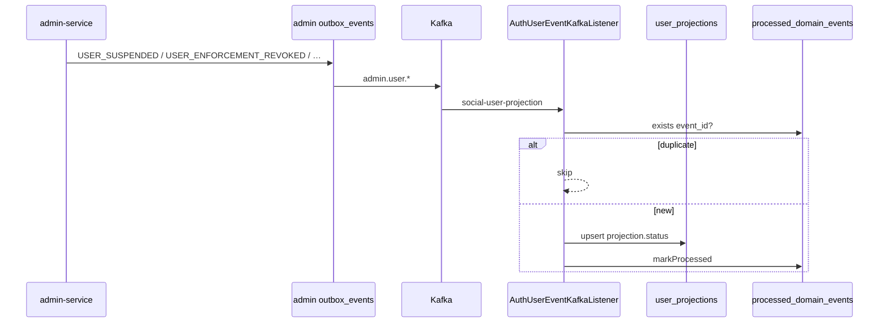

# Kafka — Hạng mục 7A: Admin enforcement → Social (user projection)

Tài liệu **tách riêng** luồng **Admin publish enforcement → Social `user_projections`** trên local. **Không thêm consumer Java** — cùng stack đã có ở [mục 3](kafka_section_3.md).

**Phạm vi 7A:** `docs/kafka/kafka_section_7.md` + comment `social-service/.env.example`. **Không** sửa Java/tests.

---

## Định vị hạng mục 7

| Mục | Phạm vi |
|-----|---------|
| [3](kafka_section_3.md) | Auth `auth.user.*` + **cùng** `AuthUserEventKafkaListener` / `ConsumeAuthUserEventsUseCase` |
| [6](kafka_section_6.md) | Admin publish + Social (user + post) + Notification |
| **7** | **Chỉ** 5 topic `admin.user.*` enforcement → Mongo `user_projections` + `UserWriteGuard` |

**Mục 7 không phải consumer mới.** Một flag `SOCIAL_KAFKA_CONSUMER_ENABLED=true` bật listener `social-user-projection` cho **3 auth + 5 admin** topic (xem `application.yml`).

**Out of scope 7:** `admin.post.moderated` / `admin.post.restored`, Notification (`admin.*` handlers mục 6D/6E), `auth.user.*` (chi tiết mục 3), Commerce.

**E2E chi tiết:** [§10 Verify 7B](#10-verify-7b--e2e-admin-enforcement--social-manual) hoặc [kafka_section_6.md §11](kafka_section_6.md#11-verify-6c--social-consumers) (post moderate). Mục 7A không duplicate checklist dài.

---

## 1. Phụ thuộc

| Tài liệu / hạng mục | Vai trò |
|---------------------|---------|
| [kafka_section_0.md](kafka_section_0.md) | Broker `localhost:9092`, Kafka UI |
| [kafka_section_1.md](kafka_section_1.md) | `KafkaOutboxEventPublisher`, outbox pattern |
| [kafka_section_3.md](kafka_section_3.md) | `SOCIAL_KAFKA_CONSUMER_ENABLED`, projection Auth, cùng listener |
| [kafka_section_6.md](kafka_section_6.md) | `ADMIN_OUTBOX_PUBLISH_ENABLED` — admin **phải publish** trước khi Social nhận |

---

## 2. Luồng end-to-end

```text
Admin API suspend / ban / restrict / revoke / expire
  → InsertAdminOutboxEventUseCase (cùng transaction enforcement)
  → admin outbox_events: USER_SUSPENDED | USER_BANNED | USER_RESTRICTED | …
  → PublishAdminOutboxEventsUseCase → Kafka admin.user.*
  → Social AuthUserEventKafkaListener (group: social-user-projection)
  → AuthUserEventMessageParser → ConsumeAuthUserEventsUseCase
  → Mongo user_projections + Postgres processed_domain_events
  → UserWriteGuard (SUSPENDED / DELETED → 403 write)
```



**Tuỳ chọn (không thay Kafka projection):** `ADMIN_AUTH_INTEGRATION_ENABLED=true` → admin gọi Auth HTTP đồng bộ enforcement; Social vẫn cập nhật qua Kafka.

---

## 3. Topics (5 admin enforcement)

Khớp `AuthUserEventTopicResolver` + `social.kafka.consumer.topics` trong `application.yml` / `SocialKafkaConsumerProperties`.

| Kafka topic | `event_type` (envelope) | `user_projections.status` |
|-------------|-------------------------|---------------------------|
| `admin.user.suspended` | `USER_SUSPENDED` | `SUSPENDED` |
| `admin.user.banned` | `USER_BANNED` | `SUSPENDED` |
| `admin.user.restricted` | `USER_RESTRICTED` | Giữ status cũ nếu payload không có `status` (MVP) |
| `admin.user.enforcement_revoked` | `USER_ENFORCEMENT_REVOKED` | `ACTIVE` |
| `admin.user.enforcement_expired` | `USER_ENFORCEMENT_EXPIRED` | `ACTIVE` |

**Cùng consumer config (mục 3, không lặp test 7):**

| Kafka topic | Ghi chú |
|-------------|---------|
| `auth.user.created` / `updated` / `deleted` | Xem [kafka_section_3.md](kafka_section_3.md) |

**Idempotency:** `processed_domain_events`, `consumer_name` = `social-user-projection` (`ConsumeAuthUserEventsUseCase.CONSUMER_NAME`).

---

## 4. Payload Admin (reference)

### Outbox payload (`UserEnforcementOutboxPayloadBuilder`)

Suspend / ban / restrict (chung `buildEnforcementPayload`):

| Field | Mô tả |
|-------|--------|
| `user_id` | UUID user bị enforcement |
| `enforcement_id` | UUID bản ghi enforcement |
| `action_type` | `SUSPEND` / `BAN` / `RESTRICT` |
| `reason_code`, `description` | Lý do |
| `expires_at` | Optional ISO-8601 |
| `enforced_by` | Admin UUID |
| `status` | Trạng thái enforcement trên admin |

Revoke / expire: thêm `revoked_by`, `revoke_reason`, `note`, `expired_at`, `previous_status`, `new_status` tùy event.

### Envelope Kafka (`AdminOutboxMessageBuilder`)

| Field | Mô tả |
|-------|--------|
| `event_id` | UUID outbox row |
| `event_type` | `USER_SUSPENDED`, … |
| `event_key`, `aggregate_id` | Partition / aggregate |
| `source` | `admin` |
| `occurred_at` | ISO-8601 |
| `payload` | Object JSON (snake_case) |

Routing envelope: `recipient_user_ids` từ `user_id` khi có (phục vụ Notification — **ngoài** phạm vi projection 7).

### Social parser (`AuthUserEventMessageParser`)

- Bắt buộc: `event_id` (root hoặc payload), `payload.user_id`
- Profile fields (`display_name`, `avatar_url`, `is_private`) optional — admin enforcement thường chỉ đổi `status` qua `ConsumeAuthUserEventsUseCase.resolveTargetStatus`

---

## 5. Consumer config Social

| Property | Env / default | Ghi chú |
|----------|---------------|---------|
| `social.kafka.consumer.enabled` | `SOCIAL_KAFKA_CONSUMER_ENABLED` | `true` để bật listener |
| `social.kafka.consumer.group-id` | `social-user-projection` | Cố định trong `application.yml` |
| `social.kafka.consumer.topics` | 3 `auth.user.*` + 5 `admin.user.*` | Một flag bật tất cả |
| `social.kafka.consumer.bootstrap-servers` | `KAFKA_BOOTSTRAP_SERVERS` | `localhost:9092` |

**Không cần** cho mục 7: `SOCIAL_KAFKA_PRODUCER_ENABLED`, `SOCIAL_OUTBOX_PUBLISH_ENABLED` (mục 4 social publish).

**Lưu ý:** `SOCIAL_KAFKA_CONSUMER_ENABLED=true` cũng bật `PostModeratedEventKafkaListener` (group `social-post-moderated`) — out of scope 7, xem [mục 6](kafka_section_6.md).

---

## 6. Biến môi trường

### Admin (reference — chi tiết [kafka_section_6.md](kafka_section_6.md))

```env
KAFKA_BOOTSTRAP_SERVERS=localhost:9092
ADMIN_KAFKA_PRODUCER_ENABLED=true
ADMIN_OUTBOX_PUBLISH_ENABLED=true
ADMIN_AUTH_INTEGRATION_ENABLED=true   # optional: Auth DB sync; projection vẫn qua Kafka
ADMIN_AUTH_BASE_URL=http://localhost:3001
```

### Social (`Services/social-service/.env` — copy từ `.env.example`, **không commit**)

```env
KAFKA_BOOTSTRAP_SERVERS=localhost:9092
SOCIAL_KAFKA_CONSUMER_ENABLED=true
DB_URL=jdbc:postgresql://localhost:5433/social_db
MONGO_URI=mongodb://localhost:27017/social_db
```

---

## 7. Class / file tham chiếu

| Thành phần | File |
|------------|------|
| Admin publish | `AdminOutboxTopicResolver`, `KafkaOutboxEventPublisher`, `UserEnforcementOutboxPayloadBuilder` |
| Admin use cases | `SuspendUserUseCase`, `BanUserUseCase`, `RestrictUserUseCase`, `RevokeUserEnforcementUseCase` |
| Admin HTTP | `UserEnforcementController` (`/admin/api/v1/users/...`), `UserEnforcementRevokeController` |
| Social consume | `AuthUserEventKafkaListener`, `AuthUserEventTopicResolver`, `AuthUserEventMessageParser`, `ConsumeAuthUserEventsUseCase` |
| Write guard | `UserWriteGuard`, domain `UserProjection` |
| FR / behavior | [FR_ConsumeAuthUserEvents.md](../feature_requirements/social/FR_ConsumeAuthUserEvents.md), [ConsumeAuthUserEvents-api-and-behavior.md](../api_fe_behavior/social_api_fe_behavior/ConsumeAuthUserEvents-api-and-behavior.md), [FR_EnforceUserStatusOnWrite.md](../feature_requirements/social/FR_EnforceUserStatusOnWrite.md) |

---

## 8. Liên kết chéo

- [kafka_section_3.md](kafka_section_3.md) — Auth projection, payload `auth.user.*`
- [kafka_section_6.md §11](kafka_section_6.md#11-verify-6c--social-consumers) — checklist E2E Social (suspend, revoke, post moderate)
- [admin outbox-event-flow.md](../business_flow/admin_business_flow/outbox-event-flow.md)
- [kafka_section_6.md](kafka_section_6.md) — Admin publish matrix, Notification (6D/6E)

---

## 9. Việc chưa làm

| Hạng mục | Nội dung |
|----------|----------|
| **7B** | E2E checklist §10 — chạy manual, ghi Pass/Fail §12 |
| **Notification** | Admin handlers (`admin.user.*`) — mục [6D](kafka_section_6.md#12-verify-6d--notification-admin-publish-e2e) / [6E](kafka_section_6.md#14-verify-6e--mở-rộng-consumer--commerce-sync-optional) |
| **FR sau** | `USER_RESTRICTED` business semantics nâng cao (nếu FR đổi projection `status`) |
| **Ops** | DLQ, lag monitoring, alert consumer stall |

---

## 10. Verify 7B — E2E Admin enforcement → Social (manual)

**Phạm vi:** chỉ `admin.user.*` → `user_projections` + `UserWriteGuard`. **Không** bắt buộc Notification hay `admin.post.moderated` (xem [mục 6 §11](kafka_section_6.md#11-verify-6c--social-consumers)).

**Tiền đề:** [mục 0](kafka_section_0.md) Kafka chạy; [mục 6](kafka_section_6.md) admin publish; user **U** đã có projection (mục 3: register + verify → `auth.user.created` / `updated` → `ACTIVE`).

### Chuẩn bị infra & services

```bash
cd Infrastructure
docker compose up -d kafka kafka-ui postgres-admin postgres-social mongodb redis

# Terminal riêng (thứ tự gợi ý)
cd Services/auth-service && ./gradlew bootRun      # :3001 — tạo / verify user U
cd Services/admin-service && ./gradlew bootRun     # :3004
cd Services/social-service && ./gradlew bootRun    # :3002
```

Kafka UI: http://localhost:8080 — filter `admin.user.`.

| Service | Port | DB |
|---------|------|-----|
| auth-service | 3001 | `auth_db` :5432 |
| social-service | 3002 | `social_db` :5433 + Mongo `social_db` :27017 |
| admin-service | 3004 | `admin_db` :5436 |

### Env runtime (copy vào `.env` — **không commit**)

**`Services/admin-service/.env`**

```env
KAFKA_BOOTSTRAP_SERVERS=localhost:9092
ADMIN_KAFKA_PRODUCER_ENABLED=true
ADMIN_OUTBOX_PUBLISH_ENABLED=true
ADMIN_OUTBOX_RETRY_ENABLED=true
ADMIN_AUTH_INTEGRATION_ENABLED=true
ADMIN_AUTH_BASE_URL=http://localhost:3001
```

**`Services/social-service/.env`**

```env
KAFKA_BOOTSTRAP_SERVERS=localhost:9092
SOCIAL_KAFKA_CONSUMER_ENABLED=true
SOCIAL_KAFKA_PRODUCER_ENABLED=false
SOCIAL_OUTBOX_PUBLISH_ENABLED=false
DB_URL=jdbc:postgresql://localhost:5433/social_db
MONGO_URI=mongodb://localhost:27017/social_db
```

### Personas & permissions

| Ký hiệu | Mô tả |
|---------|--------|
| **U** | End-user đã verify; ghi `userId` (UUID) |
| **A** | Admin JWT: `USER_SUSPEND`, `USER_ENFORCEMENT_REVOKE`; optional `USER_BAN`, `USER_RESTRICT` |

Sau mỗi bước: lưu `enforcementId`, `outbox_event_id` / `event_id` từ response hoặc Kafka envelope.

---

### Test 0 — Baseline projection

**Mongo** (`social_db`):

```javascript
db.user_projections.find({ user_id: "<uuid-U>" }).pretty()
// Kỳ vọng: status "ACTIVE" (hoặc PENDING_VERIFICATION nếu chưa verify — suspend vẫn chạy)
```

Nếu không có document → chạy E2E [kafka_section_3.md](kafka_section_3.md) (register + verify) trước.

| | Pass | Fail |
|---|:----:|:----:|
| **T0** | ☐ | ☐ |

---

### Test 1 — `USER_SUSPENDED` (bắt buộc)

```http
POST http://localhost:3004/admin/api/v1/users/{userId}/suspend
Authorization: Bearer <admin-jwt>
Content-Type: application/json

{
  "reason_code": "POLICY_VIOLATION",
  "description": "E2E 7B suspend test"
}
```

Response `data.enforcement_id` → lưu cho Test 2.

| Bước | Kỳ vọng |
|------|---------|
| Kafka UI `admin.user.suspended` | `event_type`: `USER_SUSPENDED`; `payload.user_id` = **U** |
| Log social | `Applied auth user event to projection … USER_SUSPENDED … status=SUSPENDED` |
| Mongo | `user_projections.status` = `"SUSPENDED"` |
| Postgres `social_db` | Row `processed_domain_events`, `consumer_name` = `social-user-projection`, `event_type` = `USER_SUSPENDED` |

```sql
SELECT event_id, consumer_name, event_type, processed_at
FROM processed_domain_events
WHERE consumer_name = 'social-user-projection'
ORDER BY processed_at DESC
LIMIT 5;
```

**Write guard** — JWT user **U** (post **P** tồn tại):

```http
POST http://localhost:3002/api/v1/social/posts/{postId}/like
Authorization: Bearer <user-U-jwt>
```

Kỳ vọng: **403**, code `SOCIAL-403-SUSPENDED` (`ACCOUNT_SUSPENDED`). Tương đương: `POST /api/v1/social/posts` (create) cũng 403.

| | Pass | Fail |
|---|:----:|:----:|
| **T1** Kafka + projection + processed row | ☐ | ☐ |
| **T1b** Write 403 suspended | ☐ | ☐ |

---

### Test 2 — `USER_ENFORCEMENT_REVOKED` → `ACTIVE` (bắt buộc)

```http
POST http://localhost:3004/admin/api/v1/user-enforcements/{enforcementId}/revoke
Authorization: Bearer <admin-jwt>
Content-Type: application/json

{
  "note": "E2E 7B revoke",
  "reason": "Appeal accepted"
}
```

Body có thể `{}` hoặc bỏ body (API chấp nhận optional).

| Bước | Kỳ vọng |
|------|---------|
| Kafka `admin.user.enforcement_revoked` | `USER_ENFORCEMENT_REVOKED`; `payload.user_id` = **U** |
| Mongo | `status` = `"ACTIVE"` |
| Write | **U** like/comment lại → **2xx** (không 403 suspend) |

| | Pass | Fail |
|---|:----:|:----:|
| **T2** | ☐ | ☐ |

---

### Test 3 — `USER_BANNED` (optional)

User **U2** (hoặc suspend lại **U** sau T2).

```http
POST http://localhost:3004/admin/api/v1/users/{userId}/ban
Authorization: Bearer <admin-jwt>
Content-Type: application/json

{
  "reason_code": "POLICY_VIOLATION",
  "description": "E2E 7B ban test"
}
```

Kafka `admin.user.banned` → projection `SUSPENDED` (`ConsumeAuthUserEventsUseCase` map `USER_BANNED` → `SUSPENDED`).

| | Pass | Fail | Skip |
|---|:----:|:----:|:----:|
| **T3** | ☐ | ☐ | ☐ |

---

### Test 4 — `USER_RESTRICTED` (optional)

```http
POST http://localhost:3004/admin/api/v1/users/{userId}/restrict
Authorization: Bearer <admin-jwt>
Content-Type: application/json

{
  "reason_code": "POLICY_VIOLATION",
  "description": "E2E 7B restrict test"
}
```

Kafka `admin.user.restricted`. **MVP thực tế:** payload admin có `status` enforcement nhưng **không** map sang projection status — `resolveTargetStatus(USER_RESTRICTED)` trả `command.status()` (null) → **giữ status cũ** (thường vẫn `ACTIVE`). Ghi actual behavior khi test.

| | Pass | Fail | Skip |
|---|:----:|:----:|:----:|
| **T4** | ☐ | ☐ | ☐ |

---

### Test 5 — `USER_ENFORCEMENT_EXPIRED` (optional)

Admin `.env`:

```env
ADMIN_ENFORCEMENT_EXPIRATION_ENABLED=true
```

Tạo suspend có `expires_at` trong quá khứ (hoặc chờ cron `ADMIN_ENFORCEMENT_EXPIRATION_CRON`). Kafka `admin.user.enforcement_expired` → projection `ACTIVE`.

| | Pass | Fail | Skip |
|---|:----:|:----:|:----:|
| **T5** | ☐ | ☐ | ☐ |

---

### Test 6 — Idempotency (khuyến nghị)

- Replay cùng message / duplicate `event_id` trên Kafka UI.
- Log: `Skip duplicate auth user event`.
- Mongo: **một** document `user_id` = **U**; không flip status sai.

| | Pass | Fail | Skip |
|---|:----:|:----:|:----:|
| **T6** | ☐ | ☐ | ☐ |

---

### SQL debug (optional)

**Admin outbox:**

```sql
-- admin_db (port 5436)
SELECT event_type, status, created_at
FROM outbox_events
WHERE event_type LIKE 'USER_%'
ORDER BY created_at DESC
LIMIT 10;
```

**Social processed:**

```sql
SELECT * FROM processed_domain_events
WHERE consumer_name = 'social-user-projection'
  AND event_type IN ('USER_SUSPENDED', 'USER_ENFORCEMENT_REVOKED')
ORDER BY processed_at DESC;
```

---

### Tiêu chí hoàn thành 7B

- [ ] **T1** + **T1b** + **T2** Pass
- [ ] **T3–T6** optional (ghi Skip nếu không chạy)
- [ ] Không regression code path: `ConsumeAuthUserEventsUseCase` unit tests pass

---

## 11. Troubleshooting (7B)

| Triệu chứng | Kiểm tra |
|-------------|----------|
| Không có message trên Kafka | `ADMIN_OUTBOX_PUBLISH_ENABLED=true`; `ADMIN_KAFKA_PRODUCER_ENABLED`; `admin_db.outbox_events.status` → `PUBLISHED`; scheduler admin (~1s) |
| Social không log consume | `SOCIAL_KAFKA_CONSUMER_ENABLED=true`; restart social sau đổi env; `KAFKA_BOOTSTRAP_SERVERS=localhost:9092` |
| `Invalid auth user event` | Envelope thiếu `event_id` hoặc `payload.user_id`; so sánh `AdminOutboxMessageBuilder` |
| Projection không đổi | Consumer lag (Kafka UI → group `social-user-projection`); user chưa có row projection (T0) |
| Auth suspended, Social vẫn `ACTIVE` | Đợi outbox publish; kiểm tra đúng topic `admin.user.suspended`; không nhầm group `social-post-moderated` |
| Write vẫn OK khi `SUSPENDED` | JWT đúng user **U**; Mongo `user_id` string khớp UUID; cache không áp dụng (projection đọc Mongo mỗi request) |
| `processed_domain_events` trống | Flyway `social_db`; exception trong log social (transaction rollback) |
| Revoke không ACTIVE | Revoke sai `enforcement_id`; enforcement đã hết hạn/revoked; topic `admin.user.enforcement_revoked` |

---

## 12. Kết quả smoke (7B)

> Cập nhật sau khi chạy checklist §10. **Manual E2E (T0–T2)** cần `bootRun` auth `:3001`, admin `:3004`, social `:3002` + JWT **U** / **A**.

| ID | Mô tả | Kết quả | Ghi chú |
|----|--------|---------|---------|
| T0 | Baseline ACTIVE | **Pending** | Mongo `user_projections` + user **U** (mục 3) |
| T1 | Suspend → Kafka + SUSPENDED | **Pending** | Cần admin API + consumer log |
| T1b | Write 403 | **Pending** | `POST /api/v1/social/posts/{postId}/like` |
| T2 | Revoke → ACTIVE | **Pending** | Sau T1, `POST …/user-enforcements/{id}/revoke` |
| T3 | Ban | **Skip** | Optional |
| T4 | Restrict | **Skip** | MVP: projection thường giữ ACTIVE |
| T5 | Expired | **Skip** | `ADMIN_ENFORCEMENT_EXPIRATION_ENABLED` |
| T6 | Idempotency | **Skip** | Replay `event_id` trên Kafka UI |

### Xác minh tự động (2026-06-04)

| Kiểm tra | Kết quả |
|----------|---------|
| Docker: `kafka`, `kafka-ui`, `mongodb`, `postgres-admin`, `postgres-social` | **Up** |
| Ports `:9092`, `:8080` | **Up** |
| Ports `:3001`, `:3002`, `:3004` (services) | **Down** — chưa `bootRun` |
| `social-service` unit: `consumeauthuserevents.*` | **Pass** — suspend, revoke→ACTIVE, duplicate skip, admin envelope parser |

```bash
cd Services/social-service
./gradlew test --tests "com.twohands.social_service.unit.application.integration.consumeauthuserevents.*"
```

**Kết luận 7B doc:** checklist §10 + §11 **đủ**. **Tiêu chí Pass** (T1+T1b+T2) — điền **Pass** vào bảng trên sau khi chạy manual; hiện **Pending** vì stack ứng dụng chưa chạy.

### Tóm tắt nhanh

| | |
|--|--|
| **Env** | Admin: outbox + kafka producer. Social: `SOCIAL_KAFKA_CONSUMER_ENABLED=true`, producer/outbox **off**. |
| **API** | Suspend/ban/restrict: `POST /admin/api/v1/users/{userId}/suspend\|ban\|restrict`. Revoke: `POST /admin/api/v1/user-enforcements/{enforcementId}/revoke`. |
| **Social write test** | `POST /api/v1/social/posts/{postId}/like` → 403 `SOCIAL-403-SUSPENDED`. |
| **Mongo** | `db.user_projections.find({ user_id: "<uuid>" })` |
| **SQL** | `processed_domain_events` WHERE `consumer_name = 'social-user-projection'` |

---

## Liên kết

- [kafka_section_0.md](kafka_section_0.md)
- [kafka_section_1.md](kafka_section_1.md)
- [kafka_section_3.md](kafka_section_3.md)
- [kafka_section_6.md](kafka_section_6.md)
