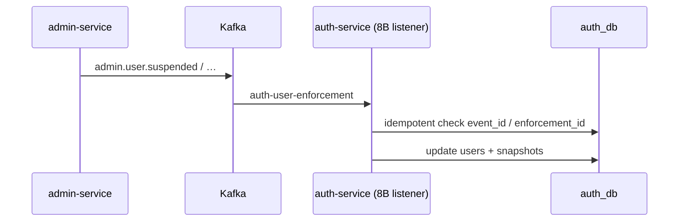

# Kafka — Hạng mục 8A: Admin enforcement → Auth (user status)

Tài liệu luồng **Admin publish enforcement → Auth consume → cập nhật `users` + `user_enforcement_snapshots`** trên local. **8A:** doc + consumer config. **8B:** `@KafkaListener`, topic resolver, message parser (đã triển khai).

**Không sửa** `admin-service` hoặc `social-service` trong 8A.

---

## Định vị hạng mục 8

| Mục | Phạm vi |
|-----|---------|
| [6](kafka_section_6.md) | Admin publish outbox → Kafka `admin.user.*` |
| [7](kafka_section_7.md) | Cùng 5 topic → Social `user_projections` (listener `social-user-projection`) |
| **8** | Cùng 5 topic → Auth `users.status` + enforcement snapshots (listener `auth-user-enforcement`) |

Hai consumer **độc lập** trên cùng topic: Social không gọi Auth; Auth không ghi Mongo projection.

```text
Admin API → outbox → Kafka admin.user.*
                    ├─► Social (mục 7) → user_projections
                    └─► Auth (mục 8)   → users + user_enforcement_snapshots
```

**Out of scope mục 8:** Notification, `admin.post.*`, Commerce. Listener + parser: **8B** (đã có).

---

## 1. Phụ thuộc

| Tài liệu / hạng mục | Vai trò |
|---------------------|---------|
| [kafka_section_0.md](kafka_section_0.md) | Broker `localhost:9092` |
| [kafka_section_1.md](kafka_section_1.md) | Outbox publish pattern |
| [kafka_section_6.md](kafka_section_6.md) | `ADMIN_OUTBOX_PUBLISH_ENABLED` — admin phải publish |
| [kafka_section_7.md](kafka_section_7.md) | Social projection song song (cùng topic, khác DB) |

---

## 2. Luồng end-to-end (Auth path)

```text
Admin API suspend / ban / restrict / revoke / expire
  → InsertAdminOutboxEventUseCase
  → outbox USER_SUSPENDED | USER_BANNED | …
  → PublishAdminOutboxEventsUseCase → Kafka admin.user.*
  → (8B) UserEnforcementEventKafkaListener — group auth-user-enforcement
  → ConsumeUserEnforcementEventUseCase
  → ApplyUserEnforcementUseCase
  → users.status (SUSPENDED / ACTIVE / …) + user_enforcement_snapshots
  → revoke refresh tokens khi suspend/ban
```



**8A:** chỉ bật `ConsumerFactory` + `authUserEnforcementKafkaListenerContainerFactory` (manual ack, String deserializer) — listener gắn ở 8B.

---

## 3. Topics (5 admin enforcement)

Khớp `AdminOutboxTopicResolver` (admin-service) và `auth.kafka.consumer.topics` trong `application.yml`.

| Kafka topic | `event_type` (envelope) | Auth `UserEnforcementActionType` | `users.status` (tóm tắt) |
|-------------|-------------------------|----------------------------------|---------------------------|
| `admin.user.suspended` | `USER_SUSPENDED` | `SUSPEND` | `SUSPENDED` |
| `admin.user.banned` | `USER_BANNED` | `BAN` | `SUSPENDED` |
| `admin.user.restricted` | `USER_RESTRICTED` | `RESTRICT` | Giữ / policy restrict (MVP) |
| `admin.user.enforcement_revoked` | `USER_ENFORCEMENT_REVOKED` | `REVOKE` | `ACTIVE` nếu không còn blocking enforcement |
| `admin.user.enforcement_expired` | `USER_ENFORCEMENT_EXPIRED` | `EXPIRE` | Tương tự revoke |

Mapping `event_type` → action: `UserEnforcementActionType.fromEventType` trong `ConsumeUserEnforcementEventUseCase`.

---

## 4. Payload & envelope (reference)

Nguồn: `UserEnforcementOutboxPayloadBuilder` (admin-service) + `AdminOutboxMessageBuilder` envelope.

### Suspend / ban / restrict (`buildEnforcementPayload`)

| Field payload | Mô tả |
|---------------|--------|
| `user_id` | UUID user |
| `enforcement_id` | UUID enforcement |
| `action_type` | `SUSPEND` / `BAN` / `RESTRICT` |
| `reason_code`, `description` | Bắt buộc khi apply trên Auth |
| `expires_at` | Optional ISO-8601 |
| `enforced_by` | Admin UUID |
| `status` | Trạng thái enforcement trên admin |

### Revoke (`buildUserEnforcementRevokedPayload`)

| Field | Mô tả |
|-------|--------|
| `user_id`, `enforcement_id`, `action_type`, `reason_code` | |
| `previous_status`, `new_status` | |
| `revoked_by` | Admin UUID |
| `note`, `revoke_reason` | Optional |

### Expire (`buildUserEnforcementExpiredPayload`)

| Field | Mô tả |
|-------|--------|
| `user_id`, `enforcement_id`, `action_type`, `reason_code` | |
| `expires_at`, `expired_at` | |
| `previous_status`, `new_status` | |

### Envelope Kafka

| Field | Mô tả |
|-------|--------|
| `event_id` | UUID outbox — **idempotency key** trên Auth (`findByEventId`) |
| `event_type` | `USER_SUSPENDED`, … |
| `source` | `admin` |
| `occurred_at` | ISO-8601 |
| `payload` | Object JSON (snake_case) |

**8B parser** đọc: `event_id`, `event_type` (hoặc fallback từ topic), `payload.user_id`, `enforcement_id`, `action_type`, `reason_code`, `description` (hoặc `revoke_reason` / `note`), `expires_at`, `occurred_at` (hoặc `expired_at` cho expire).

---

## 5. Consumer config Auth (8A)

| Property | Env / default | Ghi chú |
|----------|---------------|---------|
| `auth.kafka.consumer.enabled` | `AUTH_KAFKA_CONSUMER_ENABLED` | `false` mặc định (8A) |
| `auth.kafka.consumer.group-id` | `auth-user-enforcement` | |
| `auth.kafka.consumer.topics` | 5× `admin.user.*` | Chỉ enforcement |
| `auth.kafka.consumer.bootstrap-servers` | `KAFKA_BOOTSTRAP_SERVERS` | |

Beans (khi `enabled=true`):

| Bean | Vai trò |
|------|---------|
| `authUserEnforcementEventTopics` | SpEL `#{@authUserEnforcementEventTopics}` cho 8B `@KafkaListener` |
| `authUserEnforcementKafkaListenerContainerFactory` | Manual ack, `StringDeserializer`, error handler |

**Không bật** cho mục 8: `AUTH_OUTBOX_PUBLISH_ENABLED` (Auth publish `auth.user.*` là mục 1/3).

---

## 6. Biến môi trường

### Admin (reference — [kafka_section_6.md](kafka_section_6.md))

```env
KAFKA_BOOTSTRAP_SERVERS=localhost:9092
ADMIN_KAFKA_PRODUCER_ENABLED=true
ADMIN_OUTBOX_PUBLISH_ENABLED=true
```

**E2E Kafka-only path (khuyến nghị mục 8):**

```env
ADMIN_AUTH_INTEGRATION_ENABLED=false
```

Admin **không** gọi HTTP sync sang Auth; Auth chỉ nhận enforcement qua Kafka.

### Auth (`Services/auth-service/.env` — **không commit**)

```env
KAFKA_BOOTSTRAP_SERVERS=localhost:9092
AUTH_KAFKA_CONSUMER_ENABLED=true
```

Producer/outbox Auth có thể tắt khi chỉ test mục 8:

```env
AUTH_KAFKA_PRODUCER_ENABLED=false
AUTH_OUTBOX_PUBLISH_ENABLED=false
```

---

## 7. Dual path khi `ADMIN_AUTH_INTEGRATION_ENABLED=true`

Admin-service có thể **đồng thời**:

1. **HTTP sync** — `AuthUserEnforcementGateway` → Auth admin API (`SuspendUserByAdminUseCase`, …) → `ApplyUserEnforcementUseCase.forSyncApply`
2. **Kafka** — message `admin.user.*` → (8B) `ConsumeUserEnforcementEventUseCase` → `forEventApply`

`ApplyUserEnforcementUseCase` idempotency:

| Key | Khi nào |
|-----|---------|
| `event_id` | `enforcementSnapshotRepository.findByEventId` — replay Kafka duplicate |
| `enforcement_id` | Snapshot đã `APPLIED` cho suspend/ban/restrict — tránh double-apply cùng enforcement |

Revoke/expire **không** short-circuit theo `enforcement_id` trước apply (cho phép lift đúng enforcement).

**Thứ tự thực tế:** HTTP thường chạy trong transaction admin **trước** outbox publish (~1s). Kafka message tới sau → replay idempotent → **không** double-suspend.

**E2E 8:** tắt integration trên admin để chứng minh chỉ Kafka cập nhật Auth.

---

## 8. Class / file tham chiếu

| Thành phần | File (auth-service) |
|------------|---------------------|
| Config 8A | `AuthKafkaConsumerProperties`, `AuthKafkaConsumerConfig` |
| Listener 8B | `UserEnforcementEventKafkaListener` (`@ConditionalOnProperty` `auth.kafka.consumer.enabled=true`) |
| Parser 8B | `UserEnforcementEventMessageParser`, `InvalidUserEnforcementEventException` |
| Topic map 8B | `UserEnforcementEventTopicResolver` (5× `admin.user.*` → `USER_*`) |
| Consume | `ConsumeUserEnforcementEventUseCase`, `ConsumeUserEnforcementEventCommand` |
| Apply domain | `ApplyUserEnforcementUseCase`, `UserEnforcementSnapshotRepository` |
| Admin sync API (khi integration) | `SuspendUserByAdminUseCase`, `BanUserByAdminUseCase`, `RestrictUserByAdminUseCase`, `RevokeUserEnforcementByAdminUseCase` |

| Thàm phần | File (admin-service — read-only) |
|-----------|----------------------------------|
| Publish | `UserEnforcementOutboxPayloadBuilder`, `AdminOutboxMessageBuilder`, `AdminOutboxTopicResolver` |

---

## 9. Liên kết chéo

- [kafka_section_6.md](kafka_section_6.md) — Admin publish matrix
- [kafka_section_7.md](kafka_section_7.md) — Social projection cùng topic
- [admin outbox-event-flow.md](../business_flow/admin_business_flow/outbox-event-flow.md)

---

## 10. Verify 8B — Unit (automated)

| Test class | Phạm vi |
|------------|---------|
| `UserEnforcementEventMessageParserTest` | Admin outbox envelope suspend + revoke; topic fallback `USER_BANNED`; reject missing `user_id` |
| `UserEnforcementEventTopicResolverTest` | 5 topic → `USER_*` event types |

```bash
cd Services/auth-service
./gradlew test --tests "*UserEnforcementEventMessageParserTest" --tests "*UserEnforcementEventTopicResolverTest"
```

**Invalid payload:** listener ack (không retry vô hạn) — giống `AuthUserEventKafkaListener` (social).

---

## 11. Verify 8C — E2E Admin enforcement → Auth (manual)

**Phạm vi:** chỉ `admin.user.*` → `users` + `user_enforcement_snapshots`. **Không** cần Social consumer (có thể tắt `SOCIAL_KAFKA_CONSUMER_ENABLED`).

**Tiền đề:** [mục 0](kafka_section_0.md) Kafka; [mục 6](kafka_section_6.md) admin publish; user **U** tồn tại trên Auth (`ACTIVE`).

### Chuẩn bị infra & services

```bash
cd Infrastructure
docker compose up -d kafka kafka-ui postgres-auth postgres-admin redis

cd Services/auth-service && ./gradlew bootRun      # :3001
cd Services/admin-service && ./gradlew bootRun     # :3004
```

Kafka UI: http://localhost:8080 — filter `admin.user.`.

| Service | Port | DB |
|---------|------|-----|
| auth-service | 3001 | `auth_db` :5432 |
| admin-service | 3004 | `admin_db` :5436 |

### Env runtime (copy vào `.env` — **không commit**)

**`Services/admin-service/.env`**

```env
KAFKA_BOOTSTRAP_SERVERS=localhost:9092
ADMIN_KAFKA_PRODUCER_ENABLED=true
ADMIN_OUTBOX_PUBLISH_ENABLED=true
ADMIN_OUTBOX_RETRY_ENABLED=true
ADMIN_AUTH_INTEGRATION_ENABLED=false
```

**`Services/auth-service/.env`**

```env
KAFKA_BOOTSTRAP_SERVERS=localhost:9092
AUTH_KAFKA_CONSUMER_ENABLED=true
AUTH_KAFKA_PRODUCER_ENABLED=false
AUTH_OUTBOX_PUBLISH_ENABLED=false
```

### Personas

| Ký hiệu | Mô tả |
|---------|--------|
| **U** | End-user UUID trên Auth |
| **A** | Admin JWT: `USER_SUSPEND`, `USER_ENFORCEMENT_REVOKE` |

---

### Test 0 — Baseline Auth

```sql
SELECT id, status FROM users WHERE id = '<uuid-U>';
-- Kỳ vọng: ACTIVE
```

| | Pass | Fail |
|---|:----:|:----:|
| **T0** | ☐ | ☐ |

---

### Test 1 — `USER_SUSPENDED` (bắt buộc)

```http
POST http://localhost:3004/admin/api/v1/users/{userId}/suspend
Authorization: Bearer <admin-jwt>
Content-Type: application/json

{
  "reason_code": "POLICY_VIOLATION",
  "description": "E2E 8C suspend test"
}
```

Lưu `enforcement_id` từ response.

| Bước | Kỳ vọng |
|------|---------|
| Kafka UI `admin.user.suspended` | `event_type`: `USER_SUSPENDED`; `payload.user_id` = **U** |
| Log auth | Consume / apply enforcement (không lỗi parse) |
| Postgres `auth_db` | `users.status` = `SUSPENDED` |
| | `user_enforcement_snapshots` row `APPLIED`, `event_id` = outbox `event_id` |
| Login **U** | 403 / blocked (refresh tokens revoked) |

```sql
SELECT status FROM users WHERE id = '<uuid-U>';
SELECT event_id, enforcement_id, status, action_type
FROM user_enforcement_snapshots
WHERE user_id = '<uuid-U>'
ORDER BY created_at DESC
LIMIT 3;
```

| | Pass | Fail |
|---|:----:|:----:|
| **T1** | ☐ | ☐ |

---

### Test 2 — `USER_ENFORCEMENT_REVOKED` (bắt buộc)

```http
POST http://localhost:3004/admin/api/v1/users/{userId}/enforcements/{enforcementId}/revoke
Authorization: Bearer <admin-jwt>
Content-Type: application/json

{
  "note": "E2E 8C revoke"
}
```

| Bước | Kỳ vọng |
|------|---------|
| Kafka `admin.user.enforcement_revoked` | `USER_ENFORCEMENT_REVOKED` |
| Postgres | `users.status` = `ACTIVE` (nếu không còn blocking enforcement) |
| Idempotency | Replay cùng `event_id` không double-apply |

| | Pass | Fail |
|---|:----:|:----:|
| **T2** | ☐ | ☐ |

---

### Test 3 — Idempotency (optional)

Gửi lại cùng message `event_id` (Kafka UI / console producer) hoặc suspend lại cùng enforcement đã `APPLIED`.

| Kỳ vọng |
|---------|
| Log: skipped / already applied |
| Không duplicate snapshot `APPLIED` cho cùng `event_id` |

| | Pass | Fail |
|---|:----:|:----:|
| **T3** | ☐ | ☐ |

---

### Troubleshooting

| Triệu chứng | Kiểm tra |
|-------------|----------|
| Auth không consume | `AUTH_KAFKA_CONSUMER_ENABLED=true`; log bean `UserEnforcementEventKafkaListener`; group `auth-user-enforcement` trên Kafka UI |
| `users` không đổi nhưng Kafka có message | `ADMIN_AUTH_INTEGRATION_ENABLED` phải `false` **hoặc** message tới sau HTTP — với 8C dùng `false` |
| Parse error + ack | Log `Invalid user enforcement event payload` — sửa envelope / payload |
| Validation error (reason/description) | Suspend cần `reason_code` + `description` trong payload admin |

### Smoke (điền sau khi chạy local)

| Test | Kết quả | Ghi chú |
|------|---------|---------|
| T0 | Pending | |
| T1 | Pending | |
| T2 | Pending | |

---

## 12. Việc chưa làm

| Hạng mục | Nội dung |
|----------|----------|
| **Ops** | DLQ, consumer lag alert |

---

## Liên kết

- [kafka_section_0.md](kafka_section_0.md)
- [kafka_section_1.md](kafka_section_1.md)
- [kafka_section_6.md](kafka_section_6.md)
- [kafka_section_7.md](kafka_section_7.md)
