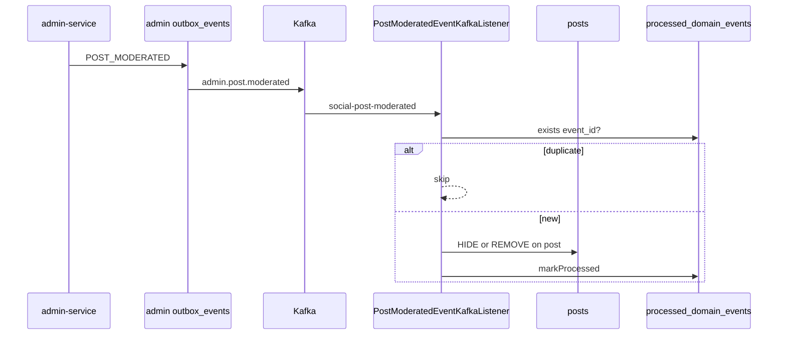

# Kafka — Hạng mục 9: Admin post moderated → Social only

Tài liệu **tách riêng** luồng **`admin.post.moderated` → Social Mongo `posts`** trên local. **Không thêm consumer Java** — stack đã có từ [mục 6](kafka_section_6.md).

**Phạm vi 9A:** `docs/kafka/kafka_section_9.md` + comment `social-service/.env.example`. **Không** sửa Java/tests trừ khi review phát hiện bug thật.

---

## Định vị hạng mục 9

| Mục | Phạm vi |
|-----|---------|
| [0](kafka_section_0.md) | Broker `localhost:9092`, Kafka UI |
| [1](kafka_section_1.md) | Outbox publish pattern |
| [6](kafka_section_6.md) | Admin publish matrix + E2E Social tổng hợp (user + post) — **§11 Test S3** là nguồn gốc checklist post |
| [3](kafka_section_3.md) | `auth.user.*` → projection (listener khác) |
| [7](kafka_section_7.md) | `admin.user.*` enforcement → projection (listener khác) |
| **9** | **Chỉ** `admin.post.moderated` → `PostModeratedEventKafkaListener` → `HandlePostModeratedEventUseCase` |

```text
Admin API moderate post (HIDE | REMOVE)
  → ModeratePostUseCase
  → INSERT admin outbox_events (POST_MODERATED)
  → PublishAdminOutboxEventsUseCase
  → Kafka admin.post.moderated
  → PostModeratedEventKafkaListener (group: social-post-moderated)
  → PostModeratedEventMessageParser
  → HandlePostModeratedEventUseCase
  → Mongo posts + Postgres processed_domain_events
```



**Out of scope 9**

| Không thuộc mục 9 | Xem |
|-------------------|-----|
| `admin.post.restored` (`POST_RESTORED`, `action=RESTORE`) | [mục 6 §14 (6E)](kafka_section_6.md#14-verify-6e--optional-extensions) |
| Notification ingest `admin.post.moderated` | [mục 6 §12](kafka_section_6.md#12-verify-6d--notification-admin-publish-e2e) — **N8** negative |
| `admin.user.*`, `auth.user.*` | [mục 7](kafka_section_7.md), [mục 3](kafka_section_3.md) |
| Auth / Commerce consumers | — |

**Lưu ý config:** `SocialKafkaConsumerProperties` Java default gồm `admin.post.restored`, nhưng `application.yml` hiện chỉ liệt kê `admin.post.moderated` trong `post-moderated-topics` — E2E mục 9 theo **YAML runtime** (chỉ moderated).

---

## 1. Phụ thuộc

| Tài liệu | Vai trò |
|----------|---------|
| [kafka_section_0.md](kafka_section_0.md) | Kafka + Kafka UI |
| [kafka_section_1.md](kafka_section_1.md) | `KafkaOutboxEventPublisher`, scheduler publish |
| [kafka_section_6.md](kafka_section_6.md) | `ADMIN_OUTBOX_PUBLISH_ENABLED`, `ModeratePostUseCase`, ma trận topic |

---

## 2. Topic & event type

| Admin `event_type` | Kafka topic | Social listener |
|--------------------|-------------|-------------------|
| `POST_MODERATED` | `admin.post.moderated` | `PostModeratedEventKafkaListener` |

Mapping topic: `AdminOutboxTopicResolver` (admin-service).

---

## 3. Payload & envelope

**Producer:** `ModeratePostUseCase` → `InsertAdminOutboxEventUseCase` → `PostModerationOutboxPayloadBuilder.buildPostModeratedPayload`.

### Payload (`POST_MODERATED`)

| Field | Mô tả |
|-------|--------|
| `post_id` | Mongo `_id` post (24-char hex string) |
| `moderation_log_id` | UUID log moderation |
| `action` | `HIDE` hoặc `REMOVE` (enum `ContentModerationAction`) |
| `reason` | Lý do moderation |
| `moderated_by` | Admin UUID |
| `moderated_at` | ISO-8601 instant |

### Envelope Kafka (Admin outbox)

| Field | Mô tả |
|-------|--------|
| `event_id` | UUID outbox — **idempotency key** (`processed_domain_events.event_id`) |
| `event_type` | `POST_MODERATED` |
| `source` | `admin` |
| `occurred_at` | ISO-8601 |
| `payload` | Object JSON snake_case ở trên |

**Parser:** `PostModeratedEventMessageParser` đọc `event_id` (root hoặc fallback `moderation_log_id`), `payload.post_id`, `action`, `moderation_log_id`, `reason`, `moderated_at` (fallback `occurred_at`).

---

## 4. Social consumer (đã triển khai)

| Property | Env / default | Ghi chú |
|----------|---------------|---------|
| `social.kafka.consumer.enabled` | `SOCIAL_KAFKA_CONSUMER_ENABLED` | `false` mặc định |
| `social.kafka.consumer.post-moderated-group-id` | `social-post-moderated` | **Khác** `social-user-projection` |
| `social.kafka.consumer.post-moderated-topics` | `admin.post.moderated` | Trong `application.yml` |
| `social.kafka.consumer.bootstrap-servers` | `KAFKA_BOOTSTRAP_SERVERS` | |

| Thành phần | File |
|------------|------|
| Publish (admin) | `ModeratePostUseCase`, `PostModerationOutboxPayloadBuilder` |
| Listener | `PostModeratedEventKafkaListener` (`@ConditionalOnProperty` `social.kafka.consumer.enabled=true`) |
| Parser | `PostModeratedEventMessageParser`, `InvalidPostModeratedEventException` |
| Apply | `HandlePostModeratedEventUseCase` (`CONSUMER_NAME = social-post-moderated`) |
| Config | `SocialKafkaConsumerConfig`, `SocialKafkaConsumerProperties` |

### Mapping `action` → Mongo `posts`

| `action` | `status` | `moderation_status` | Ghi chú |
|----------|----------|---------------------|---------|
| `HIDE` | `ACTIVE` | `HIDDEN` | Feed public loại trừ post (query `moderation_status=NONE`) |
| `REMOVE` | `DELETED` | `REMOVED` | `deleted_at` set — soft delete |

**Idempotency**

| Cơ chế | Khi nào |
|--------|---------|
| `processed_domain_events.event_id` | Replay cùng Kafka `event_id` → skip |
| `isDuplicateModeration` | Cùng `moderation_log_id` + action đã apply trên post → skip |
| Post đã `DELETED` + action `REMOVE` | Skip apply, vẫn mark processed |

**Invalid payload:** listener **ack** (không retry vô hạn) — log `Invalid post moderated event payload`.

**Post không tồn tại:** warn + mark processed (tránh poison loop).

---

## 5. Env checklist (runtime)

Copy vào `.env` local — **không commit**.

### Admin (`Services/admin-service/.env`)

```env
KAFKA_BOOTSTRAP_SERVERS=localhost:9092
ADMIN_KAFKA_PRODUCER_ENABLED=true
ADMIN_OUTBOX_PUBLISH_ENABLED=true
ADMIN_OUTBOX_RETRY_ENABLED=true
```

Optional: `ADMIN_SOCIAL_INTEGRATION_ENABLED=true` + `ADMIN_SOCIAL_BASE_URL` — admin **đọc** post tồn tại trước moderate; **không** thay Kafka path cập nhật Mongo.

### Social (`Services/social-service/.env`)

```env
KAFKA_BOOTSTRAP_SERVERS=localhost:9092
SOCIAL_KAFKA_CONSUMER_ENABLED=true
DB_URL=jdbc:postgresql://localhost:5433/social_db
MONGO_URI=mongodb://localhost:27017/social_db
```

Có thể tắt producer/outbox social khi chỉ test post moderate:

```env
SOCIAL_KAFKA_PRODUCER_ENABLED=false
SOCIAL_OUTBOX_PUBLISH_ENABLED=false
```

| Flag | Bắt buộc mục 9 |
|------|----------------|
| `ADMIN_OUTBOX_PUBLISH_ENABLED` | ✓ |
| `SOCIAL_KAFKA_CONSUMER_ENABLED` | ✓ |
| `NOTIFICATION_KAFKA_CONSUMER_ENABLED` | ✗ (out of scope) |

---

## 6. Verify 9B — E2E `admin.post.moderated` → Social (manual)

Adapt từ [kafka_section_6.md §11 Test S3 + S4](kafka_section_6.md#test-s3--moderate-post-hide-hoặc-remove-bắt-buộc). **Không** cần pass S1/S2 (user enforcement).

### E2E run log (local)

| Field | Value |
|-------|--------|
| **Date** | 2026-06-05 |
| **Verifier** | automated (Cursor agent) |
| **Stack** | Kafka + Mongo + postgres-admin/social; `admin-service` :3004, `social-service` :3002 |
| **Posts** | P1 `6a21b25c6be2396cab4cc6c6` (HIDE), P2 `6a21b3b8081e1ee0951a129c` (REMOVE) |
| **Outbox events** | `f26e242f-d292-4b43-9d32-ba30472222a8`, `6f306aab-047d-4265-90f5-7dc2466100f1` → `PUBLISHED` |
| **Admin JWT** | HS256 minted với `JWT_ACCESS_SECRET` trong `admin-service/.env` + `POST_MODERATE` (không có seed `admin@2hands.vn` trên `auth_db` local) |

**Kết quả:** P0–P3 **PASS** (xem smoke table). Social log: `Applied post moderation` cho cả HIDE và REMOVE. P3: replay `event_id` qua `kafka-console-producer` → vẫn **1** row `processed_domain_events` (idempotent).

**Blocker đã gặp (không thuộc mục 9 listener):** `OutboxEventRepositoryAdapter` so sánh `outbox_status` enum với `varchar` → moderate API 500, outbox không publish. Đã sửa cast `CAST(:status AS outbox_status)` + `Timestamp` cho `Instant` trong admin-service (cần cho E2E admin → Kafka).

### Chuẩn bị

```bash
cd Infrastructure
docker compose up -d kafka kafka-ui postgres-admin postgres-social mongodb redis

cd Services/admin-service && ./gradlew bootRun    # :3004
cd Services/social-service && ./gradlew bootRun     # :3002
```

| Service | Port | DB |
|---------|------|-----|
| admin-service | 3004 | `admin_db` :5436 |
| social-service | 3002 | `social_db` :5433 + Mongo `social_db` :27017 |

Kafka UI: http://localhost:8080 — filter `admin.post.moderated`.

| Yêu cầu | Ghi chú |
|---------|---------|
| Post **P** | Mongo `posts._id` = 24-char hex; author user **T** (tùy chọn) |
| Admin JWT | Permission `POST_MODERATE` |
| Outbox lag | Scheduler admin ~1s — đợi message trên topic trước assert |

---

### Test P0 — Baseline post

**Mongo** (`social_db`):

```javascript
db.posts.find({ _id: ObjectId("<postId-P>") }).pretty()
// Kỳ vọng: status ACTIVE, moderation_status NONE (hoặc tương đương chưa moderate)
```

| | Pass | Fail |
|---|:----:|:----:|
| **P0** | ☑ | ☐ |

---

### Test P1 — HIDE (bắt buộc)

```http
POST http://localhost:3004/admin/api/v1/social/posts/{postId}/moderate
Authorization: Bearer <admin-jwt>
Content-Type: application/json

{
  "action": "HIDE",
  "reason": "E2E 9B moderation HIDE"
}
```

Lưu `moderation_log_id` / `event_id` từ response hoặc Kafka envelope.

| Bước | Kỳ vọng |
|------|---------|
| Kafka UI `admin.post.moderated` | `event_type`: `POST_MODERATED`; `payload.post_id` = **P**; `action`: `HIDE` |
| Log social | `Applied post moderation` … `action=HIDE` |
| Mongo **P** | `moderation_status`: `"HIDDEN"`, `status`: `"ACTIVE"` |
| Feed / list public | Post **P** không còn hiển thị |
| Postgres | `consumer_name` = `social-post-moderated`, `event_type` = `POST_MODERATED` |

```sql
SELECT event_id, consumer_name, event_type, processed_at
FROM processed_domain_events
WHERE consumer_name = 'social-post-moderated'
ORDER BY processed_at DESC
LIMIT 5;
```

| | Pass | Fail |
|---|:----:|:----:|
| **P1** | ☑ | ☐ |

---

### Test P2 — REMOVE (bắt buộc)

Dùng post **P2** khác (hoặc tạo post mới) — REMOVE sau HIDE trên cùng post vẫn hợp lệ tùy data.

```http
POST http://localhost:3004/admin/api/v1/social/posts/{postId-P2}/moderate
Authorization: Bearer <admin-jwt>
Content-Type: application/json

{
  "action": "REMOVE",
  "reason": "E2E 9B moderation REMOVE"
}
```

| Bước | Kỳ vọng |
|------|---------|
| Kafka | `action`: `REMOVE` |
| Mongo | `status`: `"DELETED"`, `moderation_status`: `"REMOVED"`, `deleted_at` set |
| Feed | Post không xuất hiện |

| | Pass | Fail |
|---|:----:|:----:|
| **P2** | ☑ | ☐ |

---

### Test P3 — Idempotency (khuyến nghị)

1. Replay cùng `event_id` trên Kafka UI → log `Skip duplicate post moderated event`; Mongo không corrupt.
2. Moderate lại cùng `moderation_log_id` + action đã apply → `Skip duplicate moderation application`.

| | Pass | Fail |
|---|:----:|:----:|
| **P3** | ☑ | ☐ |

---

### Troubleshooting

| Triệu chứng | Kiểm tra |
|-------------|----------|
| Không consume | `SOCIAL_KAFKA_CONSUMER_ENABLED=true`; restart social; `KAFKA_BOOTSTRAP_SERVERS` |
| Topic trống | `ADMIN_OUTBOX_PUBLISH_ENABLED`; outbox `PUBLISHED`; `ADMIN_KAFKA_PRODUCER_ENABLED` |
| Post không ẩn | `post_id` đúng 24 hex; `action` uppercase `HIDE`/`REMOVE` |
| Message vào nhóm sai | Group **`social-post-moderated`** — không phải `social-user-projection` |
| Parse error + ack | Log `Invalid post moderated event` — thiếu `event_id` / `post_id` |
| Notification row xuất hiện | **Không** kỳ vọng — topic này Social-only ([6D N8](kafka_section_6.md#12-verify-6d--notification-admin-publish-e2e)) |
| Moderate API 500, outbox trống | Log `outbox_status = character varying` — cần cast enum trong `OutboxEventRepositoryAdapter` (admin-service) |
| Admin login 401 | Local `auth_db` có thể chưa seed admin; dùng JWT minted với secret khớp `admin-service/.env` |

### Tiêu chí hoàn thành 9B

- [x] **P1** HIDE → Kafka + Mongo + `social-post-moderated` processed row
- [x] **P2** REMOVE → Mongo soft-delete fields
- [x] **P3** replay / duplicate không corrupt (khuyến nghị)

### Smoke (2026-06-05 local)

| Test | Kết quả | Ghi chú |
|------|---------|---------|
| P0 | **Pass** | `6a21b25c…` / `6a21b3b8…` — `ACTIVE` + `moderation_status` `NONE` |
| P1 | **Pass** | HIDE → `HIDDEN` / `ACTIVE`; outbox `f26e242f…` `PUBLISHED`; log social OK |
| P2 | **Pass** | REMOVE → `DELETED` / `REMOVED` + `deleted_at`; outbox `6f306aab…` |
| P3 | **Pass** | Replay `event_id` `f26e242f…` → count processed = 1, Mongo unchanged |

---

## 7. Unit tests (reference)

Không bắt buộc chạy cho doc 9A; coverage có sẵn:

```bash
cd Services/social-service
./gradlew test --tests "*HandlePostModerated*" --tests "*PostModeratedEventMessageParser*"
```

---

## 8. Tài liệu liên quan

| Tài liệu | Nội dung |
|----------|----------|
| [FR_HandlePostModeratedEvent.md](../feature_requirements/social/FR_HandlePostModeratedEvent.md) | FR Social |
| [HandlePostModeratedEvent-api-and-behavior.md](../api_fe_behavior/social_api_fe_behavior/HandlePostModeratedEvent-api-and-behavior.md) | API behavior |
| [ModeratePost-api-and-behavior.md](../api_fe_behavior/admin_api_fe_behavior/ModeratePost-api-and-behavior.md) | Admin moderate API |

---

## Liên kết

- [kafka_section_0.md](kafka_section_0.md)
- [kafka_section_1.md](kafka_section_1.md)
- [kafka_section_6.md](kafka_section_6.md) — §11 Test S3/S4 (combined Social E2E)
- [kafka_section_7.md](kafka_section_7.md) — enforcement projection (listener khác)
