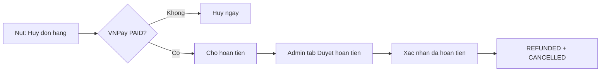
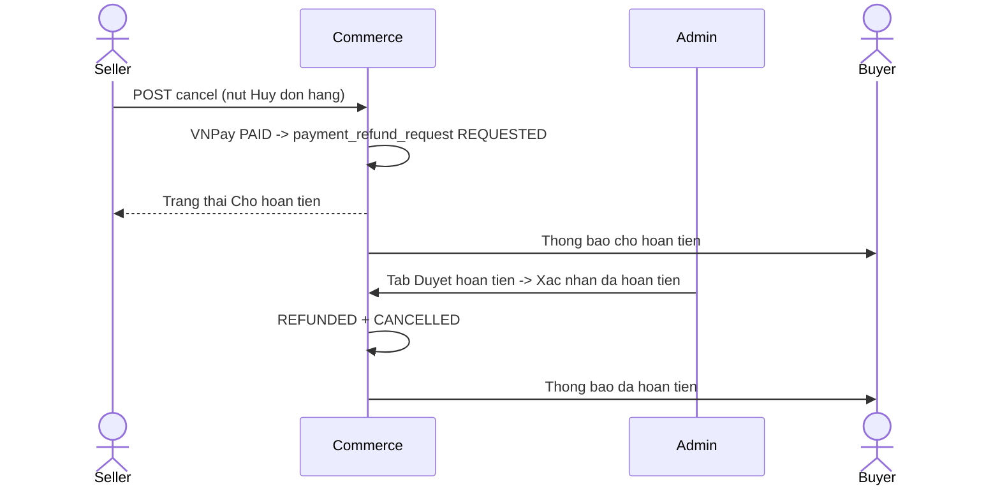
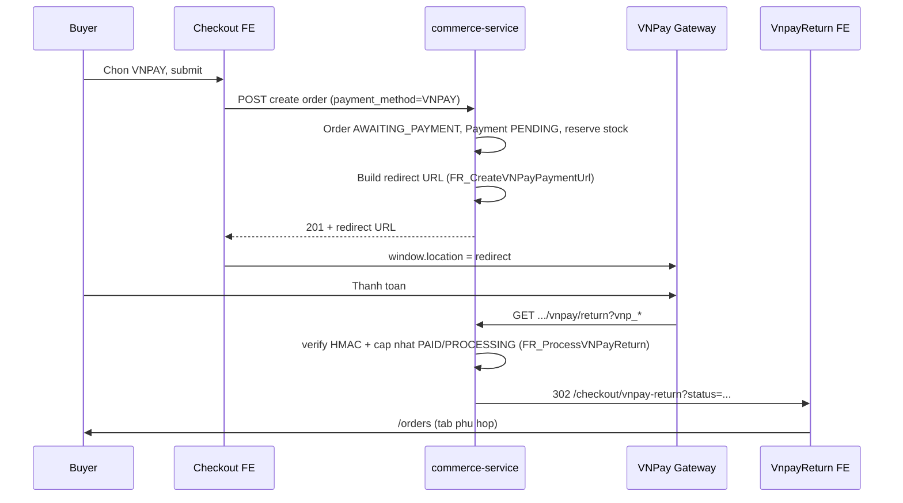

# ADR - VNPay Payment & Order/Shipment Cancellation Policy

> **Muc dich:** Tai lieu chot pham vi trien khai **thanh toan VNPay** va **chinh sach huy don / huy van don** truoc khi code.
>
> **Ai doc file nay:**
> - **Product / Owner:** muc 1, 1.1, 3, 10, 11 - chot quyet dinh.
> - **Dev trien khai VNPay:** **bat buoc doc muc 4** + toan bo FR trong `docs/vnpay/` theo thu tu ben duoi.
>
> **Trang thai:** Draft de review - can Product/Owner tick **Da chot** o muc 11.
>
> **Tai lieu VNPay (implement):** xem **muc 4** - day la entry point cho dev.
>
> **Tai lieu lien quan (ngoai vnpay/):**
> - `docs/feature_requirements/commerce/FR_CancelOrder.md`
> - `docs/business_flow/commerce_business_flow/seller-finance-cod-payout-flow.md`
> - `docs/business_flow/commerce_business_flow/payment-lifecycle-flow.md`
> - `docs/ghn/GHN.Cancel Order.txt`

---

## 1. Tom tat de xuat chot

| # | Quyet dinh de xuat | Ghi chu |
|---|-------------------|---------|
| D1 | Them `VNPAY` nhu payment method online (tuong tu PayOS) | Checkout -> `AWAITING_PAYMENT` -> redirect VNPay -> `PAID` + `PROCESSING` |
| D2 | **Doanh thu seller / GMV admin** chi ghi nhan khi `order_item = COMPLETED` + `payment = PAID` | Khong doi so voi COD/PayOS |
| D3 | **Seller huy shipment** (da tao, chua `SHIPPED`) - **Co**, kem thong bao buyer | GHN: mo rong flow hien co; them notify + revert item |
| D4 | **Seller & buyer deu bam nut "Huy don hang"** | COD `PENDING`: huy ngay; VNPay `PAID`: vao **hang cho hoan tien** |
| D5 | **Admin: tab "Duyet hoan tien"** | Chi **Xac nhan da hoan tien** / Tu choi - **khong** co nut huy don |
| D6 | Sau khi admin xac nhan da hoan tien | He thong tu `REFUNDED` + `CANCELLED` + release stock |
| D7 | Sau VNPay success: auto `order_item` `PENDING` -> `PROCESSING` | Tranh item mat khoi bucket finance |

---

## 1.1 Mo hinh UI (chot)

**Nguyen tac:** Seller va buyer **luon dung cung nhan nut "Huy don hang"** tren UI. Khong co nut rieng kieu "Tao yeu cau hoan tien". Backend phan nhanh theo payment.

| Ben | Tren man hinh | Sau khi bam |
|-----|---------------|-------------|
| **Buyer** | Nut **Huy don hang** | COD / VNPay chua tra: **huy ngay**. VNPay da tra: don **Cho hoan tien** |
| **Seller** | Nut **Huy don hang** | COD `PENDING`: **huy ngay**. VNPay `PAID`: don **Cho hoan tien** |
| **Admin** | Tab **Duyet hoan tien** (Admin FE moi) | **Xac nhan da hoan tien** hoac Tu choi - **khong** bam huy don |

**Trang thai don (VNPay da tra, user da bam Huy don hang):** hien thi **Cho hoan tien** / **Dang cho admin xac nhan hoan tien**. Backend tu dong tao `payment_refund_requests` (`REQUESTED`); order **chua** `CANCELLED` cho den khi admin xac nhan.



---

## 2. Phan tich kha thi

### 2.1 Seller huy shipment

| Khia canh | Hien trang | Can lam |
|-----------|------------|---------|
| GHN cancel | Da co `CancelGhnShipmentUseCase` | - |
| Manual cancel | Chua co | Endpoint huy shipment |
| Notify buyer | Thieu | `COMMERCE_SHIPMENT_CANCELLED` |
| VNPay da tra | Huy shipment khong hoan tien | Co the tao shipment moi hoac seller bam **Huy don hang** |

### 2.2 Seller bam "Huy don hang"

| Payment | Ket qua |
|---------|---------|
| COD `PENDING` | Huy ngay, release stock |
| VNPay `PAID` | Tao `payment_refund_requests`, UI **Cho hoan tien** |

API: `POST .../seller/orders/{orderId}/cancel` - **ten nut FE la Huy don hang**, khong endpoint refund rieng cho seller.



### 2.3 Buyer bam "Huy don hang"

| Payment | Ket qua |
|---------|---------|
| COD `PENDING` / VNPay chua tra | Huy ngay (mo rong V2 cho COD `PROCESSING`) |
| VNPay `PAID` | **Cho hoan tien** - giong seller |

API: `POST /commerce/api/v1/orders/{orderId}/cancel` - cung nut **Huy don hang**.

### 2.4 Admin - tab "Duyet hoan tien"

- Danh sach don buyer/seller da bam **Huy don hang** voi VNPay `PAID`.
- Admin thuc hien hoan tien tren VNPay (thu cong MVP), roi bam **Xac nhan da hoan tien**.
- **Khong** co nut **Huy don** tren Admin.
- Tu choi (optional): don tiep tuc `PROCESSING`, seller co the fulfill.

---

## 3. Ma tran theo payment

| Tinh huong | COD `PENDING` | VNPay chua tra | VNPay `PAID` |
|------------|---------------|----------------|--------------|
| Buyer **Huy don hang** | Huy ngay | Huy ngay | Cho hoan tien |
| Seller **Huy don hang** | Huy ngay | N/A | Cho hoan tien |
| Seller huy shipment | Cho phep | Cho phep | Cho phep (chua hoan tien) |
| Da SHIPPED+ | Khong | Khong | Return/dispute (sau) |

---

## 4. Huong dan trien khai VNPay (doc cho dev)

Phan nay huong dan **ai code VNPay** doc va implement dung. Cac file `FR_*.md` trong `docs/vnpay/` mo ta hanh vi he cu (Node.js); khi port sang **commerce-service** (Java) + FE moi, **uu tien quy tac trong ADR nay** neu khac spec cu.

### 4.1 Thu tu doc (bat buoc)

| Buoc | File | Doc de biet |
|------|------|-------------|
| 1 | **ADR nay** (muc 1, 1.1, 4, 9) | Quyet dinh da chot, phase, khac biet vs he cu |
| 2 | `FR_VNPayPaymentInCreateOrder.md` | Checkout chon VNPAY: tao don `AWAITING_PAYMENT`, reserve stock, tra `redirect` |
| 3 | `FR_CreateVNPayPaymentUrl.md` | Sinh URL: HMAC-SHA512, `vnp_Amount` x100, `txnRef`, ENV |
| 4 | `FR_ProcessVNPayReturn.md` | Return URL: verify hash, cap nhat payment/order, redirect FE |
| 5 | `FR_VNPayReturnPage.md` | Trang FE `/checkout/vnpay-return` - chi dieu huong, khong goi API |

**Khong can doc file nao khac trong `docs/vnpay/`** ngoai 4 FR tren + ADR nay.

### 4.2 Luong end-to-end (V1 - thanh toan)



### 4.3 Map FR → viec can code (commerce-service)

| FR | Hanh vi chinh (tu FR) | Implement trong commerce-service | Tham chieu code hien co |
|----|----------------------|----------------------------------|-------------------------|
| **FR_VNPayPaymentInCreateOrder** | `payment_provider: VNPAY` → order `AWAITING_PAYMENT`, payment pending, stock reserve, response co `redirect` | Mo rong `CreateOrderUseCase` / checkout: them `PaymentMethod.VNPAY` → `AWAITING_PAYMENT` (giong PayOS). Sau create, goi gateway sinh URL. | `CreateOrderUseCase.resolveInitialOrderStatus()` - hien chi PayOS → `AWAITING_PAYMENT` |
| **FR_CreateVNPayPaymentUrl** | `getPaymentUrl`: v2.1.0, SHA512, `txnRef = {orderId}-{timestamp}` | Tao `VnpayCheckoutUrlGateway` (tuong tu `PayosCheckoutUrlGatewayAdapter`). Config `commerce.integrations.vnpay.*` trong `application.yml`. | `PayosCheckoutUrlGatewayAdapter`, `CommerceIntegrationProperties.Payos` |
| **FR_ProcessVNPayReturn** | `GET` public, verify `vnp_SecureHash`, success → payment paid + order processing | `ProcessVnpayReturnUseCase` + controller public (khong JWT). Idempotent neu da `PAID`. | `ProcessPayosWebhookUseCase`, `ProcessPayosPaymentSuccessRepository` |
| **FR_VNPayReturnPage** | FE doc `status` + `orderId`, redirect orders | FE route `/checkout/vnpay-return` - **khong** verify lai payment | Spec mo ta React cu; port sang FE hien tai |

### 4.4 Map FR → viec can code (Frontend)

| FR | FE can lam |
|----|------------|
| **FR_VNPayPaymentInCreateOrder** | PaymentOptions: them VNPAY. Sau create: neu co `redirect` → `window.location.href = redirect` (**khong** vao `/checkout/success`). |
| **FR_VNPayReturnPage** | Route public `/checkout/vnpay-return`. `status=success` → orders tab cho ship; `failed` → tab that bai / cho thanh toan. **Khong** goi API xac nhan. |
| Retry thanh toan | Nut "Thanh toan lai" tren don `AWAITING_PAYMENT` - goi API retry, nhan `redirect` moi (xem FR_CreateVNPayPaymentUrl muc 7). |

### 4.5 Khac biet bat buoc: spec cu (Node) vs 2Hands moi (ADR)

| Chu de | FR he cu (Node) | **Chot implement (commerce-service)** |
|--------|-----------------|--------------------------------------|
| Order sau thanh toan thanh cong | `processing` (string) | `OrderStatus.PROCESSING` + `PaymentStatus.PAID` |
| Payment status | `completed` / `pending` | `PAID` / `PENDING` / `FAILED` (enum hien tai) |
| Order item sau VNPay success | FR cu khong noi ro | **D7:** auto `PENDING` → `PROCESSING` (finance bucket) |
| TTL chua thanh toan | FR cu: 24h `reserve_expires_at` | **Q1:** job auto-cancel **30 phut** (`auto-cancel-unpaid-order`) - cap nhat FR khi implement |
| Return URL | `GET /api/vnpay/return` (Node) | `GET /commerce/api/v1/payments/vnpay/return` (de xuat - dat trong commerce-service, public) |
| IPN VNPay | Out of scope | **V1 out of scope** - chi Return URL |
| ENV | `VNP_*` vs `VNPAY_*` khong dong nhat | **Chon mot bo:** `COMMERCE_VNPAY_TMN_CODE`, `COMMERCE_VNPAY_HASH_SECRET`, `COMMERCE_VNPAY_PAY_URL`, `COMMERCE_VNPAY_RETURN_URL` |
| Standalone `POST /vnpay/create_payment_url` | Public, khong auth (GAP) | **Khong port** - chi tao URL trong create order / retry (co JWT) |
| Huy don VNPay da tra | FR payment khong mo ta | **Muc 1.1:** nut **Huy don hang** → cho hoan tien; admin **Duyet hoan tien** (phase V4-V5) |

### 4.6 API & config de xuat (V1 payment)

| Thanh phan | De xuat |
|------------|---------|
| Create order + redirect | Mo rong response checkout hien co: them field `redirect` khi `payment_method = VNPAY` |
| Return handler | `GET /commerce/api/v1/payments/vnpay/return` - **public**, permit trong `SecurityConfig` |
| Retry | `POST /commerce/api/v1/orders/{orderId}/payments/vnpay/retry` - JWT buyer, order `AWAITING_PAYMENT` |
| Config | `commerce.integrations.vnpay.enabled`, `tmn-code`, `hash-secret`, `pay-url`, `return-url`, `frontend-return-base-url` |

### 4.7 Checklist trien khai VNPay (dev tick)

**Doc & chuan bi**

- [ ] Da doc day du 4 file `FR_*.md` trong `docs/vnpay/` theo muc 4.1
- [ ] Da doc muc 1 (D1, D7) va `payment-lifecycle-flow.md`
- [ ] ENV VNPay sandbox da cau hinh; `return-url` tro dung commerce-service (khong tro FE)

**Backend V1**

- [ ] `PaymentMethod.VNPAY` + checkout validation
- [ ] Create order → `AWAITING_PAYMENT` + payment `PENDING` + reserve stock
- [ ] `VnpayCheckoutUrlGateway`: URL hop le, `vnp_SecureHash` dung thuat toan FR
- [ ] Return handler: verify hash, `PAID` + `PROCESSING`, idempotent
- [ ] Sau success: order items `PENDING` → `PROCESSING` (D7)
- [ ] Outbox / notification order created (neu da co cho PayOS)
- [ ] Job auto-cancel unpaid (30 phut) ap dung cho VNPAY

**Frontend V1**

- [ ] Checkout: VNPAY + redirect
- [ ] Trang `/checkout/vnpay-return`
- [ ] Retry payment tren don cho thanh toan

**Test**

- [ ] Happy path: create → VNPay sandbox → return success → `PAID` + `PROCESSING`
- [ ] Fail / hash sai → payment `FAILED`, order van `AWAITING_PAYMENT`
- [ ] Return lap lai khi da `PAID` → khong corrupt
- [ ] Het TTL → auto cancel + release stock

**Ngoai V1 (khong lam cung dot payment)**

- V4: Huy don hang → hang cho hoan tien (VNPay `PAID`)
- V5: Admin tab Duyet hoan tien
- V6: VNPay refund API tu dong

### 4.8 Pham vi phase (tom tat)

| Phase | Noi dung VNPay |
|-------|----------------|
| **V1** | Payment: create + URL + return + retry + FE return page |
| V4-V5 | Huy don / duyet hoan tien (muc 1.1, 7) |
| V6 | Refund API tu dong |

Out of scope V1: IPN, auto refund API, endpoint `create_payment_url` public.

---

## 5. Tai chinh Admin - cach tinh doanh thu / GMV

Phan nay chot **cach admin nhin so lieu san** (Finance Overview), dong bo voi `PlatformFinanceReadRepositoryAdapter`.

### 5.1 Tien da thu vs GMV da ghi nhan

| Khai niem | Dieu kien | Ghi chu |
|-----------|-----------|---------|
| Tien da thu (prepaid) | `payment.status = PAID` | VNPay/PayOS: tien vao he thong som |
| GMV da ghi nhan | `order_item.status = COMPLETED` AND `payment.status = PAID` | Filter theo `completed_at` |
| Pipeline | Item `PROCESSING`/`SHIPPED`/`DELIVERED` (chua COMPLETED) | Chua tinh GMV |

### 5.2 Cong thuc KPI Admin (code hien tai)

| KPI | Cong thuc |
|-----|-----------|
| GMV (recognized) | `SUM(order_items.final_price)` WHERE `COMPLETED` + `PAID`, theo `completed_at` |
| Phi san | `SUM(platform_fee_amount)` tu `seller_ledger_entries` CREDIT POSTED |
| Pipeline COD | `in_transit` (`PROCESSING`,`SHIPPED`) + `pending_confirm` (`DELIVERED`) |
| Payout cho duyet | `seller_payout_requests` status `REQUESTED` |

### 5.3 Anh huong huy don / hoan tien (VNPay)

| Trang thai don | GMV da ghi nhan | Pipeline |
|----------------|-----------------|----------|
| VNPay `PAID`, dang giao | Chua | Co (in_transit) |
| **Cho hoan tien** (da bam Huy don hang) | Chua | Van co cho den khi admin xac nhan |
| Sau admin **Xac nhan da hoan tien** | Khong (`REFUNDED` + `CANCELLED`) | Loai khoi pipeline |
| `COMPLETED` + `PAID` | Co | Khong |

---

## 6. Notification

| Event | Khi nao |
|-------|---------|
| `COMMERCE_ORDER_CANCEL_PENDING_REFUND` | User bam Huy don hang, VNPay PAID |
| `COMMERCE_PAYMENT_REFUNDED` | Admin xac nhan da hoan tien |
| `COMMERCE_ORDER_CANCELLED` | Huy ngay COD hoac sau xac nhan hoan tien |

---

## 7. API de xuat

### User (nut "Huy don hang")

| Method | Endpoint |
|--------|----------|
| POST | `/commerce/api/v1/orders/{orderId}/cancel` |
| POST | `/commerce/api/v1/seller/orders/{orderId}/cancel` |

### Admin (tab "Duyet hoan tien")

| Method | Endpoint |
|--------|----------|
| GET | `/commerce/api/v1/admin/refund-approvals` |
| POST | `/commerce/api/v1/admin/refund-approvals/{id}/confirm` |
| POST | `/commerce/api/v1/admin/refund-approvals/{id}/reject` |

---

## 8. Data model

```text
payment_refund_requests
  (tao tu dong khi goi API Huy don hang + VNPay PAID)
  status: REQUESTED | CONFIRMED | REJECTED
payments.status + REFUNDED
orders.status + CANCELLED (sau admin confirm)
```

---

## 9. Lo trinh

| Phase | Noi dung |
|-------|----------|
| V1 | VNPay payment |
| V2 | Buyer Huy don hang (COD PROCESSING) |
| V3 | Huy shipment day du |
| V4 | Huy don hang -> refund queue (VNPay) |
| V5 | Admin tab Duyet hoan tien |
| V6 | VNPay refund API tu dong |

---

## 10. Cau hoi chot

| # | De xuat |
|---|---------|
| Q1 | TTL VNPay chua tra: **30 phut** |
| Q2 | Ten nut buyer/seller: **Huy don hang** |
| Q3 | Admin: tab **Duyet hoan tien**, nut **Xac nhan da hoan tien** |
| Q4 | Admin **khong** co nut huy don |
| Q5 | Go-live can V5: **Co** |

---

## 11. Checklist

- [ ] Dong y D1-D7 va muc 1.1
- [ ] Dong y ma tran muc 3
- [ ] Dong y huong dan trien khai VNPay muc 4
- [ ] Dong y cach tinh GMV muc 5
- [ ] Dong y API muc 7
- [ ] Tra loi Q1-Q5

**Nguoi chot:** _______________  **Ngay:** _______________

## 12. Tham chieu codebase

| Chu de | File |
|--------|------|
| Create order / order status | `CreateOrderUseCase.java` |
| PayOS pattern (tham khao port VNPay) | `PayosCheckoutUrlGatewayAdapter.java`, `ProcessPayosWebhookUseCase.java` |
| Payment config | `CommerceIntegrationProperties.java`, `application.yml` |
| Auto-cancel unpaid | `auto-cancel-unpaid-order` job trong `application.yml` |
| Buyer cancel rule | `OrderCancellationRepositoryAdapter.java` |
| Seller finance buckets | `SellerFinanceReadRepositoryAdapter.java` |
| Admin platform finance / GMV | `PlatformFinanceReadRepositoryAdapter.java` |
| GHN cancel shipment | `CancelGhnShipmentUseCase.java` |

### 12.1 Tai lieu VNPay trong `docs/vnpay/`

| File | Muc dich |
|------|----------|
| `ADR_VNPay_Payment_And_Cancellation_Policy.md` | Chot quyet dinh + huong dan implement (file nay) |
| `FR_VNPayPaymentInCreateOrder.md` | Checkout tao don + redirect |
| `FR_CreateVNPayPaymentUrl.md` | Sinh URL thanh toan |
| `FR_ProcessVNPayReturn.md` | Xu ly Return URL |
| `FR_VNPayReturnPage.md` | Trang FE sau redirect |
